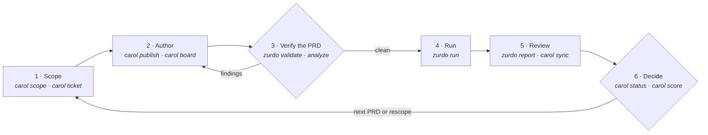

---
# Page settings
layout: default

# Hero section
title: Carol
description: "Project management for zurdo-driven repositories: your planning files and zurdo's run state, mirrored onto GitHub."

# Page navigation
page_nav:
    next:
        content: Installation
        url: '/carol/installation.html'

# Mermaid diagrams on this page
mermaid: true
---

Zurdo runs one PRD and verifies it. **Carol** manages everything around that run: the initiative a PRD belongs to, the research it waits on, the GitHub issues your team reads, and where the work stands when you come back to it. The two tools are built to be used together. Each is still a separate binary, and zurdo doesn't know Carol exists.

| | zurdo | Carol |
|---|---|---|
| **Unit of work** | One PRD | An initiative: a `scope.md` with phases, tickets, and one PRD per phase |
| **Reads** | The PRD, `.zurdo/config.toml`, the working tree | Your planning files, plus zurdo's [published JSON](#what-carol-reads-from-zurdo) |
| **Writes** | `.zurdo/<slug>/` run state | GitHub issues, milestones, labels, and a Projects board (only with `--apply`) |
| **Decides** | Whether each criterion passed | Nothing. It mirrors decisions you and zurdo already made. |

## Where Carol fits in the PRD loop

[The PRD loop](../docs/workflow.md) has six phases. Zurdo owns the middle ones. Carol keeps the tracker in step at each edge, so nobody has to copy run results into issues by hand.



| Loop phase | zurdo | Carol |
|---|---|---|
| 1 · Scope | — | [`carol scope`](github-sync.md#carol-scope) mirrors `scope.md` as a pinned scope issue with its phases table. [`carol ticket`](github-sync.md#carol-ticket) files research questions under it. |
| 2 · Author | `zurdo-prd-author` writes the PRD | [`carol publish`](github-sync.md#carol-publish) turns the PRD into a milestone, an epic, and one issue per task. [`carol board`](github-sync.md#carol-board) puts them on the initiative's board. |
| 3 · Verify the PRD | `zurdo validate`, `zurdo analyze` | — |
| 4 · Run | `zurdo run` | [`carol status`](status.md) shows the phase as *in flight*, or *crashed* if the run died |
| 5 · Review | `zurdo report`, `zurdo review` | [`carol sync`](github-sync.md#carol-sync) posts each task's outcome, sets labels, closes passed tasks, and refreshes the epic's table. `carol board` moves the cards. |
| 6 · Decide | — | Update `scope.md` and re-run `carol scope`. [`carol score --report`](triage.md#carol-score---report) puts run outcomes beside the PRD's lint warnings. |

## Principles

- **Files are canonical.** `scope.md`, ticket files, and PRDs are the source of truth. GitHub is a one-way projection: Carol writes issues and never reads your plan back from them.
- **Plan, then apply.** Every command that writes to GitHub prints its plan and stops. Nothing changes until you add `--apply`, and each write is read back to confirm it stuck.
- **Markers are identity.** Every issue Carol creates carries a hidden marker naming the file (and task) it came from. Re-running a command updates that issue and never makes a duplicate.
- **Zurdo's JSON is the only run state.** Carol never opens `.zurdo/` directly. It asks the `zurdo` binary.

## What Carol reads from zurdo

Carol calls the `zurdo` on your `PATH` (or `$CAROL_ZURDO`) and parses its versioned JSON envelopes:

| Carol command | zurdo call | What it uses |
|---|---|---|
| `carol sync`, `carol board` | [`zurdo report <prd> --format json`](../docs/commands.md) | Each task's status, attempts, last model, tokens, cost, and a failed task's `failed_hints` |
| `carol status`, `carol score` | `zurdo state list --format json` | Each run's slug, PRD path, last run, and `clean` / `active` / `stale` state |
| `carol score` | [`zurdo validate <prd> --authoring-state --format json`](../docs/commands.md#zurdo-validate---authoring-state) | Lint warnings on the PRD as it was written |
| `carol doctor` | `zurdo --version` | That zurdo is installed |

<div class="callout callout--info" markdown="1">
The zurdo Carol calls must be able to load the repository's `.zurdo/config.toml`. If the config uses a table that your installed zurdo doesn't recognise yet, every `zurdo report` fails, and `carol sync` exits 6. Keep zurdo current: Carol {{ site.carol.version }} is built against zurdo {{ site.zurdo.version }}.
</div>

## A first session

```sh
brew install ElOrlis/zurdo/carol      # same tap as zurdo
carol doctor                          # gh auth, labels, zurdo on PATH
carol bootstrap --apply               # the label vocabulary, once per repo

carol scope docs/billing/scope.md     # read the plan…
carol scope docs/billing/scope.md --apply   # …then write it

zurdo validate docs/billing/prds/prd-01-invoices.md
carol publish docs/billing/prds/prd-01-invoices.md --apply
carol board   docs/billing/prds/prd-01-invoices.md --apply

zurdo run docs/billing/prds/prd-01-invoices.md
carol sync  docs/billing/prds/prd-01-invoices.md --apply
carol status billing
```

[Initiatives](initiatives.md) describes the `docs/<initiative>/` layout these paths follow. The [Tutorial](../docs/tutorial.md) walks through the same session step by step, with real output.

Next: [Installation](installation.md)
