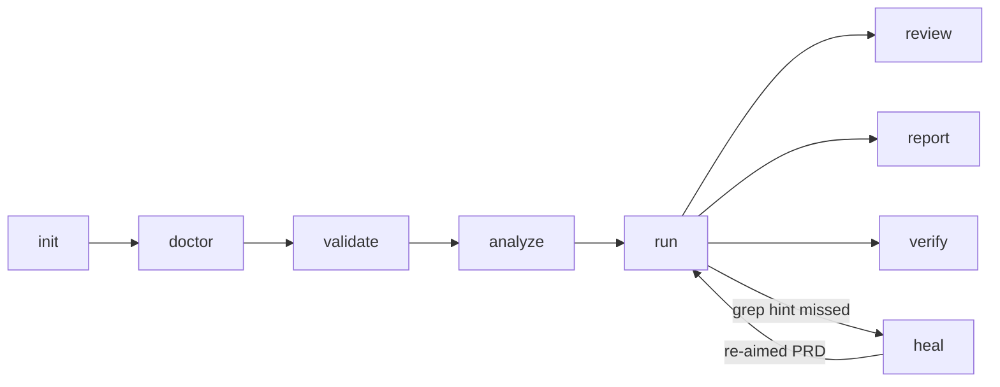

---
# Page settings
layout: default

# Hero section
title: Commands
description: "Full command and flag reference, exit codes."

# Page navigation
page_nav:
    prev:
        content: Diagnosis & lessons
        url: '/docs/reason.html'
    next:
        content: Configuration
        url: '/docs/configuration.html'

# Mermaid diagrams on this page
mermaid: true
---

The complete CLI surface of zurdo {{ site.zurdo.version }}. Every subcommand has detailed built-in help (`zurdo <subcommand> --help`), and `zurdo help <topic>` prints [guide pages](#zurdo-help--guide-pages-in-the-terminal) offline. A bare `zurdo <prd>` is shorthand for `zurdo run <prd>`.

## Subcommands

Where each command fits in a PRD's life:



| Subcommand | Purpose |
| --- | --- |
| **Setup** | |
| `zurdo init` | Write a commented default `.zurdo/config.toml` and install the bundled skills into the provider's discovery path |
| `zurdo doctor` | Diagnose why a run won't start. Needs no PRD, takes no lock, writes nothing. [Details](#zurdo-doctor--diagnose-the-environment) |
| `zurdo check-models` | **Deprecated**: use `zurdo doctor`, whose `models` section probes the same rows and adds the vocabulary canary. Kept through 1.x with identical behavior and exit codes. Prints one stderr deprecation line per call. |
| **Before a run** | |
| `zurdo validate <prd>` | Deterministic grammar and dependency-graph checks, with no LLM and no execution. [Details](#zurdo-validate) |
| `zurdo analyze <prd>` | Deterministic lints plus an LLM critique of the PRD, then exit without executing anything. [Details](#zurdo-analyze--pre-flight-analysis) |
| `zurdo reason match <prd>` | Preview which [library lessons](reason.md) would match each task. Read-only: it never updates lesson stats. |
| **Running** | |
| `zurdo run <prd>` | Drive the PRD through the agent loop. This is the default when you pass a PRD with no subcommand. [Flags](#zurdo-run) |
| **After a run** | |
| `zurdo review <prd>` | Terminal UI over a prior run's evidence, with in-band `[manual]` sign-off. [Details](#zurdo-review--walk-the-evidence-sign-off-manual-criteria) |
| `zurdo report <prd>` | Build a curated run report from `prd.json`, including the [completion gate](usage.md#the-completion-gate) verdict when one ran |
| `zurdo verify <prd>` | Re-run every terminal task's criteria against the current tree without invoking the executor |
| `zurdo heal <prd>` | Re-aim misaimed `[grep:]`/`[no-grep:]` hints using a prior run's failure history. [Details](#zurdo-heal--re-aim-misaimed-grep-hints) |
| `zurdo state list` | List every `.zurdo/<slug>/` directory at the repo root, with a `gate` column once a completion gate has run |
| `zurdo state where <prd>` | Print the absolute `.zurdo/<slug>/` path a PRD resolves to. The directory doesn't need to exist. |
| **Code index, agents, lessons** | |
| `zurdo lumen status` | Report the [structural index](lumen.md)'s record counts and the Vela watcher's freshness |
| `zurdo lumen rebuild` | Rebuild the index from scratch, atomically replacing the current generation. Requires `[lumen] enabled = true`. |
| `zurdo lumen clear` | Delete `.zurdo/lumen/`. Confirms on a TTY; pass `--yes` for non-interactive use. |
| `zurdo lumen query <selector>` | Ask the index a question over a freshly repaired view, with no prior rebuild needed. [Flags](#zurdo-lumen-query) |
| `zurdo mcp serve` | Serve the index and compound-loop state to an MCP client over stdio. The client launches it; you don't type it. [Details](mcp.md) |
| `zurdo vela serve` / `start` / `stop` / `status` | Run or manage the optional [background watcher](lumen.md#the-vela-watcher) that keeps the index fresh |
| `zurdo reason status` | Lesson count grouped by match key, one line per lesson file that failed to parse, and per-slug diagnosis-block counts |
| `zurdo reason clear` | Delete the lesson **usage** sidecar `.zurdo/reason/usage.json`. The git-tracked `lessons/` files are left alone; retire one with `git rm`. Confirms on a TTY; `--yes` skips. |
| `zurdo skills list` | List the seven [bundled skills](how-it-works.md#skills) compiled into the binary |
| `zurdo skills install <name>` | Install a bundled skill into the provider's discovery path. [Flags](#zurdo-skills-install) |
| **Shell** | |
| `zurdo help [topic]` | List every subcommand and guide topic, or print one guide page. [Details](#zurdo-help--guide-pages-in-the-terminal) |
| `zurdo completions <shell>` | Print a shell completion script to stdout. [Details](#shell-completions-and-man-pages) |

## Global flags

Every subcommand accepts these:

| Flag | Effect |
| --- | --- |
| `--no-prompt` | Suppress every interactive prompt (CI-safe). The resume prompt defaults to *Resume*, `heal` writes `<prd>.proposed.md`, and `review` refuses with exit `2` because it needs a terminal. |
| `--no-color` | Disable ANSI escapes in all output: the stdout progress stream and stderr diagnostics |
| `--log-file <path>` | Tee the stderr diagnostic log to a file. Stderr is never silenced. Independent of `progress.log`. |
| `--log-level <level>` | `error`, `warn`, `info`, `debug`, or `trace`. Default `info`. |
| `-v` / `-q` | Shortcuts for `--log-level debug` / `--log-level warn`. Mutually exclusive with `--log-level`. |
| `--log-format <text\|json>` | Diagnostic-log format. Default `text`. Doesn't affect the stdout progress stream. |

`--repo-root <path>` overrides the auto-detected repo root (the nearest ancestor with `.git`). It's accepted by `run`, `validate`, `analyze`, `verify`, `report`, `review`, `heal`, `state list`, and `state where`.

## `zurdo run`

| Flag | Effect |
| --- | --- |
| `--resume` | Skip the resume prompt and continue from existing state. No-op when no state exists. Mutually exclusive with `--reset`. |
| `--reset` | Archive old state under `.zurdo/<slug>/.archive/<ts>/` and start over. Skips the resume prompt. |
| `--max-iterations N` | Cap total agent invocations across the run. Overrides `[defaults] max_total_iterations`. `0` = unlimited. |
| `--skip-model-check` | Turn off the automatic pre-run model probe. Use it in CI with fake CLIs or with deliberately unverified models. |
| `--no-progress` | Silence the progress stream (banner, task headers, summary). Only a final exit-status line is printed on stdout. |
| `--quiet-agent` | On a TTY, drop the live tee of agent stdout/stderr. The spinner and heartbeats remain, and `.out`/`.err` files are still written. |
| `--raw-agent` | Show the agent's raw output in the live tee instead of the default step summaries. Mutually exclusive with `--quiet-agent`. |

See [How it works](how-it-works.md#the-verification-loop) for a captured run.

## `zurdo init`

| Flag | Effect |
| --- | --- |
| `--sync` | Report how many lines of the existing `.zurdo/config.toml` differ from the current template, useful after an upgrade. The config is never modified. |
| `--check-models` | After init, probe every `[effort_map.<provider>]` entry and print a status table. Informational: always exits `0`. |
| `--force` | Overwrite an existing `.zurdo/config.toml`. It still confirms on a TTY and overwrites immediately with non-interactive stdin. Pair it with `--check-models` to regenerate, then audit. |
| `--quiet` | Suppress the one-line stdout summary. Stderr diagnostics are unaffected. |

Exits `2` when the current directory can't be determined or the config can't be written.

## `zurdo doctor` — diagnose the environment

Use it when `zurdo run` won't start and you want to know why, before writing a PRD or spending a token. `zurdo doctor` re-checks the **environment half** of the run pre-flight. It takes no PRD, acquires no run lock, and writes nothing.

<figure class="lp-terminal" aria-label="zurdo doctor output with every section passing">
<div class="lp-terminal__bar"><span class="lp-terminal__dots" aria-hidden="true"><i></i><i></i><i></i></span><span class="lp-terminal__title">zurdo doctor --skip-probes</span></div>
<pre class="lp-terminal__body"><code>config:
  <span class="t-ok">ok</span>    <span class="t-dim">…/demo/</span>.zurdo/config.toml: loaded
providers:
  <span class="t-ok">ok</span>    executor → anthropic: cli `claude` found on PATH
  <span class="t-ok">ok</span>    analyzer → anthropic: cli `claude` found on PATH
models:
  <span class="t-ok">ok</span>    model probes: skipped (--skip-probes) — no provider process spawned
git:
  <span class="t-ok">ok</span>    git work tree: <span class="t-dim">…/demo</span> is a git work tree
  <span class="t-ok">ok</span>    .zurdo/ gitignored: no .gitignore present, or .zurdo/ is already listed
state:
  <span class="t-ok">ok</span>    run state directories: greeter-a4ed
  <span class="t-ok">ok</span>    run lock: no stale lock found
<span class="t-ok">doctor: all checks passed</span></code></pre>
<figcaption class="lp-terminal__caption"><span class="lp-dot" aria-hidden="true"></span><span>Each row is <code>&lt;status&gt;  &lt;label&gt;: &lt;detail&gt;</code>, with an optional <code>hint:</code> line.</span></figcaption>
</figure>

| Section | Checks |
| --- | --- |
| `config` | `.zurdo/config.toml` loads. If it doesn't, every later section is meaningless, so doctor stops here. |
| `providers` | Every provider a configured role names has a `[providers.<name>]` block, and its `cli` resolves on `PATH` |
| `models` | Every `[effort_map.<provider>]` entry plus `[roles.analyzer]`'s model, classified exactly as `check-models` did |
| `vocabulary` | The [provider vocabulary canary](providers.md#the-vocabulary-canary): does each provider's event stream still yield extractable assistant text? |
| `git` | A usable `git` work tree, and whether `.zurdo/` is gitignored |
| `state` | Run-state directories present, and any stale run lock |
| `lumen` | Index generation and Vela daemon status. Only shown when `[lumen] enabled = true`. |

| Flag | Effect |
| --- | --- |
| `--skip-probes` | Spawn no provider process at all: neither the model probes nor the canary's `--version` lookup runs. Safe offline, in CI, and on a metered account. |
| `--format <text\|json>` | `json` emits one document carrying every section. The default is the grouped human-readable form. |

- **Safe as a CI gate:** only `fail` rows move the exit code. A vocabulary gap, a stale lock, a missing `.gitignore` entry, an unbuilt Lumen index, and a stopped Vela daemon are all `warn`.
- **Free canary:** the canary reuses the stdout the model probes already captured, so it costs zero extra process spawns.
- **Exit codes:** `0` when everything passed or only advisories were reported, `2` when the config is missing or unloadable, and `4` on any blocking finding. `4` is the same code the run pre-flight uses for a failed model check.

## `zurdo validate`

Free, instant, deterministic: task-id shape, the metadata block, dependency cycles, and hint syntax. It also prints advisory [lint warnings](hints.md#the-warn-lint-families). Skill existence is checked at run pre-flight, not here.

<figure class="lp-terminal" aria-label="zurdo validate passing with a warning, then failing under --strict">
<div class="lp-terminal__bar"><span class="lp-terminal__dots" aria-hidden="true"><i></i><i></i><i></i></span><span class="lp-terminal__title">zurdo validate prds/greeter.md</span></div>
<pre class="lp-terminal__body"><code><span class="t-dim">$ zurdo validate prds/greeter.md</span>
prds/greeter.md:12: <span class="t-warn">warning:</span> task `task-greet` grep pattern `hello`
  already matches `main.rs` in the current working tree — the criterion may
  not prove the change
<span class="t-ok">OK</span>  <span class="t-dim"># exit 0</span>
<span class="t-dim">$ zurdo validate prds/greeter.md --strict</span>
prds/greeter.md:12: <span class="t-bad">error:</span> task `task-greet` grep pattern `hello`
  already matches `main.rs` in the current working tree — the criterion may
  not prove the change
<span class="t-dim"># exit 2</span></code></pre>
<figcaption class="lp-terminal__caption"><span class="lp-dot" aria-hidden="true"></span><span>A <code>grep-tautology</code> warning is advisory by default; <code>--strict</code> makes it an error.</span></figcaption>
</figure>

| Flag | Effect |
| --- | --- |
| `--strict` | Promote the six promotable lint families to errors (exit `2`). [Details](#zurdo-validate---strict) |
| `--authoring-state` | Validate the PRD as committed, against the parent of the commit that added it. [Details](#zurdo-validate---authoring-state) |
| `--at <rev>` | Like `--authoring-state`, but at an explicit revision. Mutually exclusive with `--authoring-state`. |
| `--format <text\|json>` | `json` emits the [shared envelope](#machine-readable-output). Rendering only: the exit code is unchanged. Default `text`. |

Exits `0` (`OK` on stdout) when the PRD is well-formed. Exits `2` on any structural error, a `--strict`-promoted warning, an I/O failure (an unreadable file, a directory passed as the PRD, an unresolvable `--repo-root`), or an authoring baseline that can't be resolved.

### `zurdo validate --strict`

`--strict` promotes six of the ten [lint families](hints.md#the-warn-lint-families) to errors, so a PRD that would pass with warnings exits `2`, the same code as a structural error:

`grep-target` · `vacuous-shell` · `grep-tautology` · `frozen-overlap` · `doc-echo` · `uncovered-requirement`

| Never promoted | Why |
| --- | --- |
| `skill-resolution` | Permanently exempt. PRD-referenced skills are user-managed, so a CI checkout legitimately lacks them. |
| `discarded-evidence`, `cached-verification` | Pending field data. `doc-echo` sat here until it was promoted. |
| `unaddressed-lesson` | Never. It checks *your* repo's lesson library, so no outside measurement could justify making it build-breaking. Only `zurdo analyze` emits it. |

With `--format json`, a promoted finding moves from `warnings` to `errors`, and `ok` becomes `false`. Without `--strict`, every family stays advisory and a PRD with warnings still exits `0`.

### `zurdo validate --authoring-state`

Once a PRD's work has shipped, every `[grep:]`/`[no-grep:]` hint reads green against `HEAD`, so `grep-tautology` fires on all of them. That's an artifact of the tree, not a defect. `--authoring-state` validates the PRD **as it was written**: zurdo finds the commit that added it (following renames) and checks that commit's text against its first parent. `--at <rev>` names the commit explicitly.

```sh
zurdo validate prds/feature.md --authoring-state   # the commit that added the PRD
zurdo validate prds/feature.md --at 3f1d61b        # an explicit revision
```

The two flags are mutually exclusive. The check reads the *committed* PRD, not the file on disk, so both output formats name the resolved commit and baseline (`revision` in JSON). On zurdo's own PRD corpus, this cut lint findings from 929 to 94.

## Machine-readable output

`validate`, `verify`, and `state list` accept `--format json` and emit one **shared versioned envelope**, so CI parses one contract instead of three:

```json
{
  "schema_version": 1,
  "command": "validate",
  "data": {
    "ok": true,
    "errors": [],
    "warnings": [
      { "family": "grep-tautology", "line": 12, "message": "task `task-greet` grep pattern `hello` already matches …" }
    ]
  }
}
```

| Command | `command` | `data` |
| --- | --- | --- |
| `validate` | `validate` | `{ok, errors[], warnings[]}`, where each warning names its [lint family](hints.md#the-warn-lint-families) |
| `verify` | `verify` | `{terminal_checked, changes[]}`. An empty `changes` array means no regressions. |
| `state list` | `state-list` | `{entries[]}`. A repo with no runs parses the same as one with runs. |

- **Rendering only:** stdout is a single document and diagnostics stay on stderr. Parse and validation failures are reported *inside* the payload, and exit codes are identical to text mode.
- **Own formats:** `report` and `doctor` have their own JSON shapes. `report --format json` is the default and evolves independently. `doctor --format json` carries every section.

## `zurdo analyze` — pre-flight analysis

Runs the full pre-flight analysis of the PRD and never executes a task.

| Invocation | What it does |
| --- | --- |
| `zurdo analyze <prd>` | Every deterministic [lint family](hints.md#the-warn-lint-families), including `unaddressed-lesson`, which only `analyze` emits. Adds an LLM critique of vague criteria. Requires `[roles.analyzer]`. |
| `--static-only` | Deterministic lints only: no LLM, no `[roles.analyzer]`, and no `.zurdo/config.toml` needed (an absent config falls back to `zurdo init`'s defaults). The instant CI pass. |
| `--fix` | Refinement loop: the analyzer proposes a tightened PRD and zurdo re-analyzes until warnings stop decreasing. Writes `<prd>.proposed.md` and asks before overwriting. |

| Flag | Effect |
| --- | --- |
| `--fix` | Requires `[roles.analyzer]`. Conflicts with `--static-only`. |
| `--static-only` | Conflicts with `--fix`. Covers an *absent* config only: a `config.toml` that exists but fails to parse still exits `2`. |
| `--max-iterations N` | Caps the `--fix` loop (not the run loop, despite the shared name). `0` is a flag error under `--fix`. |
| `--no-progress` | Silence the progress stream; print only the final verdict. |

Exits: `0` when clean or no errors remain, `2` when `--fix` starts with pre-existing errors, `3` when `[roles.analyzer]` is needed but missing, and `6`/`7`/`8` for [`--fix` non-convergence](#exit-codes).

## `zurdo heal` — re-aim misaimed grep hints

A `[grep:]` hint can fail because the code is wrong, or because the *hint* is. `zurdo heal <prd>` re-aims failed `[grep:]`/`[no-grep:]` payloads using the prior run's failure history and the live tree as evidence, in four steps: select, propose, verify, apply.

- **Requires** a prior run's `.zurdo/<slug>/prd.json` (missing: exit `3`) and `[roles.analyzer]` (missing: exit `3`).
- **On a TTY**, it offers each verified heal in place (`y/N`). On a non-TTY or with `--no-prompt`, it writes verified heals to `<prd>.proposed.md`.
- **Never** executes tasks and never writes `prd.json`.

<div class="callout callout--warning" markdown="1">
**Deprecated flag forms** `zurdo run --analyze` (with `--fix`/`--static-only`), `zurdo run --heal`, and bare `zurdo --analyze <prd>` still work identically. They're hidden from `--help` and print a one-line stderr notice, such as `warning: 'zurdo run --analyze' is deprecated; use 'zurdo analyze'`. Removal is deferred to 2.0.
</div>

## `zurdo review` — walk the evidence, sign off `[manual]` criteria

A full-screen terminal UI over a prior run's recorded state. It's read-only except for one action: signing off `[manual]` criteria.

<div class="lp-cards" markdown="1">
<div markdown="1">
**Task list**
Every task with its status. `passed-pending-review` tasks show `<< awaiting manual sign-off`.
</div>
<div markdown="1">
**Evidence detail**
One criterion at a time: each hint's source, the latest verdict with its provenance (exit code, typed failure reason, stderr excerpt), and a warning if the evidence changed since the baseline.
</div>
<div markdown="1">
**Baseline diff**
The tree's live diff against `.zurdo/<slug>/baseline`: changed paths and the selected file's hunks. Shows a notice instead if there's no baseline or `git diff` fails.
</div>
</div>

| Key | Action |
| --- | --- |
| `j` / `k` or arrow keys | Move |
| `Enter` | Open a task's evidence |
| `d` / `t` | Diff view / back to the task list |
| `Esc` / `q` | Up a level / quit |
| `s` | Sign off. Offered only on an unsigned `[manual]` criterion of a `passed-pending-review` task. The footer shows the key only where it works. |

**Sign-off:** zurdo asks for an optional one-line note, then a confirmation naming the task. It then appends the task id, criterion, note, and UTC time to `.zurdo/<slug>/review-log.jsonl`, a tamper-evident hash chain anchored at the run's PRD hash. Signing a task's **last** unsigned `[manual]` criterion flips it to `passed`. That's the only `prd.json` write `review` ever makes.

<details markdown="1">
<summary>Sign-off rules and guard rails</summary>

- **Locking:** the run lock is held for the whole session, so no concurrent run can race a sign-off.
- **Irrevocable:** there's no unsign. A broken log chain disables sign-off rather than appending to it.
- **PRD hash changes** (for example after `--reset`) archive the old log and start a fresh chain.
- **Later sessions** show already-signed criteria with their note and sign-off time.
- **Guard rails**, checked before any TUI setup: non-TTY stdin or `--no-prompt` prints a stderr pointer to `zurdo report` and exits `2`. A missing `.zurdo/<slug>/prd.json`, or another process holding the run lock, exits `3`.

</details>

## `zurdo verify`, `report`, and `state`

| Command | Flag | Effect |
| --- | --- | --- |
| `verify` | `--format <text\|json>` | The [shared envelope](#machine-readable-output). Default `text`. |
| `report` | `--format <json\|md>` | Default `json`, which external tooling depends on. The report is written to `.zurdo/<slug>/reports/<timestamp>.<ext>` and echoed to stdout. |
| `state list` | `--format <text\|json>` | The shared envelope. Default `text`. |

`verify` and `report` exit `4` when the PRD has no run state yet.

## `zurdo lumen query`

Exactly one selector is required (zero or two are rejected). Requires `[lumen] enabled = true`. See [Asking the index a question](lumen.md#asking-the-index-a-question).

| Flag | Effect |
| --- | --- |
| `--name <IDENT>` | Definitions whose qualified name matches: exact, then trailing segment, then substring only when neither matched |
| `--outline <PATH>` | Every definition recorded for that file, in source order |
| `--callers <NAME>` | Every call site whose callee resolves to that name |
| `--references <NAME>` | Every identifier reference to that name |
| `--limit <N>` | Maximum rows printed. Default `20`; `0` = unlimited. |

`zurdo mcp serve` takes no flags of its own. The repository is the directory it starts in.

## `zurdo skills install`

| Flag | Effect |
| --- | --- |
| `--all` | Install every bundled skill. Mutually exclusive with `<name>`. |
| `--provider <name>` | Target one provider's discovery path. Repeatable. Mutually exclusive with `--all-providers`. |
| `--all-providers` | Fan out across every configured provider. Composes with `--all`. |

## `zurdo help` — guide pages in the terminal

`zurdo help` lists every subcommand and guide topic. `zurdo help <name>` shows that subcommand's `--help`, or else one of the compiled-in guide topics:

| Topic | Condensed version of |
| --- | --- |
| `hints` | The hint-type menu |
| `prd-grammar` | The PRD grammar rules |
| `exit-codes` | The [exit-code table](#exit-codes) |
| `config` | The config key reference |
| `workflow` | The operating loop |
| `state-dir` | The `.zurdo/<slug>/` layout |

A subcommand name always shadows a topic with the same name. A name that matches neither is a stderr error, exit `2`.

## Shell completions and man pages

`zurdo completions <shell>` prints a script for `bash`, `zsh`, `fish`, `elvish`, or `powershell`. It's generated from the same command tree that parses every call, so it always matches the installed binary. It writes nothing, reads no config, and works from any directory.

```sh
eval "$(zurdo completions zsh)"
zurdo completions bash > /etc/bash_completion.d/zurdo
zurdo completions fish | source
```

**Homebrew installs set up bash/zsh/fish completions and man pages automatically** (`man zurdo`, `man zurdo-run`, …). Release tarballs bundle both under `completions/` and `man/`. See [Installation](installation.md#shell-completions-and-man-pages).

## Examples

```sh
zurdo init                                    # bootstrap config + skills in this repo
zurdo doctor                                  # why won't a run start? config, PATH, models, state
zurdo doctor --skip-probes --format json      # offline environment check, parseable
zurdo validate prds/feature.md                # free, instant grammar check
zurdo validate prds/feature.md --strict       # advisory lints become errors (CI gate)
zurdo validate prds/done.md --authoring-state # lint a shipped PRD as it was written
zurdo analyze prds/feature.md --static-only   # lint hints without an LLM
zurdo run prds/feature.md                     # the main event
zurdo run prds/feature.md --resume            # continue after Ctrl-C, no prompt
zurdo heal prds/feature.md                    # re-aim grep hints that failed last run
zurdo verify prds/feature.md                  # re-check criteria after hand edits
zurdo review prds/feature.md                  # walk the evidence, sign off [manual] criteria
zurdo report prds/feature.md --format md      # human-readable run report
zurdo reason match prds/feature.md            # preview lessons that would inform this PRD
zurdo lumen query --name Config::load         # ask the structural index (needs [lumen] enabled)
zurdo help workflow                           # guide pages, offline in the terminal
eval "$(zurdo completions zsh)"               # shell completions from the live binary
zurdo skills install --all --all-providers    # every bundled skill, every provider
```

## Exit codes

| Code | Meaning |
| --- | --- |
| `0` | Success |
| `1` | General failure (unhandled error) |
| `2` | PRD parse or validation error: grammar errors, analyze findings, a `--strict`-promoted warning, or `heal`'s input PRD. Also a missing or invalid `.zurdo/config.toml` (except that `analyze --static-only` tolerates an *absent* one), `review` without a terminal, and an unknown `zurdo help` topic. |
| `3` | Pre-flight failure: a CLI missing from `PATH` or the lock already held. For `heal` and `review`, a missing `prd.json`. For `heal` and `analyze --fix`, a missing `[roles.analyzer]`. A missing config is **not** this class; it exits `2`. |
| `4` | State needs `--reset` (a `prd_hash` mismatch with no valid heal-log chain), there's no run state yet (`report`, `verify`), the pre-flight model probe rejected a model, or `doctor` found a blocking problem |
| `5` | One or more tasks finished `failed` or `blocked-by-dependency` |
| `6` | Iteration budget exhausted (`--max-iterations`, including under `analyze --fix`) |
| `7` | `analyze --fix` thrash: the warning count didn't decrease across the last 3 iterations |
| `8` | `analyze --fix` halted because the LLM produced an unparseable PRD. The last good iteration is preserved. |
| `9` | Every task passed, but the run-end [completion gate](usage.md#the-completion-gate) failed or timed out |

CI can branch on `5` (a task failed), `9` (every task passed but the repo is still broken), `6` (budget), and `7`/`8` (`analyze --fix` didn't converge). See the [CI integration example](usage.md#ci-integration). The same table ships in the binary: `zurdo help exit-codes`.

<div class="callout callout--info" markdown="1">
**Note** `zurdo validate` and `zurdo verify` exit `2` (not `1`) on a parse or structural validation failure, matching what `2` means everywhere else. Releases before 1.10.0 used `1`.
</div>
