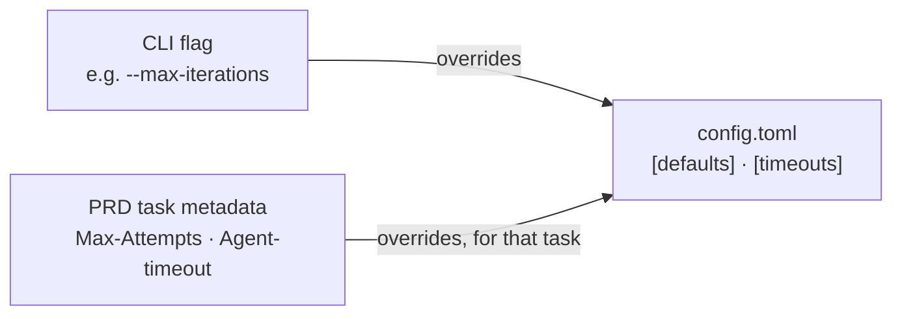
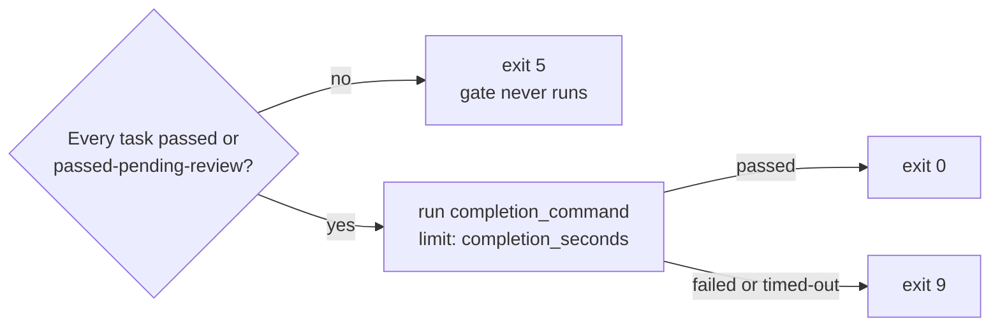

---
# Page settings
layout: default

# Hero section
title: Configuration
description: "The .zurdo/config.toml reference."

# Page navigation
page_nav:
    prev:
        content: Commands
        url: '/docs/commands.html'
    next:
        content: Providers
        url: '/docs/providers.html'

# Mermaid diagrams on this page
mermaid: true
---

Zurdo reads `.zurdo/config.toml` at the **repo root**, so config is per repository, not per user. `zurdo init` writes the default below.

| Table | Controls | Seeded by `init` |
| --- | --- | --- |
| [`[roles.*]`](#roles) | Which provider and model play executor, analyzer, and reasoner | executor, analyzer |
| [`[effort_map.<provider>]`](#the-effort-map) | Effort label → model id | yes |
| [`[defaults]`, `[timeouts]`](#defaults-and-timeouts) | Attempt budgets, parallelism, time limits | yes |
| [`[providers.<name>]`](#providers) | CLI binary and extra args | yes |
| [`[verification]`](#the-verification-table) | Protected paths, context priming, completion gate | no |
| [`[skills]`](#skills-search-paths) | Extra skill directories | no |
| [`[lumen]`](#lumen-and-structural-hints) | Structural code index | yes |
| [`[vela]`](#the-vela-watcher) | Background index watcher | yes |
| [`[mcp]`](#mcp-server-injection) | Hand zurdo's MCP server to the executor | yes |
| [`[reason]`](#reason-diagnosis-and-lessons) | Stall diagnosis and lessons | no |
| [`[pricing.<model>]`](#pricing-overrides) | Cost-estimate overrides | no |

## The default config

```toml
[roles.executor]
provider = "anthropic"            # or "codex" or "copilot"
# model is determined by [effort_map.<provider>] below

[roles.analyzer]                  # required for zurdo analyze / heal
provider = "anthropic"
model    = "claude-haiku-4-5"

[effort_map.anthropic]
low    = "claude-haiku-4-5"
medium = "claude-sonnet-4-6"
high   = "claude-opus-4-7"

[effort_map.codex]
low    = "gpt-5.5"
medium = "gpt-5.5"
high   = "gpt-5.5"

[effort_map.copilot]                # `auto` lets the Copilot CLI pick the model
low    = "auto"                      # concrete dotted ids (e.g. claude-sonnet-4.6)
medium = "auto"                      # are plan-gated; probe with `zurdo doctor`
high   = "auto"

[defaults]
max_attempts         = 3          # per-task fallback
max_total_iterations = 0          # 0 = unlimited
parallel_criteria    = false      # true only if every shell/http criterion is hermetic
analyzer_parallelism = 4          # concurrent analyzer LLM calls (1–16)

[timeouts]
criterion_seconds = 300           # shell + http only
agent_seconds     = 1800

[providers.anthropic]
cli        = "claude"
extra_args = []

[providers.codex]
cli        = "codex"
extra_args = []

[providers.copilot]
cli        = "copilot"
extra_args = []

[lumen]                           # structural code index — off by default
enabled          = false          # also the only gate on structural hints
languages        = ["rust", "python", "go", "typescript", "javascript"]
max_file_bytes   = 2097152
gc_grace_minutes = 10

[experimental]                    # no gate currently lives here; kept for future opt-ins

[vela]                            # background index watcher — off by default
enabled = false

[mcp]                             # hand zurdo's MCP server to the executor — off by default
inject_server        = false      # also requires [lumen] enabled = true
strict_claude_config = false      # claude only: --strict-mcp-config hides your other servers

[mcp.adapters]                    # per-provider injection gates
anthropic = true
codex     = true
copilot   = false                 # org policy can block third-party MCP servers there
```

After upgrading zurdo, `zurdo init --sync` reports how far your config has drifted from the current template, without modifying it.

## Precedence



Command-line flags override config values (`--max-iterations` beats `defaults.max_total_iterations`). A task's PRD metadata overrides config defaults for that task (`**Max-Attempts**`, `**Agent-timeout**`).

## Roles

| Role | Does | Model comes from |
| --- | --- | --- |
| `[roles.executor]` | The work: one agent call per iteration | The [effort map](#the-effort-map), keyed by each task's `**Effort**`. Switching providers is a one-line `provider` edit. |
| `[roles.analyzer]` | `zurdo analyze`'s LLM critique and `zurdo heal`'s re-aim proposals | Its own `model` (analysis doesn't vary by effort). Unused if you never run `analyze` or `heal`. |
| `[roles.reasoner]` | The opt-in [reason subsystem](reason.md)'s diagnosis and lesson-extraction calls | Its own `provider`/`model`, the same shape as the analyzer. Falls back to `[roles.analyzer]` when absent. Enabling `[reason]` with neither role configured is a config-load error. |

## The effort map

`[effort_map.<provider>]` maps effort labels to model ids. A task's `**Effort**` must be a key in the **active executor's** map. The labels aren't a fixed enum, so you can define your own:

```toml
[effort_map.anthropic]
trivial = "claude-haiku-4-5"
normal  = "claude-sonnet-4-6"
gnarly  = "claude-opus-4-7"
```

With that map, `**Effort**: gnarly` is valid and `**Effort**: medium` is rejected at pre-flight. The default config defines `low | medium | high` for all three providers.

Before a run, zurdo probes each mapped model against its provider CLI. An unknown or plan-gated model fails pre-flight with exit `4`. Check without running via [`zurdo doctor`](commands.md#zurdo-doctor--diagnose-the-environment), or skip the probe with `--skip-model-check`. See [Providers](providers.md).

## Defaults and timeouts

| Key | Meaning | Default |
| --- | --- | --- |
| `defaults.max_attempts` | Per-task attempt budget when the PRD omits `**Max-Attempts**` | `3` |
| `defaults.max_total_iterations` | Cap on agent calls across the whole run; `0` = unlimited. `--max-iterations` overrides it. | `0` |
| `defaults.parallel_criteria` | Run a task's criteria concurrently. Enable it only if every `shell:`/`http:` criterion is hermetic, because non-hermetic checks can interfere. | `false` |
| `defaults.analyzer_parallelism` | Concurrent analyzer LLM calls in `zurdo analyze` (1–16; `1` is fully sequential) | `4` |
| `timeouts.criterion_seconds` | Limit per `shell:`/`http:` hint. File and grep checks are local and unbounded. | `300` |
| `timeouts.agent_seconds` | Limit per agent call when the task omits `**Agent-timeout**` | `1800` |
| `timeouts.completion_seconds` | Limit for the [completion gate](#the-completion-gate). A timeout counts as a gate failure (exit `9`). Not seeded by `init`. | `900` |

A single `[shell:]` hint can override `criterion_seconds` with a trailing `timeout:<N>(s|m|h)` token. `[http:]` hints can't. See [Timeouts](hints.md#timeouts).

## Providers

Each `[providers.<name>]` block names the CLI binary zurdo shells out to, plus optional `extra_args` appended to every call. The binary must be on your `PATH` and already authenticated; zurdo holds no credentials of its own. See [Providers](providers.md) for how each CLI is driven.

## The `[verification]` table

Optional, and **not seeded by `zurdo init`**:

```toml
[verification]
protected_paths    = ["Cargo.lock", "docs/**/*.md"]
prime_context      = true                       # the default
completion_command = "cargo test --workspace && cargo clippy --all-targets -- -D warnings"
```

| Key | Meaning | Default |
| --- | --- | --- |
| `verification.protected_paths` | Run-wide frozen globs ([below](#protected-paths)) | `[]` |
| `verification.prime_context` | Add an `# Evidence Paths` section to the executor prompt ([below](#context-priming)). Set it to `false` to drop the section. | `true` |
| `verification.completion_command` | The run-end [completion gate](#the-completion-gate). No gate runs when it's unset. | unset |

### Protected paths

`protected_paths` names paths no agent may modify during **any** task. A task's own `**Frozen**` globs add to the list for that task and never narrow it.

- **Enforcement:** after every iteration, a protected path in the diff against the task's baseline fails the iteration, whatever the criteria say. The baseline is captured at the task's first attempt and reused across retries.
- **Patterns** are root-anchored: `*` stays within one path segment and `**` crosses directories. Negation isn't supported.
- **Outside a git repo**, enforcement degrades to a warning because it needs the baseline. See [How it works](how-it-works.md#evidence-integrity).
- **`zurdo validate`** warns when a criterion points at a protected path it can't satisfy without touching it. That's the [`frozen-overlap`](hints.md#the-warn-lint-families) lint.

### Context priming

Every executor prompt carries an `# Evidence Paths` section, between `# Acceptance Criteria` and `# Available Skills`, from the first attempt on. It lists every file the task's criteria point at (`[file-exists:]`, `[file-absent:]`, `[grep:]`, `[no-grep:]`, and the structural hints). Each file is annotated with what the agent can't cheaply discover:

- **Exists yet?** A missing path names a file the task must create.
- **Frozen?** The agent learns a path is untouchable by reading the prompt, instead of by editing it and failing an iteration.

Tasks whose hints are all `[shell:]`, `[http:]`, or `[manual]` get no section. `prime_context = false` turns it off.

### The completion gate

Every criterion can be green while the repository is still broken: a criterion proves one task's requirement, and nothing checks the whole suite unless every PRD remembers to. `completion_command` states that repository-wide rule once, in config.



<figure class="lp-terminal" aria-label="A run where every task passed but the completion gate failed with exit 9">
<div class="lp-terminal__bar"><span class="lp-terminal__dots" aria-hidden="true"><i></i><i></i><i></i></span><span class="lp-terminal__title">zurdo run prds/greeter.md</span></div>
<pre class="lp-terminal__body"><code><span class="t-dim">═══ Run Summary ═══</span>
  task-greet           passed (pre-flight)    0/3
  task-docs            passed (pre-flight)    0/3
  totals               <span class="t-ok">2 passed</span>, 0 pending-review, 0 failed, 0 blocked
  completion gate      <span class="t-bad">FAILED (exit 1)</span> after 6ms
    command: test -s README.md &amp;&amp; grep -q Usage README.md
<span class="t-bad">run failed: every task passed but the completion gate exited 1: …</span>  <span class="t-dim"># exit 9</span>
<span class="t-dim">$ zurdo state list</span>
slug          prd_path         last_run              status  gate
greeter-a4ed  prds/greeter.md  2026-10-05T06:15:47Z  clean   <span class="t-bad">failed</span></code></pre>
<figcaption class="lp-terminal__caption"><span class="lp-dot" aria-hidden="true"></span><span>Every task passed; the repository-wide rule did not. Exit 9, not 5.</span></figcaption>
</figure>

| Aspect | Rule |
| --- | --- |
| **When** | Once, at run end, when every task is `passed` or `passed-pending-review`. A pending `[manual]` review doesn't hold it back. It **also runs on resume**, even of an already-complete run, because the rule is about the working tree, not one run. |
| **What** | One shell command string; chain steps with `&&`. There's no list form and no per-PRD override. |
| **Not a criterion** | It proves no requirement, belongs to no task, and never changes a task's status. `zurdo verify` and `zurdo heal` never run it. |
| **Budget** | `[timeouts] completion_seconds` (default `900`), separate from `criterion_seconds` |
| **Outcome** | `passed`, `failed`, or `timed-out`. Either failure exits `9`, distinct from `5`, so CI can tell "a task failed" from "every task passed and the repo is broken". |
| **Where it shows** | The run summary (failing command and output), the `gate` column in `zurdo state list`, and the full record in `zurdo report` (text and JSON) |

Without a `completion_command`, nothing changes. See [The completion gate](usage.md#the-completion-gate) for how it looks in a run.

## Skills search paths

Skills named in a task's `**Skills**` metadata are user-managed. Beyond the provider's own discovery paths (project-scope `.claude/skills/` or `.agents/skills/`, and their global equivalents), you can register extra directories:

```toml
[skills]
search_paths = ["tools/skills", "/opt/shared-skills"]
```

Zurdo checks them at pre-flight and only warns if a named skill is missing. It never installs or modifies user-managed skills.

## Lumen and structural hints

`[lumen]` controls the optional **structural code index** at `.zurdo/lumen/`. The index is repo-scoped and shared by every PRD.

| Key | Meaning | Default |
| --- | --- | --- |
| `lumen.enabled` | Build and maintain the index. It's also the **only** gate allowing `[symbol:]`/`[references:]`/`[callers:]` hints in a PRD. | `false` |
| `lumen.languages` | Languages indexed: `rust`, `python`, `go`, `typescript`, `javascript` | all five |
| `lumen.max_file_bytes` | Larger files are skipped | `2097152` |
| `lumen.gc_grace_minutes` | Index generations older than this become GC-eligible | `10` |

A PRD with no structural hints never touches the index. The old `[experimental] structural_hints` gate is deprecated and ignored: it still parses so old configs load, but it warns on stderr and decides nothing. The full subsystem is on [Structural verification](lumen.md).

## The Vela watcher

`[vela]` configures the optional background watcher that keeps the Lumen index fresh between runs. It's a speed optimization and never needed for correctness.

| Key | Meaning | Default |
| --- | --- | --- |
| `vela.enabled` | Auto-start the watcher from structural operations | `false` |
| `vela.idle_minutes` | Shut down after this long with no filesystem events and no clients. `0` disables the timeout. | `30` |
| `vela.debounce_ms` | Debounce window for bursts of filesystem events | `200` |

Manage it with `zurdo vela serve|start|stop|status`; `zurdo lumen status` also reports it. See [Structural verification](lumen.md#the-vela-watcher).

## MCP server injection

`[mcp]` lets `zurdo run` register [`zurdo mcp serve`](mcp.md) with the executor it launches, so the agent can query the structural index instead of re-reading the tree.

| Key | Meaning | Default |
| --- | --- | --- |
| `mcp.inject_server` | Master switch. Takes effect only when `[lumen] enabled = true` too. | `false` |
| `mcp.strict_claude_config` | Also pass `--strict-mcp-config` to `claude`, which ignores every other MCP server you've configured | `false` |
| `mcp.adapters.anthropic` | Inject into the `claude` executor | `true` |
| `mcp.adapters.codex` | Inject into the `codex` executor | `true` |
| `mcp.adapters.copilot` | Inject into the `copilot` executor. Off by default because an organization's Copilot policy can block third-party MCP servers. | `false` |

With injection off, the executor's command line is unchanged. If the registration can't be written, zurdo warns and runs without it. See [Agent access (MCP)](mcp.md) for per-provider details and the server's tools.

## Reason: diagnosis and lessons

`[reason]` and `[roles.reasoner]` configure stall diagnosis and the [lesson library](reason.md#lessons). `[reason] enabled` switches on only the reasoner calls made on a stall. Reading and injecting committed lessons needs no switch. Neither table is seeded by `zurdo init`. The full key reference is on [Diagnosis & lessons](reason.md#configuration).

## Pricing overrides

Cost estimates in the run banner and summary come from a built-in price table that covers every default-config model. `[pricing.<model>]` blocks override it, whether to correct a stale rate, alias a self-hosted model, or apply a discount:

```toml
[pricing.claude-sonnet-4-6]
input       = 3.00      # USD per million tokens; required
output      = 15.00     # required
cache_write = 3.75      # optional
cache_read  = 0.30      # optional
```

Copilot bills in premium requests, not tokens, so its override is a request rate plus per-model multipliers. `default` covers `auto` and any unmapped id:

```toml
[pricing.copilot]
request_rate = 0.04

[pricing.copilot.multipliers]
default            = 1.0
"claude-haiku-4.5" = 0.33
```

- **Negative values** are rejected at config load.
- **Exact ids only:** prices are looked up by exact model id. A dated pin like `claude-haiku-4-5-20251001` doesn't fall back to the `claude-haiku-4-5` row, so the cost estimate is marked `partial`. Add a `[pricing.<dated-id>]` block if you pin one.
