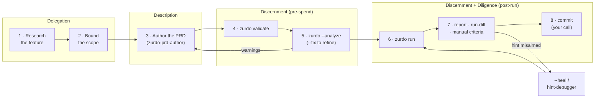

# How to use zurdo effectively
{: .no_toc }

Zurdo automates the loop, not the thinking. The teams that get the most out of it treat a run as the *last* step of a pipeline — research first, scope second, an evidence-first PRD third, cheap checks fourth, and only then tokens. This page walks that pipeline end to end, framed with the 4D model from Anthropic's [AI Fluency course](https://www.anthropic.com/ai-fluency): **Delegation** (deciding what to hand to the AI), **Description** (communicating it precisely), **Discernment** (evaluating what comes back), and **Diligence** (staying accountable for the result).

1. TOC
{:toc}

## The pipeline at a glance



Steps 1–5 cost nothing or almost nothing. Step 6 is where tokens are spent — everything before it exists to make that spend land.

## Step 1 — Research the feature (Delegation: problem awareness)

Before anything touches a PRD, understand what you're actually building. Read the code the feature will live in. Find the seams it crosses — which modules, which tests, which configs. Decide what "done" observably looks like: which command exits zero, which endpoint returns what, which file must contain which line.

This is the Delegation question from AI Fluency: *what part of this work belongs to the AI, and what part belongs to you?* The split for zurdo is crisp:

- **Yours:** deciding *what* to build, *where* it goes, and *how you'll know it worked*. Zurdo cannot research your domain, and an agent guessing at intent produces plausible-looking wrong code that — without good criteria — passes nothing or, worse, passes vacuous checks.
- **The agent's:** producing the change that makes your checks go green.
- **Zurdo's:** running those checks and refusing to take the agent's word for it.

If you can't yet state a machine-checkable outcome, you're not done researching — you're still in design, and design is a conversation with your agent CLI directly, not a zurdo run.

## Step 2 — Bound the scope (Delegation: task delegation)

Turn the research into boundaries the loop can enforce:

- **Split by verifiable outcome, not by file.** Each task should have criteria that can fail independently. A task whose only honest criterion is "the whole feature works" is really three tasks.
- **Wire the order with `Depends-on`.** Tasks run sequentially in dependency order; a failed task blocks its dependents rather than letting the agent build on sand.
- **Declare what must not change.** Paths the agent has no business touching — ADRs, lockfiles, generated code — go in `**Frozen**` (or run-wide in `[verification] protected_paths`). A frozen-path edit fails the iteration regardless of criteria.
- **Size the effort honestly.** `**Effort**` maps to a model via your `[effort_map]` — reserve `high` for tasks that need it, and give gnarly tasks a realistic `Max-Attempts` and `Agent-timeout` instead of hoping.

Scope creep in a PRD isn't just wasted tokens — it widens the blast radius you have to review at the end. Small, well-fenced tasks keep step 7 tractable.

## Step 3 — Author the PRD with the bundled skill (Description)

Description is where most agent-driven work fails: instructions that a human would fill in from context, an LLM fills in from imagination. Zurdo's answer is the PRD grammar — and the fastest way to a good one is the bundled `zurdo-prd-author` skill, installed by `zurdo init`. Invoke it from your agent CLI and it runs an **evidence-first interview**: it drafts the acceptance criteria *first*, derives tasks from them, renders the grammar, and pressure-tests every criterion until its hint actually verifies.

Evidence-first matters because it forces the three layers of description AI Fluency distinguishes:

| Layer                       | In a zurdo PRD                                                                                                    |
| --------------------------- | ------------------------------------------------------------------------------------------------------------------ |
| **Product** — what you want | `### Description` prose plus `### Requirements` (`req-*` ids the criteria can `[proves:]`).                        |
| **Process** — how to get there | Task decomposition, `Depends-on` order, `**Skills**` the agent should load, `**Frozen**` paths it must not touch. |
| **Performance** — how to behave | `**Effort**` (model tier), `Max-Attempts` (retry budget), `Agent-timeout` (patience).                            |

Two habits worth building, with or without the skill:

- **Write the hint before the criterion prose.** If you can't produce a `[shell:]`, `[http:]`, `[grep:]`, or `[file-exists:]` payload for it, it's either `[manual]` or it's not a criterion yet. The full menu is on the [Hints reference](hints.md).
- **Make criteria fail on the current tree.** A criterion that's already green before the agent runs proves nothing about the run — zurdo will flag it at pre-flight, but it's better authored out.

## Steps 4–5 — Validate and analyze before you spend (Discernment, pre-flight)

Discernment isn't only for outputs — evaluate your *input* while it's free:

```sh
zurdo validate prds/feature.md        # deterministic: grammar + dep-graph; instant, run constantly
zurdo --analyze prds/feature.md       # static hint lints + an LLM critique of the PRD itself
zurdo run prds/feature.md --analyze --fix   # iterative refinement loop → <prd>.proposed.md
```

`validate` catches structural errors (em-dash headings, hintless criteria, dangling `Depends-on`) instantly. `--analyze` catches the subtler failure mode: hints that *execute* but prove nothing — `[shell: true]`, grep tautologies, criteria too vague to verify — plus requirements no criterion covers. `--fix` turns the critique into an edit loop that converges on a tightened PRD, which you review and accept.

The discipline: **never pay for a run to discover what analysis would have told you.**

## Step 6 — Run the loop (Delegation, executed)

```sh
zurdo run prds/feature.md
```

Now the delegation happens for real: the agent works your tree, and after every iteration zurdo re-runs every hint itself — the agent's self-report is never consulted. Failed checks (with typed reasons and captured output) feed the retry prompt, so each iteration starts from evidence, not amnesia.

You don't need to babysit it, but the live narration rewards a glance: per-criterion pass/fail as it happens, token/cost tallies, and `already passed at pre-flight` tails on criteria that were green before the agent ran. Ctrl-C is safe — state is crash-safe and the next run resumes.

## Step 7 — Review the evidence (Discernment, post-run)

A green summary table is a claim; the evidence behind it is on disk. Discernment here has the same three layers as description did:

- **The product.** Read `.zurdo/<slug>/run-diff.patch` — the unified diff of everything the run changed. Criteria prove behavior; only a human reads for design, naming, and the change nobody asked for. `zurdo report prds/feature.md --format md` gives the curated per-task account.
- **The process.** Watch the `passed-at-preflight` tally (those criteria prove nothing about this run) and any `evidence-modified` warnings. If a task burned all its attempts, `.zurdo/<slug>/iterations/` holds every prompt and every byte of agent output — read the last failing iteration before blaming the agent or the PRD.
- **The performance.** `passed-pending-review` tasks are waiting on your `[manual]` sign-off — that status *is* the human checkpoint; don't rubber-stamp it.

When a criterion fails and you suspect the *hint* rather than the code — a moved file, a renamed symbol — the bundled `zurdo-hint-debugger` skill correlates the hint with the iteration logs, and `zurdo run <prd> --heal` proposes verified re-aims for failed grep hints. After any hand-edits or a rebase, `zurdo verify prds/feature.md` re-runs every terminal task's criteria against the current tree.

## Step 8 — Ship it yourself (Diligence)

Zurdo deliberately does **no git automation**: no auto-commit, no auto-branch, no auto-PR. That's not a missing feature — it's the accountability line. AI Fluency calls this Diligence: you are responsible for what you create with AI, and for being transparent about how it was made.

Concretely:

- **Nothing merges on zurdo's say-so.** The commit, the PR, and the review request are yours; a passing run is input to that decision, not a substitute for it.
- **Keep the receipts.** `.zurdo/<slug>/` is a complete audit trail — prompts, agent output, per-criterion verdicts, the run diff. In CI, capture `reports/*.json` and `iterations/*` as artifacts so post-mortems have evidence instead of vibes.
- **Be honest about the guardrails' limits.** Frozen-path enforcement is tamper-evident, not tamper-proof, and `[manual]` criteria are only as good as the human who checks them.

## A worked example, end to end

Everything above, applied once. The repo is an axum web service; the feature is rate-limiting its `/login` endpoint.

**Step 1 — Research.** Half an hour of reading, no zurdo involved. It turns up: middleware lives in `src/middleware/` and is registered in `src/app.rs`; integration tests drive the router with `tower::ServiceExt::oneshot`; config is centralized in `src/config.rs`; and ADR-011 already fixed the algorithm (fixed-window) — that decision is closed, not up for relitigating. "Done" becomes observable: the over-limit request returns 429, and a test proves it.

**Step 2 — Scope.** Two verifiable outcomes, so two tasks: the limiter middleware itself (provable by unit tests), and wiring it onto `/login` (provable by an integration test). The second gets `Depends-on: [task-limiter]` so it can't build on a broken limiter, and the ADR directory gets frozen so the agent can't "helpfully" update the record of a decision it didn't make.

**Step 3 — The PRD.** Hints first, prose after — every criterion below existed as a `[shell:]`/`[grep:]` payload before its sentence did:

```markdown
# PRD: Rate-limit the login endpoint

## Task: task-limiter — Fixed-window rate limiter middleware
**Effort**: medium
**Depends-on**: []
**Frozen**: docs/adr/*.md

### Requirements

- req-window: Requests above the per-IP limit within the window are rejected.
- req-configurable: Limit and window come from AppConfig, not hard-coded values.

### Description

Add a fixed-window rate limiter as tower middleware in
src/middleware/rate_limit.rs, following the shape of the existing middleware
in that directory. Per-IP counters; limit and window sourced from AppConfig
(src/config.rs). ADR-011 fixes the algorithm choice — do not revisit it.

### Acceptance Criteria

- [ ] limiter unit tests pass [shell: cargo test rate_limit::] [proves:req-window]
- [ ] limit is read from config [grep: rate_limit in src/config.rs] [proves:req-configurable]
- [ ] window is not hard-coded [no-grep: Duration::from_secs\(60\) in src/middleware/rate_limit.rs] [proves:req-configurable]

## Task: task-wire-login — Apply the limiter to /login
**Effort**: low
**Depends-on**: [task-limiter]

### Requirements

- req-429: A client exceeding the limit on /login receives HTTP 429.

### Description

Wire the rate_limit middleware onto the /login route in src/app.rs. Add an
integration test in tests/login_rate_limit.rs that drives the router with
tower::ServiceExt::oneshot and asserts the over-limit response is 429 with a
Retry-After header.

### Acceptance Criteria

- [ ] over-limit login returns 429 [shell: cargo test --test login_rate_limit] [proves:req-429]
- [ ] workspace still green [shell: cargo test --workspace]
- [ ] rate-limit error copy approved by product [manual]
```

**Steps 4–5 — Validate and analyze.** `zurdo validate` fails instantly on the first save — the editor had autocorrected the task heading's em-dash to an en-dash — and passes once fixed. `zurdo --analyze` then earns its keep twice on the first draft (which differed from the PRD above): a static lint flagged `[grep: .* in src/app.rs]` as a tautology that matches anything, and the LLM critique flagged `req-configurable` as declared but proved by nothing. The tautology became the `--test login_rate_limit` shell hint; the uncovered requirement became the `[grep:]`/`[no-grep:]` pair on `src/config.rs` and the middleware file. Total cost so far: one analyze call.

**Step 6 — The run.** `zurdo run prds/rate-limit-login.md`. The first iteration of `task-limiter` is instructive — the agent wrote a working limiter but hard-coded the window:

```
─── task-limiter: Fixed-window rate limiter middleware ─── effort=medium, deps=[]
  → iteration 1 of 5
  ✓ agent completed: exit=0, 3m 51s
  → running 3 criteria
    ✓ shell: cargo test rate_limit:: (9.2s)
    ✓ grep: rate_limit in src/config.rs
    ✗ no-grep: Duration::from_secs\(60\) in src/middleware/rate_limit.rs
      pattern found — window is hard-coded
  iteration 1: 2/3 criteria passed; will retry
  → iteration 2 of 5
  ...
  ✓ task-limiter: passed in 2 iterations (7m 03s)
```

The retry prompt carried that failure verbatim, so iteration 2 fixed the actual defect instead of guessing. Note what did *not* happen: the agent's own claim of success after iteration 1 was never consulted — the `no-grep` hint caught what a self-report would have waved through.

**Step 7 — Review.** The summary shows `task-limiter passed` and `task-wire-login passed-pending-review` — the `[manual]` criterion is holding the door. Reading `.zurdo/<slug>/run-diff.patch` takes five minutes because the scope was fenced in step 2: two new files, two touched ones, no drive-by edits, ADRs untouched. The error copy gets an actual look (it was wrong — "try again later" with no `Retry-After` mention — one small hand-edit), then `zurdo verify prds/rate-limit-login.md` confirms every criterion still passes against the edited tree.

**Step 8 — Ship.** A branch, a commit, a PR with a human-written description — none of it zurdo's doing, all of it informed by evidence zurdo left on disk.

## The habits, in one table

| AI Fluency "D" | Pipeline steps | The habit                                                                                       |
| -------------- | -------------- | ------------------------------------------------------------------------------------------------ |
| Delegation     | 1–2            | Research first; give the loop verifiable outcomes, keep design and judgment for yourself.        |
| Description    | 3              | Author evidence-first with `zurdo-prd-author`; write the hint before the criterion prose.        |
| Discernment    | 4–5, 7         | `validate` and `--analyze` before spending; read the diff and the provenance flags after.        |
| Diligence      | 8              | You commit, you review, you answer for it — zurdo just makes sure the evidence is real.          |

Next: [Writing PRDs](writing-prds.md)
