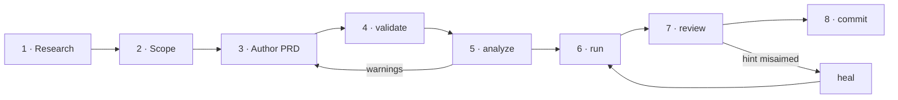

---
# Page settings
layout: default

# Hero section
title: Effective use
description: "The research → PRD → run pipeline, framed with Anthropic's AI Fluency 4Ds."

# Page navigation
page_nav:
    prev:
        content: The operating rhythm
        url: '/docs/workflow.html'
    next:
        content: Writing PRDs
        url: '/docs/writing-prds.html'

# Mermaid diagrams on this page
mermaid: true
---

Zurdo automates the loop, not the thinking. A run should be the *last* step: research first, then scope, then an evidence-first PRD, then cheap checks, and only then tokens. This page follows that pipeline using the 4D model from Anthropic's [AI Fluency course](https://www.anthropic.com/ai-fluency).

<div class="lp-cards" markdown="1">
<div markdown="1">
**Delegation**
Decide what to hand to the AI.
</div>
<div markdown="1">
**Description**
Say it precisely.
</div>
<div markdown="1">
**Discernment**
Evaluate what comes back.
</div>
<div markdown="1">
**Diligence**
Stay accountable for the result.
</div>
</div>

## The pipeline at a glance


```mermaid
flowchart LR
    R1["1 · Research"] --> R2["2 · Scope"] --> R3["3 · Author PRD"] --> R4["4 · validate"] --> R5["5 · analyze"]
    R5 -->|warnings| R3
    R5 --> R6["6 · run"] --> R7["7 · review"] --> R8["8 · commit"]
    R7 -->|hint misaimed| H["heal"] --> R6
```

Steps 1–2 are Delegation, 3 is Description, 4–5 and 7 are Discernment, and 8 is Diligence. Steps 1–5 cost little or nothing. Tokens are spent in step 6, and everything before it exists to make that spend land.

## Step 1 — Research (Delegation)

Read the code the feature will live in. Find the modules, tests, and configs it crosses. Then decide what "done" looks like in a form a machine can check: which command exits zero, which endpoint returns what, which file contains which line.

| Who | Owns |
| --- | --- |
| **You** | *What* to build, *where* it goes, and *how you'll know it worked* |
| **The agent** | Producing the change that turns your checks green |
| **Zurdo** | Running those checks and refusing to take the agent's word for it |

If you can't state an outcome a machine can check yet, you're still in design. Design is a conversation with your agent CLI, not a zurdo run.

## Step 2 — Scope (Delegation)

- **Split by verifiable outcome, not by file.** Each task needs criteria that can fail on their own. "The whole feature works" is really three tasks.
- **Order with `Depends-on`.** A failed task blocks its dependents, so nothing builds on a broken base.
- **Freeze what must not change.** Put ADRs, lockfiles, and generated code in `**Frozen**` or `[verification] protected_paths`.
- **Size effort honestly.** `**Effort**` picks the model through `[effort_map]`. Give hard tasks a realistic `Max-Attempts` and `Agent-timeout`.

Small, well-fenced tasks keep the step 7 review manageable.

## Step 3 — Author the PRD (Description)

Run the bundled `zurdo-prd-author` skill (installed by `zurdo init`) from your agent CLI. It interviews you with evidence first: it drafts the criteria, derives tasks from them, and pressure-tests every hint until it truly verifies. If the repo has a [lesson library](reason.md), it consults that too.

| Layer | In a zurdo PRD |
| --- | --- |
| **Product:** what you want | `### Description` + `### Requirements` (`req-*` ids that criteria can `[proves:]`) |
| **Process:** how to get there | Tasks, `Depends-on`, `**Skills**`, `**Frozen**` |
| **Performance:** how to behave | `**Effort**`, `Max-Attempts`, `Agent-timeout` |

Two habits:

- **Write the hint before the criterion prose.** No `[shell:]`, `[http:]`, `[grep:]`, or `[file-exists:]` payload means it's `[manual]` or not a criterion yet. See the [Hints reference](hints.md). Use [structural hints](lumen.md) for "this code is actually wired in", and let the agent [query the index over MCP](mcp.md).
- **Make criteria fail on the current tree.** A criterion that's green before the run proves nothing. Zurdo flags it at pre-flight, but it's better to write it out of the PRD.

## Steps 4–5 — Validate and analyze (Discernment, pre-spend)

```sh
zurdo validate prds/feature.md        # grammar + dependency graph; instant, run constantly
zurdo analyze prds/feature.md         # static hint lints + an LLM critique of the PRD
zurdo analyze prds/feature.md --fix   # refinement loop → <prd>.proposed.md
```

<figure class="lp-terminal" aria-label="zurdo validate catching an en-dash heading and an already-passing grep criterion">
<div class="lp-terminal__bar"><span class="lp-terminal__dots" aria-hidden="true"><i></i><i></i><i></i></span><span class="lp-terminal__title">zurdo validate</span></div>
<pre class="lp-terminal__body"><code><span class="t-dim">$</span> zurdo validate prds/bad.md
<span class="t-bad">prds/bad.md:14: task heading uses en-dash (U+2013) where an em-dash (U+2014) is required</span>
<span class="t-dim">$ echo $?</span>
2
<span class="t-dim">$</span> zurdo validate prds/greeter.md
<span class="t-warn">prds/greeter.md:12: warning: task `task-greet` grep pattern `hello` already matches `main.rs` in the current working tree — the criterion may not prove the change</span>
<span class="t-ok">OK</span></code></pre>
<figcaption class="lp-terminal__caption"><span class="lp-dot" aria-hidden="true"></span>Free and instant. It catches grammar errors and criteria that already pass.</figcaption>
</figure>

`analyze` catches hints that run but prove nothing (`[shell: true]`, grep tautologies, vague criteria) and requirements that no criterion covers. `--fix` turns the critique into an edit loop, and you review the proposed PRD before accepting it.

**Never pay for a run to discover what analysis would have told you.**

## Step 6 — Run (Delegation, executed)

```sh
zurdo run prds/feature.md
```

The agent works on your tree. After every iteration, zurdo re-runs every hint itself. Failing checks, with their reasons and output, go into the retry prompt. Watch the live narration for per-criterion results, cost tallies, and `already passed at pre-flight` flags. Ctrl-C is safe: the next run resumes.

## Step 7 — Review the evidence (Discernment, post-run)

A green summary is a claim. The evidence is on disk.

- **Product.** Read `.zurdo/<slug>/run-diff.patch`. Criteria prove behavior, but only you can judge design, naming, and the change nobody asked for. For a per-task account, run `zurdo report <prd> --format md`.
- **Process.** Check the `passed-at-preflight` tally and any `evidence-modified` warnings. If a task used up its attempts, read the last failing iteration in `iterations/` before you blame anyone.
- **Performance.** `passed-pending-review` is your checkpoint, so don't rubber-stamp it. [`zurdo review`](usage.md#reviewing-a-run-with-zurdo-review) shows each `[manual]` criterion next to its evidence and logs your sign-off.

If you suspect the *hint*, not the code, use the `zurdo-hint-debugger` skill or `zurdo heal <prd>`, which proposes verified re-aims for failed grep hints. After hand edits or a rebase, `zurdo verify <prd>` re-checks every finished task against the current tree.

## Step 8 — Ship it yourself (Diligence)

Zurdo does **no git automation**. That's deliberate: it marks where your accountability starts.

- **Nothing merges on zurdo's say-so.** The commit, PR, and review request are yours.
- **Keep the receipts.** `.zurdo/<slug>/` holds the full audit trail. In CI, save `reports/*.json` and `iterations/*` as artifacts.
- **Know the limits.** Frozen paths are tamper-evident, not tamper-proof. A `[manual]` criterion is only as good as the person who checks it.

## A worked example, end to end

The repo is an axum web service, and the feature rate-limits `/login`.

| Step | What happened |
| --- | --- |
| **1 · Research** | Half an hour of reading. Middleware lives in `src/middleware/` and is registered in `src/app.rs`. Tests use `tower::ServiceExt::oneshot`. ADR-011 already chose fixed-window. Done means the over-limit request returns 429 and a test proves it. |
| **2 · Scope** | Two tasks: `task-limiter`, proven by unit tests, and `task-wire-login`, proven by an integration test, which depends on the first. `docs/adr/*.md` is frozen. |
| **3 · PRD** | Every hint was written before its sentence (full PRD below). |
| **4–5 · Check** | `validate` caught an en-dash heading. `analyze` flagged `[grep: .* in src/app.rs]` as a tautology and `req-configurable` as proven by nothing. Both were fixed for the cost of one analyze call. |
| **6 · Run** | Iteration 1 hard-coded the window. The `no-grep` hint caught it, and iteration 2 fixed it (output below). |
| **7 · Review** | `task-wire-login` sat at `passed-pending-review`. `zurdo review` showed the scope held: two new files, two touched, ADRs untouched. The error copy needed one hand edit. `zurdo verify` re-confirmed, then the sign-off flipped the task to `passed`. |
| **8 · Ship** | A branch, a commit, and a PR description you write yourself, informed by the evidence zurdo left. |

```
─── task-limiter: Fixed-window rate limiter middleware ─── effort=medium, deps=[]
  → iteration 1 of 5
  ✓ agent completed: exit=0, 3m 51s
  → running 3 criteria
    ✓ shell: cargo test rate_limit:: (9.2s)
    ✓ grep: rate_limit in src/config.rs
    ✗ no-grep: Duration::from_secs\(60\) in src/middleware/rate_limit.rs
      pattern found — window is hard-coded
  iteration 1: 2/3 criteria passed; will retry
  → iteration 2 of 5
  ...
  ✓ task-limiter: passed in 2 iterations (7m 03s)
```

The agent reported success after iteration 1, and zurdo never consulted that claim. The retry prompt carried the exact failure, so iteration 2 fixed the real defect.

<details markdown="1">
<summary>The full PRD</summary>

```markdown
# PRD: Rate-limit the login endpoint

## Task: task-limiter — Fixed-window rate limiter middleware
**Effort**: medium
**Depends-on**: []
**Frozen**: docs/adr/*.md

### Requirements

- req-window: Requests above the per-IP limit within the window are rejected.
- req-configurable: Limit and window come from AppConfig, not hard-coded values.

### Description

Add a fixed-window rate limiter as tower middleware in
src/middleware/rate_limit.rs, following the shape of the existing middleware
in that directory. Per-IP counters; limit and window sourced from AppConfig
(src/config.rs). ADR-011 fixes the algorithm choice — do not revisit it.

### Acceptance Criteria

- [ ] limiter unit tests pass [shell: cargo test rate_limit::] [proves:req-window]
- [ ] limit is read from config [grep: rate_limit in src/config.rs] [proves:req-configurable]
- [ ] window is not hard-coded [no-grep: Duration::from_secs\(60\) in src/middleware/rate_limit.rs] [proves:req-configurable]

## Task: task-wire-login — Apply the limiter to /login
**Effort**: low
**Depends-on**: [task-limiter]

### Requirements

- req-429: A client exceeding the limit on /login receives HTTP 429.

### Description

Wire the rate_limit middleware onto the /login route in src/app.rs. Add an
integration test in tests/login_rate_limit.rs that drives the router with
tower::ServiceExt::oneshot and asserts the over-limit response is 429 with a
Retry-After header.

### Acceptance Criteria

- [ ] over-limit login returns 429 [shell: cargo test --test login_rate_limit] [proves:req-429]
- [ ] workspace still green [shell: cargo test --workspace]
- [ ] rate-limit error copy approved by product [manual]
```

</details>

## The habits, in one table

| AI Fluency "D" | Steps | The habit |
| --- | --- | --- |
| Delegation | 1–2 | Research first. Give the loop outcomes it can verify, and keep the judgment calls yourself. |
| Description | 3 | Write evidence first with `zurdo-prd-author`, with the hint before the prose |
| Discernment | 4–5, 7 | `validate` and `analyze` before you spend, then read the diff and provenance after |
| Diligence | 8 | You commit and you answer for it. Zurdo makes sure the evidence is real. |

Next: [Writing PRDs](writing-prds.md)
