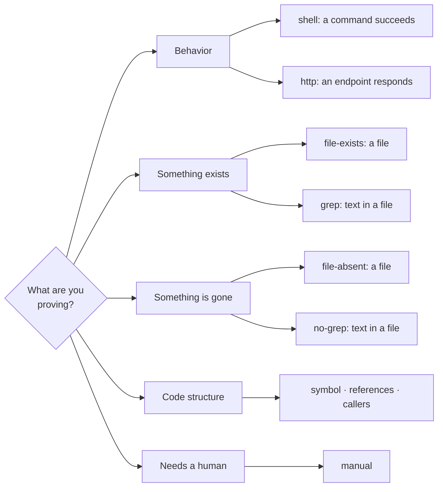

---
# Page settings
layout: default

# Hero section
title: Hints reference
description: "The seven core hint types and the three structural hints, with examples."

# Page navigation
page_nav:
    prev:
        content: Writing PRDs
        url: '/docs/writing-prds.html'
    next:
        content: Structural verification
        url: '/docs/lumen.html'

# Mermaid diagrams on this page
mermaid: true
---

A hint is the machine-checkable part of an acceptance criterion. After every agent iteration, zurdo runs each hint itself and decides pass or fail. The agent's opinion is never consulted.

## Picking a hint



## The seven core hint types

| Hint | Passes when | Example |
| --- | --- | --- |
| `[shell: <cmd>]` | The command exits `0` **and** its output doesn't show a test runner that ran zero tests ([below](#a-shell-hint-that-runs-no-tests-fails)). It runs in the repo root. | `[shell: cargo test --workspace]` |
| `[http: <method> <url> -> <status>]` | The response status matches | `[http: GET http://localhost:8080/health -> 200]` |
| `… contains "<substring>"` | The status matches **and** the body contains the substring (literal, case-sensitive). A non-empty `contains` on `HEAD` always fails. | `[http: GET http://localhost:8080/health -> 200 contains "\"status\":\"ok\""]` |
| `[file-exists: <path>]` | A file exists at the path, relative to the repo root | `[file-exists: target/debug/zurdo]` |
| `[file-absent: <path>]` | **No** file exists at the path, relative to the repo root | `[file-absent: config/legacy.toml]` |
| `[grep: <pattern> in <file>]` | The regex is found in the file | `[grep: Health check in docs/runbook.md]` |
| `[no-grep: <pattern> in <file>]` | The file is readable and the regex is **not** found. A missing or unreadable file **fails**. | `[no-grep: TODO in src/main.rs]` |
| `[manual]` | Never machine-checked. It records an obligation for human review. | `[manual]` |

In a PRD, hints go at the end of the criterion line:

```markdown
- [ ] cargo test passes [shell: cargo test --workspace]
- [ ] /health reports ok [http: GET http://localhost:8080/health -> 200 contains "\"status\":\"ok\""]
- [ ] design review signed off [manual]
```

## Combining hints

Multiple hints on one criterion are combined with **AND**: every one must pass.

```markdown
- [ ] the build succeeds and emits the binary [shell: cargo build] [file-exists: target/debug/zurdo]
```

- **`[manual]` mixed with automated hints.** The automated hints still gate the criterion. The manual part adds a review obligation to reports, which you settle with an explicit sign-off in the [`zurdo review` TUI](usage.md#reviewing-a-run-with-zurdo-review).
- **All `[manual]`.** A task whose criteria are *all* `[manual]` goes straight to `passed-pending-review` at pre-flight and never invokes the agent.

## A `[shell:]` hint that runs no tests fails

An exit code of `0` isn't proof on its own. `cargo test <filter matching nothing>` exits `0` without running anything. Without a guard, a criterion aimed at a test nobody wrote would pass. So zurdo fails any `[shell:]` hint whose combined stdout and stderr show a **test runner reporting zero tests**, whatever the exit code. The typed reason is `a test runner ran zero tests`.

<figure class="lp-terminal" aria-label="A shell hint whose cargo test filter matched no tests fails despite exit 0">
<div class="lp-terminal__bar"><span class="lp-terminal__dots" aria-hidden="true"><i></i><i></i><i></i></span><span class="lp-terminal__title">zurdo run prds/empty.md</span></div>
<pre class="lp-terminal__body"><code><span class="t-dim">─── task-login: Reject a missing password ─── effort=low, deps=[]</span>
  <span class="t-acc">→</span> iteration 1 of 1 <span class="t-dim">(max-attempts=1, agent-timeout=30m 00s)</span>
  <span class="t-ok">✓</span> agent completed: exit=0, 56ms
    <span class="t-bad">✗</span> shell: cargo test login_rejects_missing_password <span class="t-dim">(57ms)</span>
      <span class="t-dim">stdout tail:</span>
      <span class="t-dim">running 0 tests</span>
      <span class="t-dim">test result: ok. 0 passed; 0 failed; 0 ignored; 0 measured; 0 filtered out</span>
  <span class="t-bad">✗ task-login: failed in 1 iterations</span> <span class="t-dim">(56ms)</span></code></pre>
<figcaption class="lp-terminal__caption"><span class="lp-dot" aria-hidden="true"></span>cargo reported "ok" and exited 0, but it ran no tests, so the criterion fails. prd.json records failure_reason: empty_test_run.</figcaption>
</figure>

| Runner | Counts as "zero tests" | Doesn't count |
| --- | --- | --- |
| **libtest** (`cargo test`, `cargo bench --test`) | `running N tests` reports with no `N ≥ 1` line. Also a run whose only selected tests were `#[ignore]`d: every `test result:` line shows `0 passed` and no failures, and at least one shows a nonzero `ignored` count. | One target of a workspace sweep that passes for real, even if another reports ignored tests |
| **`go test`** | A package line ending `[no tests to run]` | A `[no test files]` package line: that's not a report at all |

- **Full capture.** The check reads the untruncated output. One real `running 1 test` among hundreds of zero-test reports still passes.
- **Everywhere criteria run:** pre-flight, every iteration, `zurdo verify`, and `zurdo heal`.
- **Not matched:** `cargo nextest` and the JS runners, because their output wasn't captured when the check was designed. `pytest` needs no matcher, because it already exits `5` on an empty filter.
- **Escape hatch.** If a criterion genuinely wants a zero-test run to pass, redirect its output (`… > /dev/null`). Do it deliberately: the [`discarded-evidence`](#the-warn-lint-families) lint flags that shape on `cargo test` and `go test` hints, because it blinds this check.

<div class="callout callout--warning" markdown="1">
**Why this exists** One milestone's worth of zurdo's own PRD tasks once recorded themselves as passed against `[shell: cargo test <name>]` criteria naming tests nobody had written. All four passed at pre-flight with zero agent attempts, and a release shipped claiming flags the binary didn't have. This check and the [run-end vacuous-pass warning](usage.md#when-a-task-passes-without-doing-anything) are the two guards that came out of it.
</div>

## Timeouts

| Hint | Time limit |
| --- | --- |
| `shell:`, `http:` | `[timeouts] criterion_seconds` in config (default 300s) |
| `shell:` with a trailing `timeout:<N>` (unit `s`, `m`, or `h`) | That value, for this hint only |
| File and grep hints | None. They're local checks. |

```markdown
- [ ] the integration suite passes [shell: cargo test --test integration timeout:10m]
```

Only `[shell:]` accepts `timeout:`. `[http: GET … -> 200 timeout:5s]` is a parse error (`malformed http hint`, exit `2`). For a slow HTTP check, raise `timeouts.criterion_seconds` instead.

<div class="callout callout--info" markdown="1">
**Not hints** `timeout:<duration>`, `contains "<substring>"`, and `[proves:<req-id>]` use the same bracket grammar but are modifiers. None of them runs a check on its own. A criterion carrying only `[proves:req-a]` still fails validation with *criterion has no hints*.
</div>

## Regex semantics for `[grep:]` / `[no-grep:]`

Patterns use Rust `regex` syntax in **multi-line mode**: `^` and `$` anchor at line boundaries, like command-line `grep`. `[grep: ^## Heading in doc.md]` passes if any line starts with the heading. An explicit `(?m)` prefix still works but isn't needed. These semantics apply everywhere a pattern is evaluated: the run-time verifier, the `validate` and `analyze` grep lints, and `heal` verification. What you see at authoring time matches what happens at run time.

<details markdown="1">
<summary>Upgrading from v1.1.x</summary>

Patterns used to anchor to the start and end of the entire file. An anchored `[no-grep:]` hint that passed under the old semantics may now fail: that's the check finally seeing the line it was aimed at. Patterns without anchors are unaffected.

</details>

## Prefer absence hints over shell negation

To assert that something is *gone*, use `[file-absent:]` or `[no-grep:]`. `[no-grep:]` deliberately **fails** when the file can't be read, so a mistyped filename can't make the criterion pass.

Don't use `!` in a shell hint for this. A misplaced `!`, a quoting slip, or a missing command silently flips the exit code, and the criterion *always passes*.

```markdown
# ✓ correct — file removal task
- [ ] legacy config is deleted [file-absent: config/legacy.toml]
- [ ] TODO is removed from main module [no-grep: TODO in src/main.rs]

# ✗ avoid — silent failures hide bugs
- [ ] legacy config is deleted [shell: ! test -e config/legacy.toml]
- [ ] TODO is removed from main module [shell: ! grep -q TODO src/main.rs]
```

## Beware vacuous hints and tautologies

<div class="lp-cards" markdown="1">
<div markdown="1">
**Vacuous shell hints**
`[shell: true]` and `[shell: echo "works"]` always pass. They verify no work.
</div>
<div markdown="1">
**Grep tautologies**
`[grep: .* in src/main.rs]` matches everything. `[no-grep: ^$ in src/main.rs]` fails tautologically.
</div>
<div markdown="1">
**Doc echoes**
The only hint greps a prose doc for a phrase the criterion itself names. Writing the phrase is the task, so the criterion can't fail. It proves the phrase was typed, not that anything works.
</div>
</div>

### The warn-lint families

Ten deterministic lint families catch criteria that can't fail, can't be satisfied, or can't be trusted. `zurdo validate` prints nine of them as `warning:` lines on stderr. `zurdo analyze` reports all ten as `Finding`s at warning severity; the tenth, `unaddressed-lesson`, is `analyze`-only.

<figure class="lp-terminal" aria-label="zurdo validate warnings for vacuous-shell, grep-tautology, doc-echo, uncovered-requirement, cached-verification, and discarded-evidence">
<div class="lp-terminal__bar"><span class="lp-terminal__dots" aria-hidden="true"><i></i><i></i><i></i></span><span class="lp-terminal__title">zurdo validate</span></div>
<pre class="lp-terminal__body"><code><span class="t-warn">prds/docs.md:15: warning:</span> task `task-1` shell hint `true` is a no-op and proves nothing about its criterion
<span class="t-warn">prds/docs.md:16: warning:</span> task `task-1` grep pattern `hello` already matches `main.rs` in the current working tree — the criterion may not prove the change
<span class="t-warn">prds/docs.md:17: warning:</span> task `task-1` criterion's only proof greps `README.md` for `Usage section`, a phrase the criterion itself names — the agent satisfies it by writing the phrase
<span class="t-warn">prds/docs.md:9: warning:</span> task `task-1` requirement `req-ci` is not proven by any criterion
<span class="t-warn">neg.md:14: warning:</span> task `task-1` shell hint `go test ./...` invokes `go test` with no cache-defeating flag; a replayed result can pass a criterion the current tree does not satisfy — add `-count=1`
<span class="t-warn">neg.md:13: warning:</span> task `task-1` shell hint `cargo test > /dev/null` discards stdout; `EmptyTestRun` cannot evaluate it — drop the redirect and let a `grep -q` sentinel carry the assertion in the pipeline's exit status</code></pre>
<figcaption class="lp-terminal__caption"><span class="lp-dot" aria-hidden="true"></span>Output from two PRDs. Warnings don't fail validation unless you pass --strict.</figcaption>
</figure>

Rows are in the order `validate` emits them:

| Family                  | Fires when                                                                                             | `--strict` promotes? |
| ----------------------- | -------------------------------------------------------------------------------------------------------- | ------------------------- |
| `skill-resolution`      | A PRD-referenced skill can't be resolved.                                                               | No. Permanently exempt: skills are user-managed, so a CI checkout can legitimately lack them. |
| `grep-target`           | A `[grep:]` or `[no-grep:]` pattern targets a directory or doesn't compile.                                | Yes                       |
| `vacuous-shell`         | A `[shell:]` payload can't fail (`true`, a bare `echo`, …).                                             | Yes                       |
| `grep-tautology`        | A `[grep:]` pattern already matches its target, so the criterion is green before any work. This includes patterns whose regex metacharacters *hide* the tautology: `diff_names_tree(repo_root)` searches for a capture group, not the literal call. The warning names the characters to escape. | Yes |
| `frozen-overlap`        | The evidence path of a `[grep:]`, `[no-grep:]`, `[file-exists:]`, or `[file-absent:]` hint matches a `**Frozen**` or `[verification] protected_paths` glob, and the hint doesn't already hold. The agent can't satisfy it without tripping the frozen-path guard. | Yes |
| `doc-echo`              | A criterion's only hint greps a prose doc for a phrase the criterion itself names. A prose doc is a file with extension `md`, `mdx`, `markdown`, `rst`, or `adoc`, or any path starting `docs/`. | Yes |
| `uncovered-requirement` | A declared `### Requirements` id isn't covered by any `[proves:]` criterion.                                       | Yes                       |
| `discarded-evidence`    | A `[shell:]` hint running `cargo test` or `go test` throws stdout away (`>/dev/null`, `&>/dev/null`, `1>/dev/null`). That leaves the [empty-test-run check](#a-shell-hint-that-runs-no-tests-fails) nothing to read. A bare `2>/dev/null` is fine. | No, pending field data |
| `cached-verification`   | A `[shell:]` hint runs a test runner that caches *results* without the flag that defeats the cache (`go test` without `-count=N`), so a replayed report can pass a criterion the current tree fails. `cargo test` caches compilation only and isn't flagged. | No, pending field data |
| `unaddressed-lesson`    | A [lesson with a `requires` obligation](reason.md#obligations-lessons-that-bind-future-prds) applies to this PRD and no criterion satisfies it. **`zurdo analyze` only.** | No. The obligations are repository-specific. |

`zurdo validate --strict` turns the six promotable families into validation errors, so a PRD that would otherwise pass with warnings exits `2`. See [CI integration](usage.md#ci-integration).

**Clearing a `doc-echo`.** The warning suggests two fixes:
- pin a **constant the change introduces**, not the prose describing it
- add a **second hint that checks the behavior**, so the criterion doesn't rest on the grep alone

The lint already skips:
- patterns with a constant anchor: a digit, `/`, `_`, `::`, a `.` before an alphanumeric, a backtick, or a leading `-`
- patterns containing any regex metacharacter, because a hand-built pattern is deliberate precision, not an echo
- a task where another criterion carries a `[no-grep:]` against the same file, because that remove-old-text, add-new-text pair can't pass without a real edit

**`frozen-overlap`** catches a conflict that would otherwise show up only as failed iterations at run time. A guard that already holds today isn't reported (for example, a `[no-grep:]` whose pattern is already absent).

**Not sure a hint proves anything?** Run `zurdo analyze <prd> --static-only`. It runs every family above before you spend compute on a real run. If the PRD's work has already shipped, use [`zurdo validate --authoring-state`](commands.md#zurdo-validate---authoring-state) instead, because against `HEAD` every grep reads as a tautology.

## Structural hints

Three more hint types check facts about **named code symbols** (existence, references, and calls) by static analysis instead of shell commands. They resolve against **Lumen**, zurdo's structural index at `.zurdo/lumen/`, and need one config switch: `[lumen] enabled = true`.

```
[symbol: <kind> <qualified-name> in <file>]
[references: <kind> <qname> in <file> within <kind> <qname> in <file>]
[callers: <kind> <qname> in <file> within <kind> <qname> in <file>]
```

| Hint            | Proves                                                                                                     |
| --------------- | ----------------------------------------------------------------------------------------------------------- |
| `[symbol:]`     | A **definition** of that kind and qualified name exists in exactly that file. A use site or import doesn't count. |
| `[references:]` | The target symbol is referenced **inside** the enclosing symbol named by `within`. The occurrence is bound deterministically through lexical scope and static imports, so a same-named symbol from another module doesn't count. |
| `[callers:]`    | Stronger than `[references:]`: the bound target is in the **callee position of a call expression** inside the enclosing symbol. Passing the function as a value doesn't count. |

```markdown
- [ ] limiter type is defined [symbol: struct RateLimiter in src/middleware/rate_limit.rs]
- [ ] app wires the limiter [callers: method RateLimiter::layer in src/middleware/rate_limit.rs within function build_router in src/app.rs]
- [ ] config reaches the limiter [references: struct AppConfig in src/config.rs within struct RateLimiter in src/middleware/rate_limit.rs]
```

- **Eleven kinds:** `function`, `method`, `type`, `class`, `struct`, `enum`, `interface`, `trait`, `module`, `constant`, and `variable`. Each language maps its constructs onto these. `type` means a type *alias* only, so Go's `type Foo struct` is a `struct`.
  - Naming the wrong kind fails, and the diagnostic shows the candidate's actual kind.
  - The index also records four kinds no hint can name: `enum-variant`, `field`, `macro`, and `alias`. They appear in `zurdo lumen query` output and wrong-kind diagnostics; see [hint kinds vs recorded kinds](lumen.md#what-resolves-per-language).
  - `zurdo lumen query --name <name>` prints the exact kind and qualified name to put in a hint.
- **Qualified names use `::`** as the owner separator in every language (`Config::load`). Top-level names are unqualified, and top-level occurrences bind to the file's `module` symbol (`within module main in src/main.rs`).
- **Paths are exact and repo-relative.** No globs, no directory scopes, and no inferring a file from a module name. `within` is required on `[references:]` and `[callers:]`, and rejected on `[symbol:]`.
- **Resolution must be unique.** Zero candidates fails with "not found". Several candidates fail with the list. Dynamic dispatch, trait objects, and macro-generated names fail as ambiguous rather than guessing, so a structural hint never false-passes.
- **Typed results.** Failures are `symbol_unresolved` or `binding_unresolved`. Passing verdicts record the resolved identity and source span in `prd.json` and in the report's `structural_verdicts`.

**Languages:** Rust, Python, Go, TypeScript, and JavaScript (including TSX and JSX).
- **Current tree.** Structural hints check the current working tree, so a task can satisfy its own structural criteria in the same run.
- **Evidence paths.** Their target files count as evidence paths, so frozen-overlap lints and evidence-modified warnings apply.
- **More detail.** How the index works, which constructs resolve in each language, the Vela watcher, and troubleshooting are all on [Structural verification](lumen.md).

<details markdown="1">
<summary>Upgrading from ≤ 1.8</summary>

These hints left `[experimental]` in v1.9.0. `[experimental] structural_hints` is deprecated and ignored. Old configs still load, but the setting decides nothing and prints a warning on stderr at config load. `[lumen] enabled = true` is now the only switch, and the old "can't enable structural hints with Lumen off" config-load error is gone.

</details>

## Writing hints that hold up

- **Check behavior, not side details.** `[file-exists: README.md]` passes on almost any repo. `[shell: cargo test --workspace]` proves the work.
- **Make each criterion checkable on its own.** If a hint needs a running server, say so in the task's Description so the agent starts it, or pick a hint that doesn't.
- **Let failures explain themselves.** Prefer `[shell: cargo test auth::token_expiry]` over one giant `[shell: ./check-everything.sh]`. Per-criterion results then tell you *what* broke.
- **Use `[manual]` honestly.** It carries no machine signal. It exists to put a human-review obligation on the record, not to make a task pass. You settle it with a logged sign-off in `zurdo review` that can't be undone.
