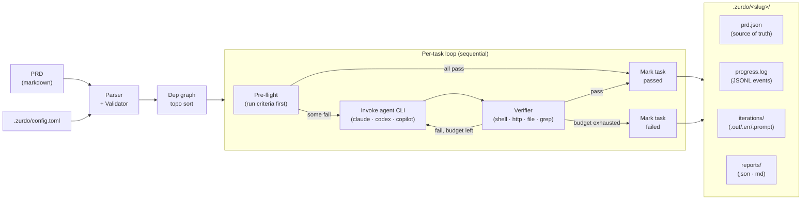

# How it works
{: .no_toc }

1. TOC
{:toc}

## The verification loop

Zurdo parses your PRD into a dependency-ordered list of tasks and runs them **sequentially**. Each task goes through the same loop:

1. **Pre-flight.** Before invoking any agent, zurdo runs the task's acceptance criteria against the working tree as-is. The per-criterion verdicts are recorded once in `prd.json` (`preflight_results`) — this "iteration 0" snapshot is what later separates *the agent made this true* from *this was already true*. If everything already passes, the task is marked done without spending a single token. A task whose criteria are *all* `[manual]` short-circuits here to `passed-pending-review` and never invokes the agent.
2. **Agent iteration.** Zurdo renders a prompt from the task's description and shells out to your configured agent CLI (`claude`, `codex`, or `copilot`). The agent works directly against your working tree.
3. **Independent verification.** When the agent exits, zurdo runs **every** hint on every criterion itself — shell commands, HTTP probes, file checks, greps. The agent's own claims about what it did are never consulted. Frozen paths are checked here too: if the run's diff against the baseline touches a path frozen by `**Frozen**` metadata or `[verification] protected_paths` config, the iteration fails regardless of criteria results.
4. **Retry or settle.** If any automated hint fails (or a frozen path was modified) and the attempt budget (`Max-Attempts`) has room, the loop goes back to step 2 — and the retry prompt carries the prior attempt's failing checks (hint, typed failure reason, captured stdout/stderr) plus the tail of the agent's own narrative, so the agent knows exactly what just failed. If the budget is exhausted, the task is marked `failed`. Tasks depending on a failed task become `blocked-by-dependency`.



## Task statuses

| Status                   | Meaning                                                                    |
| ------------------------ | -------------------------------------------------------------------------- |
| `pending`                | Not yet attempted.                                                         |
| `passed`                 | All automated hints passed.                                                |
| `passed-pending-review`  | Automated hints passed (or none exist); one or more `[manual]` criteria await human review. |
| `failed`                 | The `Max-Attempts` budget was exhausted with at least one hint still failing. |
| `blocked-by-dependency`  | A task it `Depends-on` finished `failed`.                                  |

## State directory layout

Per-PRD state lives at `.zurdo/<slug>/` under the **repo root** — never beside the PRD. The slug is deterministic: `<basename>-<sha1(repo-relative-path)[0..4]>`, so the same PRD always resolves to the same directory (`zurdo state where <prd>` prints it).

```
.zurdo/
├── config.toml                      # provider config, effort map, defaults
└── <slug>/
    ├── prd.json                     # terminal source of truth, atomic writes
    ├── progress.log                 # append-only JSONL event stream
    ├── lock                         # pid + ISO-8601 start time
    ├── baseline                     # working-tree snapshot at run start (JSON)
    ├── run-diff.patch               # unified diff of agent edits across the run
    ├── iterations/
    │   ├── <task-id>-<attempt>.out
    │   ├── <task-id>-<attempt>.err
    │   └── <task-id>-<attempt>.prompt
    └── reports/
        └── <timestamp>.{json,md}
```

Every agent invocation leaves a full audit trail: the exact prompt sent (`.prompt`), and the agent's stdout/stderr (`.out`/`.err`), per task and attempt.

Add `.zurdo/` to your `.gitignore`. Zurdo prints a one-time hint if you forget — but it never modifies your `.gitignore` itself.
{: .note }

## Evidence integrity

Verifying is only half the story — v1.2.0 added machinery to show **where the evidence came from**:

**Baseline capture.** Before the first task is evaluated, `zurdo run` snapshots the working tree as you handed it over — tracked, modified, and untracked files alike — recording a git tree hash, a `dirty` flag, and capture metadata at `.zurdo/<slug>/baseline`. The capture never touches your git state (it stages into a scratch index via `GIT_INDEX_FILE`, leaving `.git/index` and the reflog byte-for-byte unchanged), and at run end the full patch of what the run changed lands at `.zurdo/<slug>/run-diff.patch`. Outside a git repo, or with no usable `git` on `PATH`, capture degrades to a single warning and the run proceeds normally.

**Pre-flight provenance.** A criterion that was already green in the pre-flight snapshot is flagged in live progress with the tail `already passed at pre-flight — proves nothing about this run`, and the summary table carries a `passed-at-preflight` tally. This is provenance, not policy — exit codes and statuses are unaffected; legitimate cases exist (resumed runs, idempotent re-runs, criteria a dependency already satisfied). The point is that a human reading the report can weigh the evidence.

**Evidence-modified warnings.** When files that hints rely on as evidence have changed since the baseline, zurdo emits a `warning:` diagnostic and continues — a warning, never a failure, since often the task *is* "edit that file". `shell:` and `http:` payloads are treated as opaque (they may reference unbounded external state), so for them the flag signals a detected discrepancy without claiming the criterion is invalid.

**Frozen paths.** The enforcement tier: globs declared per task (`**Frozen**` metadata) or run-wide (`[verification] protected_paths` config) name files the agent must not touch. Any frozen path in the run diff fails the iteration regardless of criteria results, and the next prompt opens with a `# Frozen Path Violation` section requiring the revert. Honest limit: the baseline lives under `.zurdo/`, inside the agent's writable scope — the guard is tamper-evident, not tamper-proof, backstopped by criteria being independently re-run.

## Resume, locks, and recovery

`zurdo run` is crash-safe by design. Four mechanisms cooperate:

**The lock file.** While zurdo is running it holds `.zurdo/<slug>/lock` (pid + ISO-8601 start time). A second `zurdo run` against the same PRD refuses with exit `3` and the offending pid. Stale locks (dead pid) are taken over automatically with a warning — no manual cleanup needed.

**The interactive resume prompt.** When you run against an existing `.zurdo/<slug>/`, zurdo asks:

```
What would you like to do?
  [R] Resume from current state           (default)
  [X] Reset — archive state and start over
  [A] Abort
```

`R` (Enter) continues; `X` archives state under `.zurdo/<slug>/.archive/<ts>/` and starts fresh; `A` exits 0. The prompt is skipped — and defaults to *Resume* — when stdin is not a TTY, or when any of `--resume`, `--reset`, or `--no-prompt` was passed.

**PRD-hash drift.** `prd.json` records the SHA-1 of the PRD at the last successful parse. If the live PRD now hashes differently, `zurdo run` refuses with exit `4` and asks for `--reset`. Editing a PRD mid-run is never silently absorbed — your old state is archived, not overwritten.

**Ctrl-C.** The first press triggers a graceful exit: the current iteration finishes, the summary table renders with partial state, and the next run resumes cleanly. A second press is a hard kill — the in-flight iteration is dropped at resume time via `progress.log` reconciliation, and `attempts` is not incremented for the dropped iteration.

## Skills

Zurdo ships bundled, opinionated skills compiled into the binary. They teach an LLM the zurdo-specific bits — PRD grammar, hint authoring, run-state interpretation — so the agent doesn't rediscover them on every call.

| Skill                    | Reach for it when …                                                                                     |
| ------------------------ | -------------------------------------------------------------------------------------------------------- |
| `zurdo-prd-author`       | Authoring a PRD end-to-end, evidence-first: an interview drafts the acceptance criteria first, derives tasks from them, then pressure-tests every criterion until its hint actually verifies. |
| `zurdo-hint-debugger`    | A criterion failed and you need to know whether the hint is wrong or the code is. Correlates the hint with iteration logs and the tree. |
| `zurdo-state-summary`    | You want a human summary of `prd.json` + `progress.log` with a recommended next action (`--resume`, `--reset`, or fix-then-resume). |

`zurdo init` installs them into your provider's native discovery path (e.g. `.claude/skills/<name>/` for Anthropic, `.agents/skills/<name>/` for Codex/Copilot); `zurdo skills list` and `zurdo skills install <name>` manage them afterwards. Installs are idempotent via a `.zurdo-managed` sentinel file in each installed skill.

**PRD-referenced skills** — the ones you declare in a task's `**Skills**` metadata — are user-managed: install them to your provider's discovery path yourself, or point `[skills] search_paths` in config at custom directories. Zurdo checks they exist at pre-flight (warn-only) but never installs or modifies them.

## What zurdo deliberately does not do

- **No git automation.** No auto-commit, no auto-branch, no auto-PR. Zurdo reads and verifies your working tree; version control stays in your hands.
- **No API calls.** Zurdo talks to providers exclusively through their CLIs on your `PATH`, using your existing auth. There are no API keys to give zurdo itself.
- **No trusting the agent.** Agent stdout is captured for the audit trail, but pass/fail comes only from zurdo executing the hints.

Next: [Installation](installation.md)
