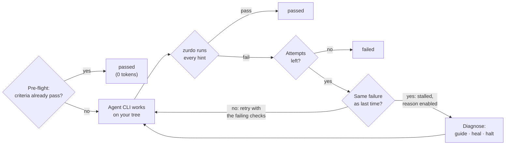
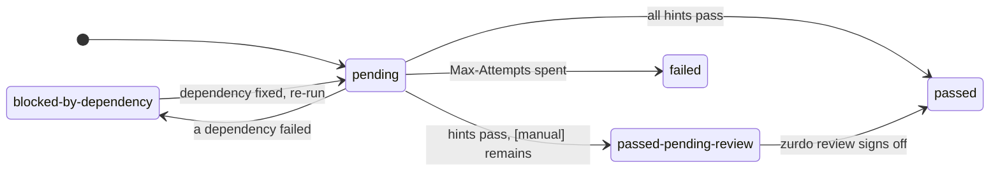

---
# Page settings
layout: default

# Hero section
title: How it works
description: "The verification loop, state model, and crash recovery."

# Page navigation
page_nav:
    prev:
        content: Home
        url: '/'
    next:
        content: Installation
        url: '/docs/installation.html'

# Mermaid diagrams on this page
mermaid: true
---

Zurdo turns a PRD into a dependency-ordered task list and runs the tasks **one at a time**. An agent does the work, and zurdo checks the result itself. It never asks the agent whether it passed.

## The verification loop


```mermaid
flowchart LR
    PRE{"Pre-flight:<br/>criteria already pass?"} -->|yes| FREE["passed<br/>(0 tokens)"]
    PRE -->|no| AGENT["Agent CLI works<br/>on your tree"]
    AGENT --> VERIFY{"zurdo runs<br/>every hint"}
    VERIFY -->|pass| PASS["passed"]
    VERIFY -->|fail| BUDGET{"Attempts<br/>left?"}
    BUDGET -->|no| FAIL["failed"]
    BUDGET -->|yes| STALL{"Same failure<br/>as last time?"}
    STALL -->|"no: retry with<br/>the failing checks"| AGENT
    STALL -->|"yes: stalled,<br/>reason enabled"| DIAG["Diagnose:<br/>guide · heal · halt"]
    DIAG --> AGENT
```

1. **Pre-flight.** The task's criteria run against the tree before any agent call. If they all pass, the task is done for free. The verdicts are recorded once, so later you can tell *the agent did this* apart from *this was already true*.
2. **Agent iteration.** Zurdo renders a prompt from the task description, the [evidence paths](configuration.md#context-priming), and any matching [lessons](reason.md#lessons). It then shells out to `claude`, `codex`, or `copilot`.
3. **Independent verification.** Zurdo runs every [hint](hints.md) itself: shell, HTTP, file, grep, and [structural](lumen.md). A change to a [frozen path](#evidence-integrity) fails the iteration.
4. **Retry or settle.** On failure, the retry prompt carries the exact failing checks. When `Max-Attempts` runs out, the task is marked `failed`.
5. **Stall detection.** When two attempts fail the same way, the task is marked *stalled*. With `[reason]` on, one diagnosis call can guide the next attempt, hand the hint to `zurdo heal`, or halt the task. See [Diagnosis & lessons](reason.md).
6. **Completion gate** *(optional).* After every task passes, `completion_command` (for example, your full test suite) runs once. If it fails, zurdo exits `9`. See [The completion gate](configuration.md#the-completion-gate).

Here's a real run. The first task already passed at pre-flight. The second missed twice, stalled, then passed:

<figure class="lp-terminal" aria-label="zurdo run output showing pre-flight, retries, a stall, and the run summary">
<div class="lp-terminal__bar"><span class="lp-terminal__dots" aria-hidden="true"><i></i><i></i><i></i></span><span class="lp-terminal__title">zurdo run prds/greeter.md</span></div>
<pre class="lp-terminal__body"><code><span class="t-dim">─── task-greet: Write the greeter ─── effort=low, deps=[]</span>
  <span class="t-ok">✓ task-greet: passed in 0 iterations</span> <span class="t-dim">(—)</span>
<span class="t-dim">─── task-docs: Document the greeter ─── effort=low, deps=[task-greet]</span>
  <span class="t-acc">→</span> iteration 1 of 3 <span class="t-dim">(max-attempts=3, agent-timeout=30m 00s)</span>
  <span class="t-ok">✓</span> agent completed: exit=0, 273ms
    <span class="t-bad">✗</span> file-exists: README.md
      <span class="t-dim">stderr tail: path does not exist</span>
  <span class="t-acc">→</span> iteration 2 of 3
  <span class="t-ok">✓</span> agent completed: exit=0, 54ms
    <span class="t-bad">✗</span> file-exists: README.md
  <span class="t-warn">⚠ task-docs: stalled — attempt 2 repeats fingerprint sha256:9a5a07c7… (2 consecutive attempts)</span>
  <span class="t-acc">→</span> iteration 3 of 3
  <span class="t-ok">✓</span> agent completed: exit=0, 55ms
    <span class="t-ok">✓</span> file-exists: README.md
  <span class="t-ok">✓ task-docs: passed in 3 iterations</span> <span class="t-dim">(459ms)</span>
<span class="t-dim">═══ Run Summary ═══</span>
  task-greet           passed (pre-flight)    0/3   —       —
  task-docs            passed                 3/3   459ms   1/1
  passed-at-preflight  <span class="t-warn">2 criteria — proved nothing about this run</span></code></pre>
<figcaption class="lp-terminal__caption"><span class="lp-dot" aria-hidden="true"></span>The agent said "Done!" both times it missed. Zurdo checked the tree, not the claim.</figcaption>
</figure>

## Task statuses


```mermaid
stateDiagram-v2
    direction LR
    state "passed-pending-review" as review
    state "blocked-by-dependency" as blocked
    [*] --> pending
    pending --> passed: all hints pass
    pending --> review: hints pass, [manual] remains
    review --> passed: zurdo review signs off
    pending --> failed: Max-Attempts spent
    pending --> blocked: a dependency failed
    blocked --> pending: dependency fixed, re-run
```

- **`passed-pending-review`**: the automated checks passed, and at least one `[manual]` criterion is waiting for sign-off in [`zurdo review`](usage.md#reviewing-a-run-with-zurdo-review).
- **`blocked-by-dependency`**: zurdo re-derives this on every resume, so it isn't final. Fix the failed dependency, re-run, and the blocked tasks unblock. You don't need `--reset`.

## State directory layout

Each PRD's state lives at `.zurdo/<slug>/` under the repo root. The slug is deterministic: `zurdo state where <prd>` prints it.

```
.zurdo/
├── config.toml            # providers, effort map, defaults
└── <slug>/
    ├── prd.json           # source of truth
    ├── progress.log       # JSONL event stream
    ├── run-diff.patch     # everything the run changed
    ├── iterations/        # <task>-<n>.prompt / .out / .err per attempt
    └── reports/           # <timestamp>.json / .md
lessons/                   # lesson library — repo root, committed
```

Every agent call leaves an audit trail: the exact prompt and the agent's stdout and stderr, for each task and attempt.

<details markdown="1">
<summary>Full layout, including repo-scoped paths</summary>

```
.zurdo/
├── config.toml                      # provider config, effort map, defaults
├── lumen/                           # optional structural code index (repo-scoped)
├── reason/
│   └── usage.json                   # lesson use counts (repo-scoped)
└── <slug>/                          # <basename>-<sha1(repo-relative-path)[0..4]>
    ├── prd.json                     # terminal source of truth, atomic writes
    ├── progress.log                 # append-only JSONL event stream
    ├── lock                         # pid + ISO-8601 start time
    ├── baseline                     # run-start snapshot + the current task's baseline tree (JSON)
    ├── baseline.index               # scratch git index used by baseline capture
    ├── baseline-diff.index          # scratch git index used by baseline comparison
    ├── run-diff.patch               # unified diff of agent edits across the run
    ├── review-log.jsonl             # [manual] sign-off chain written by zurdo review
    ├── heal-log.jsonl               # hash chain of accepted heals
    ├── iterations/
    │   ├── <task-id>-<attempt>.out
    │   ├── <task-id>-<attempt>.err
    │   └── <task-id>-<attempt>.prompt
    ├── analyze-iterations/          # audit trail of zurdo analyze --fix
    ├── reason/                      # this run's diagnosis blocks
    ├── reports/
    │   └── <timestamp>.{json,md}
    └── .archive/<ts>/               # prior state, kept by --reset

lessons/                             # the lesson library — at the repo root, git-tracked
└── lesson-<hash8>.md
```

`.zurdo/lumen/` (the [Lumen index](lumen.md)), `lessons/`, and `.zurdo/reason/usage.json` belong to the whole repo rather than one PRD, and lessons apply to every PRD. `zurdo run --reset` archives only the slug's state, and these paths survive it.

</details>

<div class="callout callout--info" markdown="1">
**Note** Add `.zurdo/` to `.gitignore`. Zurdo reminds you once but never edits the file. Do **not** ignore `lessons/`: lessons are source and get reviewed in pull requests like code.
</div>

## Evidence integrity

Zurdo doesn't just record the verdicts. It also shows **where the evidence came from**.

<figure class="lp-figure" aria-label="Timeline: a run baseline at start, a per-task baseline at each task's first attempt, a frozen-path check after every attempt, and run-diff.patch at the end">
<div class="lp-figure__scroll"><svg viewBox="0 0 680 200" role="img">
  <line class="lp-svg-line" x1="40" y1="90" x2="555" y2="90" stroke-width="2"/>
  <circle cx="40" cy="90" r="9" class="lp-svg-accent" stroke-width="2"/>
  <text class="lp-svg-text" x="40" y="60" text-anchor="middle" font-weight="600">Run start</text>
  <text class="lp-svg-muted" x="40" y="122" text-anchor="middle">run baseline</text>
  <text class="lp-svg-muted" x="40" y="138" text-anchor="middle">(tree hash)</text>
  <path class="lp-svg-line" d="M140 40 v8 h190 v-8" stroke-width="1.5"/>
  <text class="lp-svg-mono" x="235" y="32" text-anchor="middle">task-a</text>
  <rect x="133" y="83" width="14" height="14" transform="rotate(45 140 90)" class="lp-svg-box" stroke-width="1.5"/>
  <text class="lp-svg-muted" x="140" y="122" text-anchor="middle">task baseline</text>
  <circle cx="220" cy="90" r="7" class="lp-svg-bad"/>
  <circle cx="300" cy="90" r="7" class="lp-svg-ok"/>
  <text class="lp-svg-muted" x="220" y="122" text-anchor="middle">attempt 1</text>
  <text class="lp-svg-muted" x="300" y="122" text-anchor="middle">attempt 2</text>
  <path class="lp-svg-line" d="M370 40 v8 h150 v-8" stroke-width="1.5"/>
  <text class="lp-svg-mono" x="445" y="32" text-anchor="middle">task-b</text>
  <rect x="363" y="83" width="14" height="14" transform="rotate(45 370 90)" class="lp-svg-box" stroke-width="1.5"/>
  <text class="lp-svg-muted" x="370" y="122" text-anchor="middle">task baseline</text>
  <circle cx="460" cy="90" r="7" class="lp-svg-ok"/>
  <text class="lp-svg-muted" x="460" y="122" text-anchor="middle">attempt 1</text>
  <rect x="555" y="74" width="120" height="32" rx="6" class="lp-svg-accent" stroke-width="1.5"/>
  <text class="lp-svg-mono" x="615" y="94" text-anchor="middle">run-diff.patch</text>
  <text class="lp-svg-muted" x="340" y="178" text-anchor="middle">After every attempt: diff vs. the task's baseline → a touched frozen path fails the attempt</text>
</svg></div>
<figcaption>Each task is judged only on its own edits. The run's full change set lands in <code>run-diff.patch</code>.</figcaption>
</figure>

<div class="lp-cards" markdown="1">
<div markdown="1">
**Baseline capture**
Before the first task, the working tree is snapshotted, untracked files included. Your git index and reflog are left untouched.
</div>
<div markdown="1">
**Pre-flight provenance**
Criteria that were green before the run are flagged *proves nothing about this run*. A task that passes with zero attempts gets a run-end `warning:`.
</div>
<div markdown="1">
**Evidence-modified warnings**
If files a hint relies on changed since the baseline, zurdo warns and keeps going. It warns instead of failing because often the task *is* "edit that file".
</div>
<div markdown="1">
**Frozen paths**
Files matched by `**Frozen**` globs or `[verification] protected_paths` must not change. Touching one fails the attempt, and the retry prompt tells the agent to revert it.
</div>
</div>

These are provenance signals, not policy: they don't change exit codes or statuses. The guard is *tamper-evident, not tamper-proof*. The baseline lives under `.zurdo/`, which the agent can write to. The backstop is that zurdo re-runs every criterion itself.

<details markdown="1">
<summary>Baseline mechanics in detail</summary>

- **No git side effects.** Capture stages into a scratch index via `GIT_INDEX_FILE`. `.git/index` and the reflog stay byte-for-byte unchanged, so staged work survives a run.
- **Per-task diffs.** Each task's baseline is captured at its *first* attempt and reused across retries. A task is never charged for an earlier task's legitimate edits, and an illegal edit made on attempt 1 is still visible on attempt 2.
- **Tree-to-tree comparison.** Untracked paths count in both directions. A file the run created and never staged can't escape the check, and freezing a glob over a file that was untracked at capture time doesn't false-positive.
- **Resumed runs** capture a fresh baseline, so `run-diff.patch` covers only the work since the resume. The patch's `#` header lines say so (`git apply` skips them).
- **`shell:` and `http:` hints** are treated as opaque because they may depend on external state. For them, an evidence-modified flag signals a discrepancy without claiming the criterion is invalid.
- **Outside a git repo**, or without `git` on `PATH`, capture degrades to one warning. Frozen-path enforcement also becomes a warning.

</details>

## Resume, locks, and recovery

`zurdo run` is crash-safe. Re-running the same command always picks up where it left off.

| Situation | What zurdo does | Exit |
| --- | --- | --- |
| Another run holds `.zurdo/<slug>/lock` | Refuses and prints the pid. A stale lock (dead pid) is taken over automatically. | `3` |
| State already exists | Asks whether to resume, reset, or abort (below) | — |
| The PRD file changed since the last parse | Refuses and asks for `--reset`, which archives the old state instead of overwriting it. Edits made through `zurdo heal` are accepted in place. | `4` |
| Ctrl-C once | Finishes the current iteration, prints the summary, and resumes cleanly next time | — |
| Ctrl-C twice | Hard kill. The in-flight iteration is dropped on resume and doesn't count as an attempt. | — |

```
What would you like to do?
  [R] Resume from current state           (default)
  [X] Reset — archive state and start over
  [A] Abort
```

The prompt is skipped and defaults to *Resume* when stdin isn't a TTY, or when you pass `--resume`, `--reset`, or `--no-prompt`. Reset moves the old state to `.zurdo/<slug>/.archive/<ts>/`.

## Skills

Zurdo bundles skills that teach your agent the zurdo-specific parts: PRD grammar, hint authoring, and reading run state. `zurdo init` installs them into your provider's discovery path, such as `.claude/skills/` or `.agents/skills/`.

| Skill | Reach for it when… |
| --- | --- |
| `zurdo-design-author` | The work is bigger than one PRD. It turns an idea into a design record with phases and measurable exit criteria. |
| `zurdo-prd-author` | You're writing a PRD. It drafts criteria first, then pressure-tests every hint until it truly verifies. |
| `zurdo-hint-debugger` | A criterion failed and you need to know whether the hint is wrong or the code is |
| `zurdo-state-summary` | You want a plain-English read of run state and the next action to take |
| `zurdo-prd-review` | A run finished and you want to know whether it built what the PRD *meant*. Any gap becomes a follow-up PRD. |
| `zurdo-lessons`, `zurdo-domain` | Never: the other skills call these internally to write lessons and keep terminology consistent |

When the repo has a [lesson library](reason.md), the author and debugger skills check it read-only. Manage installed skills with `zurdo skills list` and `zurdo skills install <name>`. Skills you name in a task's `**Skills**` metadata are yours to install. Zurdo only warns at pre-flight if they're missing.

## What zurdo deliberately does not do

- **No git automation.** Zurdo never commits, branches, or opens PRs.
- **No API keys.** Zurdo drives provider CLIs already on your `PATH`, using your existing auth.
- **No trusting the agent.** Agent output is saved for the audit trail, but only zurdo's own checks decide pass or fail.
