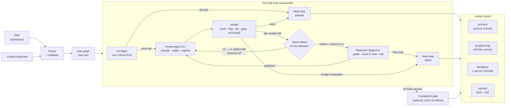

---
# Page settings
layout: default

# Hero section
title: How it works
description: "The verification loop, state model, and crash recovery."

# Page navigation
page_nav:
    prev:
        content: Home
        url: '/'
    next:
        content: Installation
        url: '/docs/installation.html'

# Mermaid diagrams on this page
mermaid: true
---

## The verification loop

Zurdo parses your PRD into a dependency-ordered list of tasks and runs them **sequentially**. Each task goes through the same loop:

1. **Pre-flight.** Before invoking any agent, zurdo runs the task's acceptance criteria against the working tree as-is. The per-criterion verdicts are recorded once in `prd.json` (`preflight_results`) — this "iteration 0" snapshot is what later separates *the agent made this true* from *this was already true*. If everything already passes, the task is marked done without spending a single token. The snapshot is written once and never refreshed, so when a *resumed* run short-circuits a task, the verdicts it actually decided on are recorded separately as `preflight_pass`, with a timestamp (v1.22.0). `zurdo report`'s `passed_at_preflight` reads that record. A task whose criteria are *all* `[manual]` short-circuits here to `passed-pending-review` and never invokes the agent.
2. **Agent iteration.** Zurdo renders a prompt from the task's description and shells out to your configured agent CLI (`claude`, `codex`, or `copilot`). The prompt also lists the files the task's criteria point at, whether each exists yet and whether it's frozen (the [`# Evidence Paths`](configuration.md#context-priming) section), plus any matching [lessons](reason.md#lessons). The agent works directly against your working tree.
3. **Independent verification.** When the agent exits, zurdo runs **every** hint on every criterion itself — shell commands, HTTP probes, file checks, greps, and (opt-in) [structural hints](hints.md#structural-hints) resolved against the Lumen code index. The agent's own claims about what it did are never consulted. Frozen paths are checked here too: if the diff against the task's baseline touches a path frozen by `**Frozen**` metadata or `[verification] protected_paths` config, the iteration fails regardless of criteria results.
4. **Retry or settle.** If any automated hint fails (or a frozen path was modified) and the attempt budget (`Max-Attempts`) has room, the loop goes back to step 2 — and the retry prompt carries the prior attempt's failing checks (hint, typed failure reason, captured stdout/stderr) plus the tail of the agent's own narrative, so the agent knows exactly what just failed. If the budget is exhausted, the task is marked `failed`. Tasks depending on a failed task become `blocked-by-dependency`.
5. **Stall detection and diagnosis.** Every failing iteration is fingerprinted; consecutive attempts failing the *same way* mark the task **stalled** — the agent is repeating itself, not converging. With the opt-in `[reason]` subsystem enabled, a stall triggers a single reasoner LLM call that either guides the next attempt, routes a misaimed hint to `zurdo heal`, or halts the task early to stop wasted spend — and a task that stalls then recovers leaves behind a **lesson** future runs get told about. The full lifecycle is on [Diagnosis & lessons](reason.md).
6. **Completion gate (optional).** Once every task is `passed` or `passed-pending-review`, zurdo runs `[verification] completion_command` — one repository-wide check such as the full test suite — and exits `9` if it fails or times out. See [The completion gate](configuration.md#the-completion-gate).


```mermaid
flowchart LR
    PRD["PRD<br/>(markdown)"] --> PARSE["Parser<br/>+ Validator"]
    CONFIG[".zurdo/config.toml"] --> PARSE
    PARSE --> GRAPH["Dep graph<br/>topo sort"]
    GRAPH --> LOOP

    subgraph LOOP ["Per-task loop (sequential)"]
        direction TB
        PREFLIGHT["Pre-flight<br/>(run criteria first)"] -->|all pass| DONE
        PREFLIGHT -->|some fail| AGENT["Invoke agent CLI<br/>(claude · codex · copilot)"]
        AGENT --> VERIFY["Verifier<br/>(shell · http · file · grep · structural)"]
        VERIFY -->|pass| DONE["Mark task<br/>passed"]
        VERIFY -->|fail, budget left| STALLQ{"Same failure<br/>as last attempt?"}
        STALLQ -->|"no — or stalled with<br/>[reason] off"| AGENT
        STALLQ -->|"stalled + [reason] on"| DIAG["Reasoner diagnosis:<br/>guide · route to heal · halt"]
        DIAG -->|guidance| AGENT
        DIAG -->|halt_task| FAIL
        VERIFY -->|budget exhausted| FAIL["Mark task<br/>failed"]
    end

    DONE --> STATE
    FAIL --> STATE
    LOOP -->|"all tasks passed"| GATE["Completion gate<br/>(optional, exit 9 on failure)"]
    GATE --> STATE

    subgraph STATE [".zurdo/&lt;slug&gt;/"]
        direction LR
        PRDJSON["prd.json<br/>(source of truth)"]
        PROGLOG["progress.log<br/>(JSONL events)"]
        ITERS["iterations/<br/>(.out/.err/.prompt)"]
        REPORTS["reports/<br/>(json · md)"]
    end
```

## Task statuses

| Status                   | Meaning                                                                    |
| ------------------------ | -------------------------------------------------------------------------- |
| `pending`                | Not yet attempted.                                                         |
| `passed`                 | All automated hints passed.                                                |
| `passed-pending-review`  | Automated hints passed (or none exist); one or more `[manual]` criteria await human sign-off in [`zurdo review`](usage.md#reviewing-a-run-with-zurdo-review) — signing the last one flips the task to `passed`. |
| `failed`                 | The `Max-Attempts` budget was exhausted with at least one hint still failing. |
| `blocked-by-dependency`  | A task it `Depends-on` finished `failed`. **Re-derived on resume** (v1.8.0) from the current dependency graph rather than treated as terminal — fix and re-run the failed dependency and its dependents unblock on the next resume, no `--reset` needed. |

## State directory layout

Per-PRD state lives at `.zurdo/<slug>/` under the **repo root** — never beside the PRD. The slug is deterministic: `<basename>-<sha1(repo-relative-path)[0..4]>`, so the same PRD always resolves to the same directory (`zurdo state where <prd>` prints it).

```
.zurdo/
├── config.toml                      # provider config, effort map, defaults
├── lumen/                           # optional structural code index (repo-scoped)
├── reason/
│   └── usage.json                   # lesson use counts (repo-scoped)
└── <slug>/
    ├── prd.json                     # terminal source of truth, atomic writes
    ├── progress.log                 # append-only JSONL event stream
    ├── lock                         # pid + ISO-8601 start time
    ├── baseline                     # run-start snapshot + the current task's baseline tree (JSON)
    ├── baseline.index               # scratch git index used by baseline capture
    ├── baseline-diff.index          # scratch git index used by baseline comparison
    ├── run-diff.patch               # unified diff of agent edits across the run
    ├── review-log.jsonl             # [manual] sign-off chain written by zurdo review
    ├── heal-log.jsonl               # hash chain of accepted heals (when zurdo heal applied any)
    ├── iterations/
    │   ├── <task-id>-<attempt>.out
    │   ├── <task-id>-<attempt>.err
    │   └── <task-id>-<attempt>.prompt
    ├── analyze-iterations/          # audit trail of zurdo analyze --fix
    ├── reason/                      # this run's diagnosis blocks
    ├── reports/
    │   └── <timestamp>.{json,md}
    └── .archive/<ts>/               # prior state, kept by --reset

lessons/                             # the lesson library — at the repo root, git-tracked
└── lesson-<hash8>.md
```

Every agent invocation leaves a full audit trail: the exact prompt sent (`.prompt`), and the agent's stdout/stderr (`.out`/`.err`), per task and attempt.

Some paths are **repository-scoped** rather than per-PRD: `.zurdo/lumen/` (the optional [Lumen structural index](lumen.md) behind structural hints), the [lesson library](reason.md#the-library-is-source-not-state) at **`lessons/`** in the repo root, and its use-count file `.zurdo/reason/usage.json`. Lessons apply to every PRD in the repo. `zurdo run --reset` archives only the slug's state; the repo-scoped paths survive it.

<div class="callout callout--info" markdown="1">
**Note** Add `.zurdo/` to your `.gitignore`. Zurdo prints a one-time hint if you forget — but it never modifies your `.gitignore` itself. Do **not** ignore `lessons/`: lessons are source, reviewed in pull requests like code.
</div>

## Evidence integrity

Verifying is only half the story — v1.2.0 added machinery to show **where the evidence came from**:

**Baseline capture.** Before the first task is evaluated, `zurdo run` snapshots the working tree as you handed it over — tracked, modified, and untracked files alike — recording a git tree hash, a `dirty` flag, and capture metadata at `.zurdo/<slug>/baseline`. The capture never touches your git state (it stages into a scratch index via `GIT_INDEX_FILE`, leaving `.git/index` and the reflog byte-for-byte unchanged), and at run end the full patch of what the run changed lands at `.zurdo/<slug>/run-diff.patch` — the primary evidence the bundled `zurdo-prd-review` skill reads. A resumed run captures a new baseline when it resumes, so its patch covers only the work done since then — and since v1.22.0 the patch says so: it opens with `#` header lines naming the baseline tree hash, when it was captured, and that scope rule. `git apply` skips them, so the patch still applies. Outside a git repo, or with no usable `git` on `PATH`, capture degrades to a single warning and the run proceeds normally.

**Pre-flight provenance.** A criterion that was already green in the pre-flight snapshot is flagged in live progress with the tail `already passed at pre-flight — proves nothing about this run`, and the summary table carries a `passed-at-preflight` tally. Since v1.13.0 a task that reaches terminal `passed` with **zero attempts** is additionally named in a run-end `warning:` line — see [When a task passes without doing anything](usage.md#when-a-task-passes-without-doing-anything). This is provenance, not policy — exit codes and statuses are unaffected; legitimate cases exist (resumed runs, idempotent re-runs, criteria a dependency already satisfied). The point is that a human reading the report can weigh the evidence.

**Evidence-modified warnings.** When files that hints rely on as evidence have changed since the baseline, zurdo emits a `warning:` diagnostic and continues — a warning, never a failure, since often the task *is* "edit that file". `shell:` and `http:` payloads are treated as opaque (they may reference unbounded external state), so for them the flag signals a detected discrepancy without claiming the criterion is invalid.

**Frozen paths.** The enforcement tier: globs declared per task (`**Frozen**` metadata) or run-wide (`[verification] protected_paths` config) name files the agent must not touch. Any frozen path in the diff fails the iteration regardless of criteria results, and the next prompt opens with a `# Frozen Path Violation` section requiring the revert.

The diff is **per task** (v1.8.0): each task's baseline is captured at its *first attempt* and reused across its retries, so a task is never charged for edits an earlier task legitimately made, and an agent's own illegal edit on attempt 1 stays visible on attempt 2. The run-start tree is still retained in the same `baseline` file for the review TUI and run-end reporting. Comparison is **tree-to-tree** (v1.13.1), so **untracked paths count in both directions**: a frozen glob naming a file that was untracked at capture time no longer reports as modified on every iteration, and a file the run *created* and never staged no longer escapes the check. Neither side of the comparison touches `.git/index`, so staged work survives a run unchanged — and `run-diff.patch` gains the same symmetry, so files the run created now appear in it and in what `zurdo review` shows.

Honest limit: the baseline lives under `.zurdo/`, inside the agent's writable scope — the guard is tamper-evident, not tamper-proof, backstopped by criteria being independently re-run.

## Resume, locks, and recovery

`zurdo run` is crash-safe by design. Four mechanisms cooperate:

**The lock file.** While zurdo is running it holds `.zurdo/<slug>/lock` (pid + ISO-8601 start time). A second `zurdo run` against the same PRD refuses with exit `3` and the offending pid. Stale locks (dead pid) are taken over automatically with a warning — no manual cleanup needed.

**The interactive resume prompt.** When you run against an existing `.zurdo/<slug>/`, zurdo asks:

```
What would you like to do?
  [R] Resume from current state           (default)
  [X] Reset — archive state and start over
  [A] Abort
```

`R` (Enter) continues; `X` archives state under `.zurdo/<slug>/.archive/<ts>/` and starts fresh; `A` exits 0. The prompt is skipped — and defaults to *Resume* — when stdin is not a TTY, or when any of `--resume`, `--reset`, or `--no-prompt` was passed.

**PRD-hash drift.** `prd.json` records the SHA-1 of the whole PRD file at the last successful parse, so **any** byte change counts. If the live PRD now hashes differently, `zurdo run` refuses with exit `4` and asks for `--reset` — your old state is archived, not overwritten. The one exception is an edit made through `zurdo heal`: its `.zurdo/<slug>/heal-log.jsonl` hash chain lets the next run accept the new hash in place, resetting the healed tasks from `failed` to `pending` without `--reset`.

**Ctrl-C.** The first press triggers a graceful exit: the current iteration finishes, the summary table renders with partial state, and the next run resumes cleanly. A second press is a hard kill — the in-flight iteration is dropped at resume time via `progress.log` reconciliation, and `attempts` is not incremented for the dropped iteration.

## Skills

Zurdo ships bundled, opinionated skills compiled into the binary. They teach an LLM the zurdo-specific bits — PRD grammar, hint authoring, run-state interpretation — so the agent doesn't rediscover them on every call.

| Skill                    | Reach for it when …                                                                                     |
| ------------------------ | -------------------------------------------------------------------------------------------------------- |
| `zurdo-design-author`    | The work is bigger than one PRD. Takes an idea to a `docs/design/<topic>.md` record — alternatives considered, phases with observable exit criteria — before any PRD is written. Its rule is **no number, no claim**: every claim marked new carries a measurement. (v1.20.0) |
| `zurdo-prd-author`       | Authoring a PRD end-to-end, evidence-first: an interview drafts the acceptance criteria first, derives tasks from them, then pressure-tests every criterion until its hint actually verifies — including whether a test the hint runs [exists yet](writing-prds.md#pre-authored-tests). Writes a `<prd-name>.trail.md` reasoning sidecar (never parsed by zurdo) and, for corrections worth remembering, [lesson files](reason.md#lessons). |
| `zurdo-hint-debugger`    | A criterion failed and you need to know whether the hint is wrong or the code is. Correlates the hint with iteration logs, the tree, and the authoring trail sidecar if present. |
| `zurdo-state-summary`    | You want a human summary of `prd.json` + `progress.log` with a recommended next action (resume, reset, heal, verify, review, or fix-then-resume). |
| `zurdo-prd-review`       | A run finished and you want to know whether it built what the PRD *meant*. Reads `run-diff.patch` against each task's intent and classifies every task as landed, landed-with-drift, vacuous-pass, or missed. A clean review ends in a short report; any gap ends in a `zurdo validate --strict`-clean **follow-up PRD**, leaving the original untouched. (v1.17.0) |
| `zurdo-lessons`          | *Called by the other skills, not by you.* The rules for writing a lesson file: when a correction deserves one, the frontmatter schema, and the two-component match floor. (v1.19.0) |
| `zurdo-domain`           | *Called by the other skills, not by you.* The discipline for naming things: checking terms against a project's `CONTEXT.md` glossary and keeping the glossary current. (v1.19.0) |

The first five are skills you invoke by name; since v1.19.0 they're marked so the model won't invoke them on its own (honored by Claude Code). The last two are **disciplines** the others call mid-task through the Skill tool.

When the repo has a [lesson library](reason.md), `zurdo-prd-author` (while pressure-testing criteria) and `zurdo-hint-debugger` (while analyzing a failure) both consult it read-only via `zurdo reason match` — a lesson recording a repo quirk is evidence about whether a hint will hold up. Both degrade silently when the library is absent.

`zurdo init` installs them into your provider's native discovery path (e.g. `.claude/skills/<name>/` for Anthropic, `.agents/skills/<name>/` for Codex/Copilot); `zurdo skills list` and `zurdo skills install <name>` manage them afterwards. Installs are idempotent via a `.zurdo-managed` sentinel file in each installed skill.

**PRD-referenced skills** — the ones you declare in a task's `**Skills**` metadata — are user-managed: install them to your provider's discovery path yourself, or point `[skills] search_paths` in config at custom directories. Zurdo checks they exist at pre-flight (warn-only) but never installs or modifies them.

## What zurdo deliberately does not do

- **No git automation.** No auto-commit, no auto-branch, no auto-PR. Zurdo reads and verifies your working tree; version control stays in your hands.
- **No API calls.** Zurdo talks to providers exclusively through their CLIs on your `PATH`, using your existing auth. There are no API keys to give zurdo itself.
- **No trusting the agent.** Agent stdout is captured for the audit trail, but pass/fail comes only from zurdo executing the hints.

Next: [Installation](installation.md)
