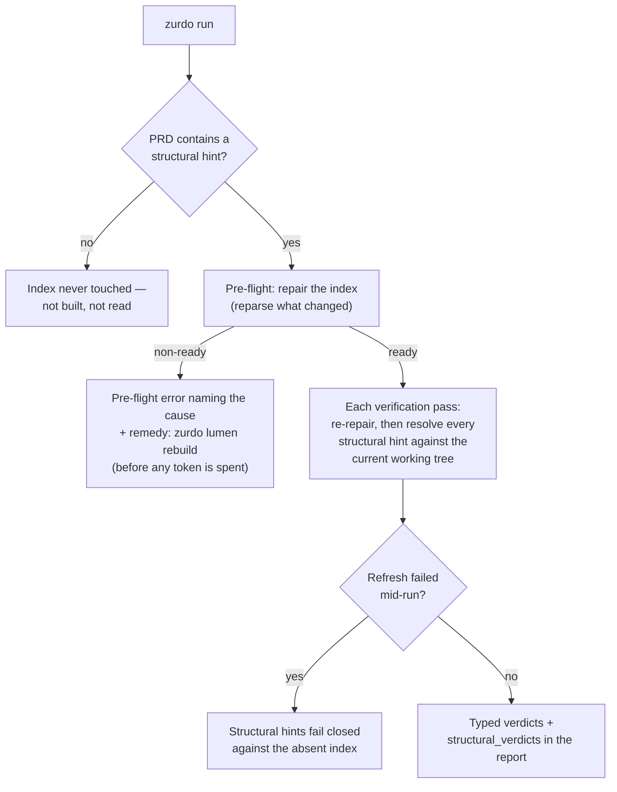

---
# Page settings
layout: default
comments: false

# Hero section
title: Structural verification
description: "The Lumen code index, the three structural hint types, and the Vela watcher."

# Micro navigation
micro_nav: true

# Page navigation
page_nav:
    prev:
        content: Hints reference
        url: '/docs/hints.html'
    next:
        content: Diagnosis & lessons
        url: '/docs/reason.html'

# Mermaid diagrams on this page
mermaid: true
---

A `[grep:]` hint proves a string exists; it cannot prove the string is *code*. `[grep: fn rotate_token in src/auth.rs]` passes just as happily on a comment, a doc example, or a stale copy as on a real definition. **Structural hints** close that gap: they verify facts about **named code symbols** — a definition exists, a symbol is referenced inside another, a function is actually *called* — by static analysis of the working tree, not text matching.

Three pieces make it work, and this page covers all of them:

- The three **structural hint types** — `[symbol:]`, `[references:]`, `[callers:]` (grammar on the [Hints reference](hints.md#structural-hints-experimental)).
- **Lumen** — the persistent, repository-scoped code index at `.zurdo/lumen/` that hint resolution queries.
- **Vela** — an optional background watcher that keeps the index fresh between runs. Never required for correctness.

The subsystem is **experimental and opt-in**: the grammar is stable, but everything sits behind two config gates and is off by default.

## Turning it on

```toml
[lumen]
enabled = true            # build and maintain the index

[experimental]
structural_hints = true   # allow [symbol:]/[references:]/[callers:] in PRDs
```

The gates compose strictly: `structural_hints = true` while `lumen.enabled = false` is a **config-load error**, and a structural hint in a PRD while the gate is off is a **validation error** naming the disabled gate — `zurdo validate`, `--analyze`, `run`, and `--resume` all enforce it identically. The full `[lumen]` key table is on the [Configuration](configuration.md#lumen-and-structural-hints) page.

## What each hint proves

```markdown
- [ ] limiter type is defined [symbol: struct RateLimiter in src/middleware/rate_limit.rs]
- [ ] app wires the limiter [callers: method RateLimiter::layer in src/middleware/rate_limit.rs within function build_router in src/app.rs]
- [ ] config reaches the limiter [references: struct AppConfig in src/config.rs within struct RateLimiter in src/middleware/rate_limit.rs]
```

| Hint            | Passes iff                                                                                                  |
| --------------- | ------------------------------------------------------------------------------------------------------------ |
| `[symbol:]`     | A **definition** of that kind and qualified name exists in exactly that file. Imports and use sites don't count. |
| `[references:]` | The target resolves uniquely, the `within` context resolves uniquely, and an occurrence inside the context **deterministically binds** to the target through lexical scope and static imports. A same-named symbol from another module doesn't count. |
| `[callers:]`    | Everything `[references:]` requires, **plus** the bound occurrence sits in the **callee position of a call expression**. Passing the function as a value doesn't count. |

The binding rule is the teeth: `[callers:]` on a cross-file call passes only when the call site's file actually *imports* the target it names — a copy-paste of the same function name from elsewhere fails as unbound. Failures are typed (`symbol_unresolved` / `binding_unresolved`) and carry a closed-taxonomy diagnostic (not-found, wrong kind naming the kind actually found, ambiguous with every candidate listed, capability-rejected) into the next iteration's prompt. Passing verdicts persist the resolved identity and source span in `prd.json` and the report's `structural_verdicts` array.

<div class="callout callout--info" markdown="1">
**Design rule: false negatives over false greens.** Anything the resolver cannot bind *deterministically* — dynamic dispatch, trait objects, macro-generated names, a method call whose receiver type would need inference — fails rather than guesses. A structural hint can be annoyingly strict; it can never be quietly wrong in your favor.
</div>

## The Lumen index

Lumen extracts structural records from source files (via tree-sitter) into `.zurdo/lumen/` — **repository-scoped, not per-PRD**. One index serves every PRD in the repo, and `zurdo run --reset` never touches it; only `zurdo lumen clear` deletes it.

How a run uses it:



The load-bearing properties:

- **Lazy.** A PRD with no structural hints never constructs or reads any Lumen state, even with `[lumen] enabled = true`.
- **Verifies the current tree.** The index is re-repaired before *each* verification pass, so a task can satisfy its own structural criteria in the same run — code the agent just wrote resolves immediately. (Within a single pass the view is pinned once, so one pass never mixes index generations.)
- **Generation-based and crash-safe.** Every publish is atomic; old generations are garbage-collected after `gc_grace_minutes` (default 10), always keeping at least the current generation and its predecessor. A torn write, stale lock, or SIGKILL mid-rebuild recovers on the next invocation.
- **Fails closed.** No pinned index at evaluation time means the structural hint fails — never passes by default.
- **Evidence-integrated.** A structural hint's target files (and the `within` context's file) count as evidence paths, so the frozen-overlap lint and evidence-modified warnings cover them like any grep hint.

### The `zurdo lumen` CLI

| Command               | What it does                                                                                          |
| --------------------- | ------------------------------------------------------------------------------------------------------ |
| `zurdo lumen status`  | Record counts, languages indexed, generations present, last publication time — plus the Vela daemon's state (`vela: not running` when absent). Requires `[lumen] enabled = true`. |
| `zurdo lumen rebuild` | Rebuild from scratch: take the repository-wide write lock, extract records from the whole repo, publish a new generation atomically, run GC. The remedy for a non-ready index. |
| `zurdo lumen clear`   | Delete `.zurdo/lumen/` entirely. Confirms on a TTY; `--yes` for non-interactive use.                   |

## What resolves, per language

Lumen indexes **Rust, Python, Go, TypeScript, and JavaScript** (including TSX/JSX). Each adapter maps its constructs onto the closed kind set (`function`, `method`, `type`, `class`, `struct`, `enum`, `interface`, `trait`, `module`, `constant`, `variable`); anything unmapped is not indexed and fails "not found" rather than approximating. Every row below is enforced in both directions by the source repo's capability-matrix test suite.

| Language | Indexed definitions                                                                                     | Cross-file binding via                                        | Deliberately **not** resolved                                                       |
| -------- | -------------------------------------------------------------------------------------------------------- | -------------------------------------------------------------- | ------------------------------------------------------------------------------------ |
| Rust     | free `fn`, `impl` methods, `struct`, `enum`, `trait`, `type` aliases, `mod`, `const`, `static`           | `use` trees, nested module paths, `pub use` re-export chains  | `macro_rules!` / proc macros; method-call callees (`receiver.method()` needs type inference); same-named symbols with no import path |
| Python   | module-level and class `def`, `class`, PEP 695 `type` aliases, module/class assignments (as `variable`)  | relative imports (`from .m import x`)                          | the `constant` kind (assignments always normalize to `variable`); bare `import` statements |
| Go       | package `func`, receiver methods, `struct`, `interface`, `type` aliases, `const`, `var`, package clause  | package imports resolved through the `go.mod` module path      | `init` blocks; same-named symbols in another package with no import                 |
| TS / JS  | `function` declarations, arrow/function-expression bindings, `class` + methods, `interface`, `type`, `enum`, variables | relative imports (`./`, `../`), `tsconfig.json` `paths` aliases | `import`/`export` re-exports; same-named symbols with no import path                |

Naming rules that trip people up: qualified names use `::` in **every** language (`Config::load`, even in Python and Go); `trait` in a hint unifies with `interface`; `type` means a type *alias* only (Go's `type Foo struct` is a `struct`). The file-level `module` symbol is the file stem — except `mod.rs`, `__init__.py`, and `index.ts`/`index.tsx`, which take the parent directory's name, and Go, where it is the `package` clause identifier.

## The Vela watcher

Repair-on-demand means a first structural query after a big rebase can pay a noticeable reparse cost at pre-flight. **Vela** is the optional cure: a background daemon that watches the source tree and incrementally publishes fresh Lumen generations as files change, so runs find a warm index.

Two properties keep it safe to ignore:

- **Never required for correctness.** Structural queries always run the in-process repair path and return the same verdict whether the daemon is running or not — Vela only moves the reparse work off the critical path.
- **Fail-inert.** A failed watcher refresh leaves the prior generation current and usable; an auto-start spawn failure logs a debug line and never blocks the operation that triggered it.

One daemon per repository, arbitrated by a PID lock under `.zurdo/vela/` (created owner-only, `0700`), with a control socket speaking a closed operation set — status, shutdown, version negotiation, nothing else. The daemon exits on its own after `idle_minutes` (default 30) without filesystem events or client connections; `debounce_ms` (default 200) coalesces bursty file events. Daemon output lands in `.zurdo/vela/vela.log`.

| Command             | What it does                                                                                          |
| ------------------- | ------------------------------------------------------------------------------------------------------ |
| `zurdo vela start`  | Spawn a detached daemon, wait for socket readiness, exit `0`. Already running → reports it and exits `0`; an older-version daemon is replaced gracefully; stale PID metadata from a dead process is detected and cleaned up. |
| `zurdo vela stop`   | Ask the daemon to shut down and wait. Not running still exits `0`.                                     |
| `zurdo vela status` | PID, version, repository root, and current Lumen generation. Exits nonzero when not running.           |
| `zurdo vela serve`  | Run the watcher in the **foreground** (what `start` daemonizes). A second `serve` in the same repo fails fast. |

With `[vela] enabled = true`, zurdo also **auto-starts** a detached daemon after each in-process structural repair — fire-and-forget, so the first structural run of the day warms the index for every run after it. Config keys are on the [Configuration](configuration.md#the-vela-watcher) page; `zurdo lumen status` reports the watcher's PID and publication freshness alongside the index summary.

## Authoring with structural hints

Where they earn their keep, relative to the [core hints](hints.md):

- **Wiring criteria.** "The new middleware is actually installed" is exactly `[callers:]` — a grep for the registration line passes on commented-out code; the call binding doesn't.
- **Existence with teeth.** `[symbol: struct RateLimiter in …]` over `[grep: struct RateLimiter in …]` when you care that it's a real definition in the right file, not a mention.
- **Cost ladder.** Structural hints are pricier to author than grep (exact kinds, exact files, `::`-qualified names) but cheaper and more precise than spinning up `[shell:]` test infrastructure to prove a relationship — the bundled `zurdo-prd-author` skill slots them between the two and checks the config gates before authoring one.

Two caveats to author around: a hint on a construct the adapter doesn't map (a Rust macro, a Go `init` block) can never pass — check the table above first; and ambiguity is a *failure*, so point hints at uniquely-named symbols or qualify them until they resolve uniquely.

## Troubleshooting

| Symptom                                                       | Cause                                                             | Fix                                                                    |
| ------------------------------------------------------------- | ------------------------------------------------------------------ | ----------------------------------------------------------------------- |
| Validation error naming `experimental.structural_hints`       | The PRD uses a structural hint while the gate is off.             | Enable **both** `[lumen] enabled` and `[experimental] structural_hints`. |
| Config-load error mentioning `lumen.enabled`                  | `structural_hints = true` with `lumen.enabled = false`.           | Enable `[lumen]` too — the gate can't stand alone.                     |
| Pre-flight fails with a non-ready index                       | A working-tree file Lumen needed could not be (re)parsed.         | `zurdo lumen rebuild`, then re-run. The failure is deliberate — before tokens, never a silent criterion failure. |
| `[symbol:]` fails "wrong kind"                                | The diagnostic names the kind actually found.                     | Fix the kind in the hint (`struct` vs `type` is the usual culprit).    |
| `[callers:]` fails `binding_unresolved` though the call is there | The call site doesn't statically import the target, or the callee needs receiver-type inference. | Bind through a static import, or fall back to `[grep:]`/`[shell:]` for that relationship. |
| Structural hints feel slow at pre-flight after big changes    | Cold repair is reparsing everything that moved.                   | Run the [Vela watcher](#the-vela-watcher) so the index stays warm.     |

Next: [Diagnosis & lessons](reason.md)
