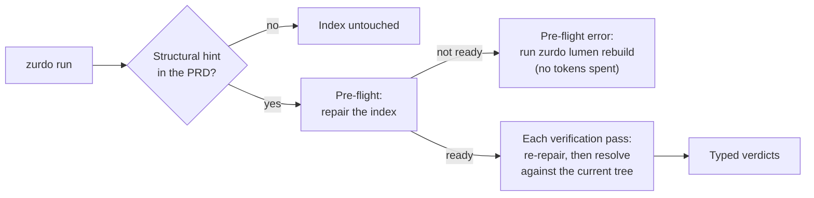

---
# Page settings
layout: default

# Hero section
title: Structural verification
description: "The Lumen code index, the three structural hint types, querying the index, and the Vela watcher."

# Page navigation
page_nav:
    prev:
        content: Hints reference
        url: '/docs/hints.html'
    next:
        content: Agent access (MCP)
        url: '/docs/mcp.html'

# Mermaid diagrams on this page
mermaid: true
---

A `[grep:]` hint proves a string exists, not that it's *code*: it passes on a comment just as happily as on a real call. **Structural hints** check facts about named code symbols — a definition exists, a symbol is referenced, a function is actually *called* — by static analysis of the working tree.

<div class="lp-cards" markdown="1">
<div markdown="1">
**Structural hints**
`[symbol:]`, `[references:]`, `[callers:]`. Grammar is on the [Hints reference](hints.md#structural-hints).
</div>
<div markdown="1">
**Lumen**
The repo-wide code index at `.zurdo/lumen/`. Hints resolve against it, and you can [query it directly](#asking-the-index-a-question).
</div>
<div markdown="1">
**Vela**
An optional watcher that keeps the index warm between runs. Never needed for correctness.
</div>
</div>

## Turning it on

```toml
[lumen]
enabled = true            # build the index — and allow [symbol:]/[references:]/[callers:]
```

That's the only switch, and it's off by default. A structural hint while Lumen is off is a validation error naming this key, in `validate`, `analyze`, `run`, and `--resume` alike. All `[lumen]` keys are on the [Configuration](configuration.md#lumen-and-structural-hints) page.

<details markdown="1">
<summary>Upgrading from 1.8 or earlier</summary>

The old second gate, `[experimental] structural_hints`, is deprecated and **ignored**. Configs that carry it still load, with `warning: '[experimental] structural_hints' is deprecated and ignored; structural hints are governed by '[lumen] enabled'`. Delete the key. `zurdo init` now writes an empty `[experimental]` table.

</details>

## What each hint proves

```markdown
- [ ] limiter type is defined [symbol: struct RateLimiter in src/middleware/rate_limit.rs]
- [ ] app wires the limiter [callers: method RateLimiter::layer in src/middleware/rate_limit.rs within function build_router in src/app.rs]
- [ ] config reaches the limiter [references: struct AppConfig in src/config.rs within struct RateLimiter in src/middleware/rate_limit.rs]
```

| Hint | Passes when | Doesn't count |
| --- | --- | --- |
| `[symbol:]` | A **definition** of that kind and name exists in exactly that file | Imports, use sites |
| `[references:]` | An occurrence inside the `within` context **binds** to the target through scope and static imports | A same-named symbol from another module |
| `[callers:]` | Same as `[references:]`, **and** the occurrence is the callee of a call | Passing the function as a value |

Here a stub agent claims the wiring is done twice. The grep passes on a `// TODO:` comment; the `[callers:]` hint holds out until the real call lands:

<figure class="lp-terminal" aria-label="zurdo run output where a grep hint passes on a comment but a callers hint fails until a real call exists">
<div class="lp-terminal__bar"><span class="lp-terminal__dots" aria-hidden="true"><i></i><i></i><i></i></span><span class="lp-terminal__title">zurdo run prds/limiter.md</span></div>
<pre class="lp-terminal__body"><code><span class="t-dim">─── task-wire: Wire the rate limiter ─── effort=low, deps=[]</span>
  <span class="t-acc">→</span> iteration 1 of 3
  <span class="t-ok">✓</span> agent completed: exit=0, 272ms
    <span class="t-ok">✓</span> symbol: struct RateLimiter in src/middleware/rate_limit.rs
      <span class="t-warn">already passed at pre-flight — proves nothing about this run</span>
    <span class="t-ok">✓</span> grep: install_limiter\(&amp;cfg\) in src/app.rs
      <span class="t-warn">already passed at pre-flight — proves nothing about this run</span>
    <span class="t-bad">✗</span> callers: function install_limiter in src/middleware/rate_limit.rs within function build_router in src/app.rs
      <span class="t-dim">stderr tail: unbound: no call occurrence of `install_limiter` in `build_router` (in src/app.rs) binds to `install_limiter` in src/middleware/rate_limit.rs</span>
  <span class="t-dim">…</span>
  <span class="t-acc">→</span> iteration 3 of 3
  <span class="t-ok">✓</span> agent completed: exit=0, 56ms
    <span class="t-ok">✓</span> callers: function install_limiter in src/middleware/rate_limit.rs within function build_router in src/app.rs
      <span class="t-dim">evidence file modified by agent</span>
  <span class="t-ok">✓ task-wire: passed in 3 iterations</span> <span class="t-dim">(464ms)</span></code></pre>
<figcaption class="lp-terminal__caption"><span class="lp-dot" aria-hidden="true"></span>The grep matched a TODO comment. Only the call binding proved the wiring.</figcaption>
</figure>

**Binding is the teeth.** A cross-file `[callers:]` passes only when the call site's file actually *imports* the target. Failures are typed (`symbol_unresolved` / `binding_unresolved`) with a diagnostic — not found, wrong kind (naming the kind found), ambiguous (listing every candidate), or capability-rejected — that goes into the next prompt. Passing verdicts record the resolved identity and source span in `prd.json` and the report's `structural_verdicts`.

<div class="callout callout--info" markdown="1">
**Design rule: false negatives over false greens.** Whatever can't be bound *deterministically* — dynamic dispatch, trait objects, macro-generated names, method calls that need receiver-type inference — fails rather than guesses. A structural hint can be strict; it can't be quietly wrong in your favor.
</div>

## The Lumen index

Lumen extracts symbols with tree-sitter into `.zurdo/lumen/`. It's **repo-scoped**: one index serves every PRD, `zurdo run --reset` leaves it alone, and only `zurdo lumen clear` deletes it.


```mermaid
flowchart LR
    RUN["zurdo run"] --> Q{"Structural hint<br/>in the PRD?"}
    Q -->|no| SKIP["Index untouched"]
    Q -->|yes| REPAIR["Pre-flight:<br/>repair the index"]
    REPAIR -->|not ready| FAIL["Pre-flight error:<br/>run zurdo lumen rebuild<br/>(no tokens spent)"]
    REPAIR -->|ready| VERIFY["Each verification pass:<br/>re-repair, then resolve<br/>against the current tree"]
    VERIFY --> VERDICT["Typed verdicts"]
```

<div class="lp-cards" markdown="1">
<div markdown="1">
**Lazy**
A PRD with no structural hints never builds or reads the index, even with Lumen on.
</div>
<div markdown="1">
**Current tree**
The index is re-repaired before *each* verification pass, so code the agent just wrote resolves immediately. One pass never mixes index versions.
</div>
<div markdown="1">
**Crash-safe**
Each publish is an atomic new generation. Old ones are cleaned up after `gc_grace_minutes` (default 10); the current one and its predecessor are always kept.
</div>
<div markdown="1">
**Fails closed**
No usable index at evaluation time — including a refresh that fails mid-run — means the structural hint fails, never passes.
</div>
</div>

A structural hint's files (target and `within` context) count as evidence paths, so the frozen-overlap lint and [evidence-modified warnings](how-it-works.md#evidence-integrity) cover them like any grep hint.

### The `zurdo lumen` CLI

| Command | What it does |
| --- | --- |
| `zurdo lumen status` | Record counts, languages, generations, last publish time, and Vela's state. Needs Lumen on. |
| `zurdo lumen rebuild` | Rebuild the whole index from scratch under a repo-wide lock. The fix for a non-ready index. |
| `zurdo lumen clear` | Delete `.zurdo/lumen/`. Confirms on a TTY; `--yes` skips it. |
| `zurdo lumen query` | Ask the index a question ([below](#asking-the-index-a-question)). Needs Lumen on. |

You don't need to `rebuild` after upgrading: records written by an older parser are re-parsed automatically.

### Asking the index a question

Structural hints *assert* facts; `zurdo lumen query` *asks*. Pass exactly one selector:

<figure class="lp-terminal" aria-label="zurdo lumen query output for name, outline, callers, and references selectors">
<div class="lp-terminal__bar"><span class="lp-terminal__dots" aria-hidden="true"><i></i><i></i><i></i></span><span class="lp-terminal__title">zurdo lumen query</span></div>
<pre class="lp-terminal__body"><code><span class="t-acc">$</span> zurdo lumen query --name load
segment  method  AppConfig::load  <span class="t-dim">src/config.rs:6:5</span>
<span class="t-acc">$</span> zurdo lumen query --outline src/middleware/rate_limit.rs
module  rate_limit               <span class="t-dim">src/middleware/rate_limit.rs:1:1</span>
struct  RateLimiter              <span class="t-dim">src/middleware/rate_limit.rs:3:1</span>
field   RateLimiter::per_second  <span class="t-dim">src/middleware/rate_limit.rs:4:5</span>
method  RateLimiter::new         <span class="t-dim">src/middleware/rate_limit.rs:8:5</span>
method  RateLimiter::layer       <span class="t-dim">src/middleware/rate_limit.rs:11:5</span>
<span class="t-acc">$</span> zurdo lumen query --callers new
RateLimiter::new  build_router  <span class="t-dim">src/app.rs:6:19</span>
<span class="t-acc">$</span> zurdo lumen query --references AppConfig
AppConfig  build_router      <span class="t-dim">src/app.rs:5:15</span>
AppConfig  config            <span class="t-dim">src/config.rs:5:6</span>
AppConfig  RateLimiter::new  <span class="t-dim">src/middleware/rate_limit.rs:8:22</span></code></pre>
<figcaption class="lp-terminal__caption"><span class="lp-dot" aria-hidden="true"></span>Real output (tabs shown as spaces). Every row ends in a 1-based file:line:column.</figcaption>
</figure>

| Selector | Row |
| --- | --- |
| `--name` | `rank  kind  qualified-name  file:line:col` |
| `--outline` | `kind  qualified-name  file:line:col`, in source order |
| `--callers` | `callee  enclosing-symbol  file:line:col` |
| `--references` | `identifier  enclosing-symbol  file:line:col` |

Results are capped at 20 rows; `--limit 0` removes the cap. The query repairs the index first (no `rebuild` needed) and writes nothing. The same four questions are served to agents by [`zurdo mcp serve`](mcp.md).

<details markdown="1">
<summary>Ranking and rendering rules</summary>

- **`--name` ranking:** `exact` matches first, then trailing-`segment` matches (`load` finds `Config::load`). `substring` matches are a fallback, returned only when nothing matched exactly or by segment.
- **Rendered from the syntax tree:** callees and receivers drop arguments and fit on one line — `db.query(sql).rows` prints as `db.query().rows` — so a multi-line call can't split a row.
- **Trailing `.name` matches:** `--callers` and `--references` match a trailing `.name`, so `--references results` finds `computed.results`.
- The row shape is the same one a structural-hint diagnostic prints.

</details>

## What resolves, per language

Lumen indexes **Rust, Python, Go, TypeScript, and JavaScript** (including TSX/JSX). Anything an adapter doesn't map isn't indexed, and fails "not found" rather than being approximated.

| | Kinds |
| --- | --- |
| **Hint kinds** (11) | `function` `method` `type` `class` `struct` `enum` `interface` `trait` `module` `constant` `variable` |
| **Query-only kinds** (4) | `enum-variant` `field` `macro` `alias` — recorded and shown by `zurdo lumen query`, but a hint naming one fails with `unknown symbol kind` |

A hint's `trait` resolves to the recorded `interface` (no adapter records `trait`). Query-only kinds still appear in wrong-kind diagnostics, so a hint aimed at a field fails naming `field ComputeResult::results`.

| Language | Cross-file binding via |
| --- | --- |
| Rust | `use` trees, nested module paths, `pub use` re-export chains |
| Python | relative imports (`from .m import x`) |
| Go | package imports resolved through the `go.mod` module path |
| TS / JS | relative imports (`./`, `../`), `tsconfig.json` `paths` aliases |

<details markdown="1">
<summary>Full per-language table: indexed definitions and deliberate gaps</summary>

| Language | Indexed definitions | Deliberately **not** resolved |
| --- | --- | --- |
| Rust | free `fn` and proc-macro fns, `impl` methods, `struct`/`union` (as `struct`), `enum`, `trait` (as `interface`), `type` aliases, `mod`, `const`, `static` (as `variable`); enum variants, named fields, `macro_rules!` (as `macro`), `use a::B as C` (as `alias`) | tuple fields; bodiless trait method signatures; macro bodies; method-call callees (`receiver.method()` needs type inference); same-named symbols with no import path |
| Python | module-level and class `def`, `class`; `Enum`-family subclasses (as `enum`, members as `enum-variant`); `Protocol` subclasses (as `interface`); annotated class attributes and `self.x` targets in `__init__` (as `field`); other assignments (as `variable`); PEP 695 `type` aliases; `import … as …` (as `alias`) | the `constant` kind (a capability rejection); plain `import`; attributes first set outside `__init__`; a base class followed through its definition (`class Mine(BaseEnum)` stays a `class`) |
| Go | package `func`, receiver methods, `struct` and its fields (embedded ones named by their type), `interface` and its method specs (as `method`), `type` aliases, `const`, `var`, package clause, named imports (as `alias`) | `init` blocks; members of an anonymous inner struct; same-named symbols in another package with no import |
| TS / JS | `function` declarations, arrow/function-expression bindings, `class` + methods and fields, `interface` (properties as `field`, method signatures as `method`), `type` (a named object type's members too), `enum` and its members, variables (each name a destructuring binds), `namespace` / `declare module` (as `module`, members qualified under it), renaming imports and exports (as `alias`) | `export … from` without a rename; members of an anonymous inline object type; same-named symbols with no import path |

Every row is enforced in both directions by the source repo's capability-matrix test suite.

</details>

**Naming rules that trip people up:**

- Qualified names use `::` in **every** language: `Config::load`, even in Python and Go. Members are owner-qualified the same way (`FailureReason::EmptyTestRun`, `Geo::Circle::radius`); TS `namespace A.B` is `A::B`.
- `type` means a type *alias* only. Go's `type Foo struct` is a `struct`.
- A file's `module` symbol is the file stem — except `mod.rs`, `__init__.py`, and `index.ts`/`index.tsx`, which take the parent directory's name, and Go, which uses the `package` identifier.

<div class="callout callout--warning" markdown="1">
**Upgrading to 1.25: some hints need re-pinning.** Deeper indexing moved some names to a new kind; a hint pinned to the old kind now fails "wrong kind":

- TS/JS non-function class properties and Python annotated class attributes: `variable` → `field`.
- Python `Enum` subclasses: `class` → `enum`, members → `enum-variant`. `Protocol` subclasses: `class` → `interface`.
- TS/JS destructuring (`const { results } = …`): one `variable` per bound name instead of one for the whole pattern.
- Declarations inside a TS `namespace` qualify under it (`Geo::area`, not `area`).

`field` and `enum-variant` aren't hint kinds, so re-pin those hints on the enclosing class or enum. `zurdo lumen query --name <needle>` shows what the index records now.
</div>

## The Vela watcher

After a big rebase, the first structural check can spend noticeable time reparsing at pre-flight. **Vela** is a background daemon that watches the tree and publishes fresh index generations as files change, so runs find a warm index.

- **Never required.** Structural checks always run the in-process repair and reach the same verdict with or without Vela. It only moves work off the critical path.
- **Fail-inert.** A failed refresh leaves the previous generation in use; a failed auto-start logs a debug line and blocks nothing.

| Command | What it does |
| --- | --- |
| `zurdo vela start` | Start a detached daemon and wait until it's ready. Already running → exits `0`; an older-version daemon is replaced; stale PID files are cleaned up. |
| `zurdo vela stop` | Ask the daemon to shut down. Exits `0` even if it wasn't running. |
| `zurdo vela status` | PID, version, repo root, and current Lumen generation. Nonzero exit when not running. |
| `zurdo vela serve` | Run the watcher in the foreground (what `start` daemonizes). A second `serve` in the same repo fails fast. |

With `[vela] enabled = true`, zurdo **auto-starts** the daemon after each in-process structural repair, so the first structural run of the day warms the index for the rest. Config keys are on the [Configuration](configuration.md#the-vela-watcher) page.

<details markdown="1">
<summary>Daemon internals</summary>

- One daemon per repository, arbitrated by a PID lock under `.zurdo/vela/` (owner-only, `0700`).
- A control socket accepts a closed set of operations: status, shutdown, version negotiation.
- Exits on its own after `idle_minutes` (default 30) with no file events or client connections. `debounce_ms` (default 200) coalesces bursts of file events.
- Logs go to `.zurdo/vela/vela.log`. `zurdo lumen status` shows the watcher's PID and publication freshness.

</details>

## Authoring with structural hints

- **Wiring criteria.** "The middleware is actually installed" is exactly `[callers:]`. A grep for the registration line passes on commented-out code, as shown above.
- **Existence with teeth.** Prefer `[symbol: struct RateLimiter in …]` over grep when it must be a real definition in the right file.
- **Cost ladder.** Pricier to write than grep (exact kinds, files, `::` names), cheaper than building `[shell:]` test infrastructure to prove a relationship. The bundled `zurdo-prd-author` skill places them between the two and checks the config gate first.

Two traps: a hint on something the adapter doesn't map (a Go `init` block) or on a query-only kind can never pass, and ambiguity is a *failure*, so qualify names until they resolve uniquely. When unsure, `zurdo lumen query --name <name>` prints the exact kind and qualified name a hint should use.

## Troubleshooting

| Symptom | Fix |
| --- | --- |
| Validation error: *structural hint requires `lumen.enabled = true`* | Set `[lumen] enabled = true` — the only gate. |
| `warning: '[experimental] structural_hints' is deprecated and ignored` | Delete the key from your pre-1.9 config. |
| Pre-flight fails with a non-ready index (a file couldn't be parsed) | `zurdo lumen rebuild`, then re-run. It fails before any tokens are spent, on purpose. |
| `[symbol:]` fails "wrong kind" | Use the kind the diagnostic names (`struct` vs `type` is the usual culprit). |
| A hint that passed before 1.25 now fails "wrong kind" | Re-pin on the kind `zurdo lumen query --name` reports, or on the enclosing type. See [the callout above](#what-resolves-per-language). |
| `unknown symbol kind` naming `field` / `enum-variant` / `macro` / `alias` | Those are query-only. Target the enclosing type, or use `[grep:]`. |
| `[callers:]` fails `binding_unresolved` though the call is there | The call site doesn't statically import the target, or the callee needs receiver-type inference. Import it directly, or fall back to `[grep:]`/`[shell:]`. |
| Slow pre-flight after big changes | Run the [Vela watcher](#the-vela-watcher) to keep the index warm. |
