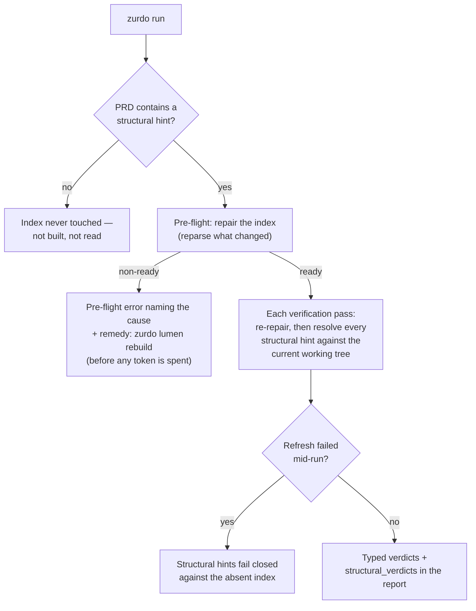

---
# Page settings
layout: default
comments: false

# Hero section
title: Structural verification
description: "The Lumen code index, the three structural hint types, querying the index, and the Vela watcher."

# Micro navigation
micro_nav: true

# Page navigation
page_nav:
    prev:
        content: Hints reference
        url: '/docs/hints.html'
    next:
        content: Agent access (MCP)
        url: '/docs/mcp.html'

# Mermaid diagrams on this page
mermaid: true
---

A `[grep:]` hint proves a string exists; it cannot prove the string is *code*. `[grep: fn rotate_token in src/auth.rs]` passes just as happily on a comment, a doc example, or a stale copy as on a real definition. **Structural hints** close that gap: they verify facts about **named code symbols** — a definition exists, a symbol is referenced inside another, a function is actually *called* — by static analysis of the working tree, not text matching.

Three pieces make it work, and this page covers all of them:

- The three **structural hint types** — `[symbol:]`, `[references:]`, `[callers:]` (grammar on the [Hints reference](hints.md#structural-hints)).
- **Lumen** — the persistent, repository-scoped code index at `.zurdo/lumen/` that hint resolution queries — and that you, or an agent, can [query directly](#asking-the-index-a-question).
- **Vela** — an optional background watcher that keeps the index fresh between runs. Never required for correctness.

The subsystem is **opt-in and off by default**, behind a single config switch. It is no longer experimental: structural hints graduated in **v1.9.0** after every hint type had dogfood coverage across three PRDs and the v1.4.0 syntax and schema soaked unchanged through three further releases.

## Turning it on

```toml
[lumen]
enabled = true            # build the index — and allow [symbol:]/[references:]/[callers:]
```

That's the whole gate. A structural hint in a PRD while Lumen is off is a **validation error** naming the one key to set (`… structural hint requires lumen.enabled = true in .zurdo/config.toml`) — `zurdo validate`, `zurdo analyze`, `run`, and `--resume` all enforce it identically. The full `[lumen]` key table is on the [Configuration](configuration.md#lumen-and-structural-hints) page.

<div class="callout callout--info" markdown="1">
**Upgrading from ≤ 1.8?** The second gate is gone. `[experimental] structural_hints` is deprecated and **ignored** — configs carrying it still load, but the key decides nothing and emits `warning: '[experimental] structural_hints' is deprecated and ignored; structural hints are governed by '[lumen] enabled'` at config load. `structural_hints = true` with `lumen.enabled = false` used to be a config-load error; with nothing left to contradict, that config now simply loads and Lumen governs. `zurdo init` writes an empty `[experimental]` table.
</div>

## What each hint proves

```markdown
- [ ] limiter type is defined [symbol: struct RateLimiter in src/middleware/rate_limit.rs]
- [ ] app wires the limiter [callers: method RateLimiter::layer in src/middleware/rate_limit.rs within function build_router in src/app.rs]
- [ ] config reaches the limiter [references: struct AppConfig in src/config.rs within struct RateLimiter in src/middleware/rate_limit.rs]
```

| Hint            | Passes iff                                                                                                  |
| --------------- | ------------------------------------------------------------------------------------------------------------ |
| `[symbol:]`     | A **definition** of that kind and qualified name exists in exactly that file. Imports and use sites don't count. |
| `[references:]` | The target resolves uniquely, the `within` context resolves uniquely, and an occurrence inside the context **deterministically binds** to the target through lexical scope and static imports. A same-named symbol from another module doesn't count. |
| `[callers:]`    | Everything `[references:]` requires, **plus** the bound occurrence sits in the **callee position of a call expression**. Passing the function as a value doesn't count. |

The binding rule is the teeth: `[callers:]` on a cross-file call passes only when the call site's file actually *imports* the target it names — a copy-paste of the same function name from elsewhere fails as unbound. Failures are typed (`symbol_unresolved` / `binding_unresolved`) and carry a closed-taxonomy diagnostic (not-found, wrong kind naming the kind actually found, ambiguous with every candidate listed, capability-rejected) into the next iteration's prompt. Passing verdicts persist the resolved identity and source span in `prd.json` and the report's `structural_verdicts` array.

<div class="callout callout--info" markdown="1">
**Design rule: false negatives over false greens.** Anything the resolver cannot bind *deterministically* — dynamic dispatch, trait objects, macro-generated names, a method call whose receiver type would need inference — fails rather than guesses. A structural hint can be annoyingly strict; it can never be quietly wrong in your favor.
</div>

## The Lumen index

Lumen extracts structural records from source files (via tree-sitter) into `.zurdo/lumen/` — **repository-scoped, not per-PRD**. One index serves every PRD in the repo, and `zurdo run --reset` never touches it; only `zurdo lumen clear` deletes it.

How a run uses it:


```mermaid
flowchart TD
    RUN["zurdo run"] --> Q{"PRD contains a<br/>structural hint?"}
    Q -->|no| SKIP["Index never touched —<br/>not built, not read"]
    Q -->|yes| REPAIR["Pre-flight: repair the index<br/>(reparse what changed)"]
    REPAIR -->|non-ready| FAIL["Pre-flight error naming the cause<br/>+ remedy: zurdo lumen rebuild<br/>(before any token is spent)"]
    REPAIR -->|ready| VERIFY["Each verification pass:<br/>re-repair, then resolve every<br/>structural hint against the<br/>current working tree"]
    VERIFY --> V{"Refresh failed<br/>mid-run?"}
    V -->|yes| CLOSED["Structural hints fail closed<br/>against the absent index"]
    V -->|no| VERDICT["Typed verdicts +<br/>structural_verdicts in the report"]
```

The load-bearing properties:

- **Lazy.** A PRD with no structural hints never constructs or reads any Lumen state, even with `[lumen] enabled = true`.
- **Verifies the current tree.** The index is re-repaired before *each* verification pass, so a task can satisfy its own structural criteria in the same run — code the agent just wrote resolves immediately. (Within a single pass the view is pinned once, so one pass never mixes index generations.)
- **Generation-based and crash-safe.** Every publish is atomic; old generations are garbage-collected after `gc_grace_minutes` (default 10), always keeping at least the current generation and its predecessor. A torn write, stale lock, or SIGKILL mid-rebuild recovers on the next invocation.
- **Fails closed.** No pinned index at evaluation time means the structural hint fails — never passes by default.
- **Evidence-integrated.** A structural hint's target files (and the `within` context's file) count as evidence paths, so the frozen-overlap lint and evidence-modified warnings cover them like any grep hint.

### The `zurdo lumen` CLI

| Command               | What it does                                                                                          |
| --------------------- | ------------------------------------------------------------------------------------------------------ |
| `zurdo lumen status`  | Record counts, languages indexed, generations present, last publication time — plus the Vela daemon's state (`vela: not running` when absent). Requires `[lumen] enabled = true`. |
| `zurdo lumen rebuild` | Rebuild from scratch: take the repository-wide write lock, extract records from the whole repo, publish a new generation atomically, run GC. The remedy for a non-ready index. |
| `zurdo lumen clear`   | Delete `.zurdo/lumen/` entirely. Confirms on a TTY; `--yes` for non-interactive use.                   |
| `zurdo lumen query`   | Ask the index a question — a name lookup, a file outline, or the call and reference sites of a name ([below](#asking-the-index-a-question)). Requires `[lumen] enabled = true`. |

The index is also re-parsed automatically when an upgrade changes what an adapter extracts: each release that teaches an adapter new constructs bumps an internal parser version, and records stored by an older one are re-parsed rather than trusted. You don't need to `rebuild` after upgrading.

### Asking the index a question

Structural hints *assert* facts. `zurdo lumen query` (v1.22.0) *asks* — the same index, open-ended, one selector at a time:

```sh
zurdo lumen query --name Config::load          # definitions matching a name
zurdo lumen query --outline src/config.rs      # a file's definitions, in source order
zurdo lumen query --callers load               # call sites whose callee resolves to a name
zurdo lumen query --references AppConfig       # identifier references to a name
zurdo lumen query --outline src/config.rs --limit 0   # no row cap (default 20)
```

Exactly one selector is required. Output is one tab-separated row per result, ending in a 1-based `file:line:column` — the same shape a structural-hint diagnostic prints:

| Selector        | Row                                                        |
| --------------- | ----------------------------------------------------------- |
| `--name`        | `rank  kind  qualified-name  file:line:col` — rank is `exact`, `segment`, or `substring` |
| `--outline`     | `kind  qualified-name  file:line:col`                        |
| `--callers`     | `callee  enclosing-symbol  file:line:col`                    |
| `--references`  | `identifier  enclosing-symbol  file:line:col`                |

`--name` ranks exact matches first, then trailing-segment matches (so `load` finds `Config::load`). Since **v1.23.0**, substring matches are a **fallback only** — returned when nothing matched exactly or by segment, instead of padding an exact answer with every name that merely contains the needle.

Callees and receivers are rendered from the syntax tree, not copied from source (v1.25.0): a chain like `db.query(sql).rows` prints as `db.query().rows` — arguments dropped, one line — so a multi-line call can't split a row. `--callers` and `--references` match a trailing `.name` too, so `--references results` finds `computed.results`.

The query reads a freshly repaired view — the same one a verification pass reads — so it needs no prior `zurdo lumen rebuild`, and it writes nothing. The same four questions are served to MCP clients as tools by [`zurdo mcp serve`](mcp.md).

## What resolves, per language

Lumen indexes **Rust, Python, Go, TypeScript, and JavaScript** (including TSX/JSX). Each adapter maps its constructs onto one shared vocabulary of **recorded kinds**; anything unmapped is not indexed and fails "not found" rather than approximating. Every row below is enforced in both directions by the source repo's capability-matrix test suite.

There are two kind lists, and the difference matters:

- **Hint kinds** — the eleven a structural hint may name: `function`, `method`, `type`, `class`, `struct`, `enum`, `interface`, `trait`, `module`, `constant`, `variable`.
- **Recorded kinds** — the fourteen the index stores and `zurdo lumen query` prints: the hint kinds minus `trait` (a hint's `trait` resolves to the recorded `interface`; no adapter records `trait`), plus **`enum-variant`**, **`field`**, **`macro`**, and **`alias`** (v1.23.0–v1.25.0).

The four extra kinds make query answers precise — `--name results` answers `ComputeResult::results` as a `field` instead of a page of substring rows — but **no hint can target them**: a hint naming one fails at parse time with `unknown symbol kind`. They do show up in wrong-kind diagnostics, so a hint pointed at a field fails naming `field ComputeResult::results`.

| Language | Indexed definitions                                                                                     | Cross-file binding via                                        | Deliberately **not** resolved                                                       |
| -------- | -------------------------------------------------------------------------------------------------------- | -------------------------------------------------------------- | ------------------------------------------------------------------------------------ |
| Rust     | free `fn` and proc-macro fns, `impl` methods, `struct`/`union` (as `struct`), `enum`, `trait` (as `interface`), `type` aliases, `mod`, `const`, `static` (as `variable`); enum variants, named fields, `macro_rules!` (as `macro`), `use a::B as C` (as `alias`) | `use` trees, nested module paths, `pub use` re-export chains  | tuple fields; bodiless trait method signatures; macro bodies; method-call callees (`receiver.method()` needs type inference); same-named symbols with no import path |
| Python   | module-level and class `def`, `class`; `Enum`-family subclasses (as `enum`, members as `enum-variant`); `Protocol` subclasses (as `interface`); annotated class attributes and `self.x` targets in `__init__` (as `field`); other assignments (as `variable`); PEP 695 `type` aliases; `import … as …` (as `alias`) | relative imports (`from .m import x`)                          | the `constant` kind (a capability rejection); plain `import`; attributes first set outside `__init__`; a base class followed through its definition (`class Mine(BaseEnum)` stays a `class`) |
| Go       | package `func`, receiver methods, `struct` and its fields (embedded ones named by their type), `interface` and its method specs (as `method`), `type` aliases, `const`, `var`, package clause, named imports (as `alias`) | package imports resolved through the `go.mod` module path      | `init` blocks; members of an anonymous inner struct; same-named symbols in another package with no import |
| TS / JS  | `function` declarations, arrow/function-expression bindings, `class` + methods and fields, `interface` (properties as `field`, method signatures as `method`), `type` (a named object type's members too), `enum` and its members, variables (each name a destructuring binds), `namespace` / `declare module` (as `module`, members qualified under it), renaming imports and exports (as `alias`) | relative imports (`./`, `../`), `tsconfig.json` `paths` aliases | `export … from` without a rename; members of an anonymous inline object type; same-named symbols with no import path |

Naming rules that trip people up: qualified names use `::` in **every** language (`Config::load`, even in Python and Go); members are owner-qualified the same way (`FailureReason::EmptyTestRun`, `Geo::Circle::radius` inside a TS namespace, `namespace A.B` is `A::B`); `trait` in a hint unifies with `interface`; `type` means a type *alias* only (Go's `type Foo struct` is a `struct`). The file-level `module` symbol is the file stem — except `mod.rs`, `__init__.py`, and `index.ts`/`index.tsx`, which take the parent directory's name, and Go, where it is the `package` clause identifier.

<div class="callout callout--warning" markdown="1">
**Changed in v1.25.0: some hints need re-pinning.** Deeper indexing moved some names to a new kind. They still resolve, but a hint that pinned the old kind now fails:

- A TS/JS non-function class property was a `variable` and is now a `field`. A Python annotated class attribute is now a `field` too.
- A Python `Enum` subclass was a `class` and is now an `enum`, and its members (`Pattern::CLAMP_AT_ZERO`) are `enum-variant`. A `Protocol` subclass was a `class` and is now an `interface`.
- A TS/JS destructuring declarator (`const { results } = …`) used to index the whole pattern as one fake `variable`. Now each bound name is its own `variable`.
- A declaration inside a TS `namespace` now qualifies under it (`Geo::area`, not `area`).

Since `field` and `enum-variant` aren't hint kinds, a hint on one of those can't be fixed by changing its kind. Re-pin it on the enclosing class or enum instead. `zurdo lumen query --name <needle>` shows what the index now records.
</div>

## The Vela watcher

Repair-on-demand means a first structural query after a big rebase can pay a noticeable reparse cost at pre-flight. **Vela** is the optional cure: a background daemon that watches the source tree and incrementally publishes fresh Lumen generations as files change, so runs find a warm index.

Two properties keep it safe to ignore:

- **Never required for correctness.** Structural queries always run the in-process repair path and return the same verdict whether the daemon is running or not — Vela only moves the reparse work off the critical path.
- **Fail-inert.** A failed watcher refresh leaves the prior generation current and usable; an auto-start spawn failure logs a debug line and never blocks the operation that triggered it.

One daemon per repository, arbitrated by a PID lock under `.zurdo/vela/` (created owner-only, `0700`), with a control socket speaking a closed operation set — status, shutdown, version negotiation, nothing else. The daemon exits on its own after `idle_minutes` (default 30) without filesystem events or client connections; `debounce_ms` (default 200) coalesces bursty file events. Daemon output lands in `.zurdo/vela/vela.log`.

| Command             | What it does                                                                                          |
| ------------------- | ------------------------------------------------------------------------------------------------------ |
| `zurdo vela start`  | Spawn a detached daemon, wait for socket readiness, exit `0`. Already running → reports it and exits `0`; an older-version daemon is replaced gracefully; stale PID metadata from a dead process is detected and cleaned up. |
| `zurdo vela stop`   | Ask the daemon to shut down and wait. Not running still exits `0`.                                     |
| `zurdo vela status` | PID, version, repository root, and current Lumen generation. Exits nonzero when not running.           |
| `zurdo vela serve`  | Run the watcher in the **foreground** (what `start` daemonizes). A second `serve` in the same repo fails fast. |

With `[vela] enabled = true`, zurdo also **auto-starts** a detached daemon after each in-process structural repair — fire-and-forget, so the first structural run of the day warms the index for every run after it. Config keys are on the [Configuration](configuration.md#the-vela-watcher) page; `zurdo lumen status` reports the watcher's PID and publication freshness alongside the index summary.

## Authoring with structural hints

Where they earn their keep, relative to the [core hints](hints.md):

- **Wiring criteria.** "The new middleware is actually installed" is exactly `[callers:]` — a grep for the registration line passes on commented-out code; the call binding doesn't.
- **Existence with teeth.** `[symbol: struct RateLimiter in …]` over `[grep: struct RateLimiter in …]` when you care that it's a real definition in the right file, not a mention.
- **Cost ladder.** Structural hints are pricier to author than grep (exact kinds, exact files, `::`-qualified names) but cheaper and more precise than spinning up `[shell:]` test infrastructure to prove a relationship — the bundled `zurdo-prd-author` skill slots them between the two and checks the config gates before authoring one.

Two caveats to author around: a hint on a construct the adapter doesn't map (a Go `init` block), or one recorded only under a query-only kind (a field, an enum variant, a macro, an alias), can never pass — check the table above first; and ambiguity is a *failure*, so point hints at uniquely-named symbols or qualify them until they resolve uniquely. When unsure what a name resolves to, ask: `zurdo lumen query --name <name>` prints the exact kind and qualified name a hint should use.

## Troubleshooting

| Symptom                                                       | Cause                                                             | Fix                                                                    |
| ------------------------------------------------------------- | ------------------------------------------------------------------ | ----------------------------------------------------------------------- |
| Validation error: *structural hint requires `lumen.enabled = true`* | The PRD uses a structural hint while Lumen is off.          | Set `[lumen] enabled = true`. That is the only gate since v1.9.0.      |
| `warning: '[experimental] structural_hints' is deprecated and ignored` | A pre-1.9 config still carries the retired second gate.   | Delete the key. `[lumen] enabled` alone governs structural hints.      |
| Pre-flight fails with a non-ready index                       | A working-tree file Lumen needed could not be (re)parsed.         | `zurdo lumen rebuild`, then re-run. The failure is deliberate — before tokens, never a silent criterion failure. |
| `[symbol:]` fails "wrong kind"                                | The diagnostic names the kind actually found.                     | Fix the kind in the hint (`struct` vs `type` is the usual culprit).    |
| A hint that passed before upgrading to v1.25.0 now fails "wrong kind" | The name moved to a deeper kind (`field`, `enum`, `enum-variant`, `interface`). | Re-pin on the kind `zurdo lumen query --name` reports, or on the enclosing type. See [the callout above](#what-resolves-per-language). |
| Hint fails `unknown symbol kind` naming `field` / `enum-variant` / `macro` / `alias` | Those are recorded kinds, not hint kinds.                    | Target the enclosing type instead, or verify with `[grep:]`.           |
| `[callers:]` fails `binding_unresolved` though the call is there | The call site doesn't statically import the target, or the callee needs receiver-type inference. | Bind through a static import, or fall back to `[grep:]`/`[shell:]` for that relationship. |
| Structural hints feel slow at pre-flight after big changes    | Cold repair is reparsing everything that moved.                   | Run the [Vela watcher](#the-vela-watcher) so the index stays warm.     |

Next: [Agent access (MCP)](mcp.md)
