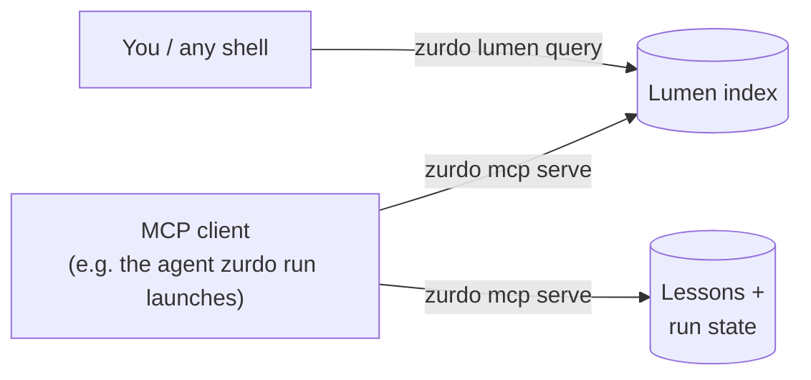
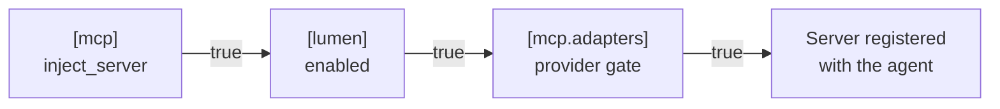

---
# Page settings
layout: default

# Hero section
title: Agent access (MCP)
description: "zurdo mcp serve — the structural index and the compound loop's own state, served to coding agents over the Model Context Protocol."

# Page navigation
page_nav:
    prev:
        content: Structural verification
        url: '/docs/lumen.html'
    next:
        content: Diagnosis & lessons
        url: '/docs/reason.html'

# Mermaid diagrams on this page
mermaid: true
---

Agents spend much of each iteration re-reading and grepping the tree to learn where a type lives or who calls a function. The [Lumen index](lumen.md) already knows. Zurdo can hand those answers to the agent directly.



- **`zurdo lumen query`** asks the index from the command line ([details](lumen.md#asking-the-index-a-question)).
- **`zurdo mcp serve`** is a [Model Context Protocol](https://modelcontextprotocol.io) server over the same index, plus which lessons a PRD would match and what a run recorded. `zurdo run` can [register it with the agent](#letting-zurdo-run-hand-the-server-to-the-agent).

Both give the same answers, and both need `[lumen] enabled = true`.

## The server

`zurdo mcp serve` speaks MCP over stdio (protocol `2025-06-18`). An MCP client launches it as a subprocess; it takes no flags and serves the repository it starts in, until stdin closes. It offers **tools** only — no resources, prompts, or sampling:

| Tool | Argument | Answers with |
| --- | --- | --- |
| `search_symbols` | name needle | Matching definitions — same rows as `zurdo lumen query --name` |
| `file_outline` | file path | The file's definitions in source order — same as `--outline` |
| `find_callers` | callee name | Call sites resolving to that name — same as `--callers` |
| `find_references` | identifier name | References to that name — same as `--references` |
| `match_lessons` | `prd` path | Per task, the [lessons](reason.md#lessons) that would match — same as `zurdo reason match` |
| `run_report` | `prd` path | The recorded run, as `zurdo report --format json` prints it |

The first four (structural) also take `limit` (default `20`, `0` for unlimited). The last two (compound) never touch the index.

<figure class="lp-terminal" aria-label="JSON-RPC exchange with zurdo mcp serve: initialize, then find_callers and search_symbols tool calls">
<div class="lp-terminal__bar"><span class="lp-terminal__dots" aria-hidden="true"><i></i><i></i><i></i></span><span class="lp-terminal__title">zurdo mcp serve  (stdout)</span></div>
<pre class="lp-terminal__body"><code><span class="t-dim">← initialize</span>
{"id":1,"result":{"capabilities":{"tools":{}},"protocolVersion":"2025-06-18",
 "serverInfo":{"name":"zurdo","version":"1.25.0"}}}
<span class="t-dim">← tools/call find_callers {"name":"install_limiter"}</span>
{"id":3,"result":{"content":[{"type":"text",
 "text":"<span class="t-ok">install_limiter\tbuild_router\tsrc/app.rs:6:20</span>"}],"isError":false}}
<span class="t-dim">← tools/call search_symbols {"name":"load"}</span>
{"id":4,"result":{"content":[{"type":"text",
 "text":"<span class="t-ok">segment\tmethod\tAppConfig::load\tsrc/config.rs:6:5</span>"}],"isError":false}}</code></pre>
<figcaption class="lp-terminal__caption"><span class="lp-dot" aria-hidden="true"></span>Real responses, wrapped, with the jsonrpc field trimmed. Each text is the CLI's own tab-separated row.</figcaption>
</figure>

<div class="lp-cards" markdown="1">
<div markdown="1">
**One row shape**
Structural answers are the CLI's rows, from the same renderer. An empty answer is the literal text `no results`.
</div>
<div markdown="1">
**Fresh every call**
The index is repaired before *each* structural call, so an agent asking about a file it just edited gets the new answer.
</div>
<div markdown="1">
**Read-only**
`match_lessons` stamps no reuse metadata; `run_report` writes no report file. Neither starts a run.
</div>
<div markdown="1">
**Errors are results**
A PRD outside the repo, or one the CLI would reject, returns `isError: true` with the CLI's message — not a JSON-RPC error.
</div>
</div>

With `[lumen] enabled = false` the server exits at startup with a message and writes no protocol frame.

To use it from your own MCP client, register a stdio server with command `zurdo` and args `["mcp", "serve"]`, started in the repository root.

## Letting `zurdo run` hand the server to the agent

A run can register `zurdo mcp serve` with the agent it launches, so the agent queries the index instead of re-reading the tree. It's **off by default**:

```toml
[lumen]
enabled = true          # required — a server with no index has nothing to answer

[mcp]
inject_server        = true    # master switch
strict_claude_config = false   # claude only; see below

[mcp.adapters]                 # per-provider gates
anthropic = true
codex     = true
copilot   = false
```



All three must be true. If any is false, the agent's command line is exactly what it would be without the feature.

Zurdo registers the **running binary** (not whichever `zurdo` is first on `PATH`) once at run start, so every attempt gets the same command line:

| Provider | Registration | Gate default |
| --- | --- | --- |
| `claude` | `--mcp-config .zurdo/mcp-claude.json`, plus `--strict-mcp-config` only when `strict_claude_config = true` | on |
| `codex` | `-c mcp_servers.zurdo.command=…` and `-c mcp_servers.zurdo.args=["mcp","serve"]` overrides — no file, nothing written to your codex config | on |
| `copilot` | `--additional-mcp-config @.zurdo/mcp-copilot.json` | **off** |

<div class="callout callout--warning" markdown="1">
**`strict_claude_config` cuts off your other servers.** `--strict-mcp-config` makes `claude` ignore every MCP server configured elsewhere, including ones passed through `[providers.anthropic] extra_args`. That's why it has its own key, off by default.
</div>

<div class="callout callout--info" markdown="1">
**Why `copilot` defaults off.** An organization's Copilot policy can disable third-party MCP servers. `copilot` then accepts the flag but never starts the server, costing a failed connection every iteration. Turn the gate on only if your organization allows third-party servers.
</div>

If the registration file can't be written, the run prints `warn: MCP server registration not written (…); running without injection` and continues. Verification never depends on the server: zurdo still checks every criterion against the tree.

## Troubleshooting

| Symptom | Fix |
| --- | --- |
| `zurdo mcp serve` exits immediately with an error | Enable Lumen: the server refuses on a disabled index by design. |
| `inject_server = true` but the agent never sees the server | Check `[lumen] enabled` and the provider's `[mcp.adapters]` gate (`copilot` defaults off). All three must be true. |
| `claude` lost access to your own MCP servers | Set `strict_claude_config = false` unless you want only zurdo's server. |
| `copilot` reports third-party MCP servers are disabled | Your org policy blocks them. Set `[mcp.adapters] copilot = false`; nothing else is affected. |
| `match_lessons` / `run_report` return an error result | The PRD is outside the repo, doesn't parse, or (for `run_report`) has no run yet. Fix it as you would for `zurdo reason match` / `zurdo report`. |
