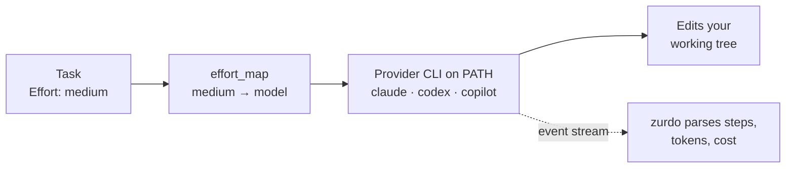

---
# Page settings
layout: default

# Hero section
title: Providers
description: "How zurdo drives the claude, codex, and copilot CLIs."

# Page navigation
page_nav:
    prev:
        content: Configuration
        url: '/docs/configuration.html'
    next:
        content: Roadmap
        url: '/docs/roadmap.html'

# Mermaid diagrams on this page
mermaid: true
---

Zurdo drives coding agents only through their **CLIs**. It runs the binary on your `PATH` with your existing auth, so there are no SDKs, no API calls from zurdo, and no credentials to hand over.



| Provider | CLI binary | Docs | Auth |
| --- | --- | --- | --- |
| Anthropic | `claude` | [Claude Code](https://docs.claude.com/en/docs/claude-code/overview) | `claude login` or `ANTHROPIC_API_KEY` |
| OpenAI | `codex` | [Codex CLI](https://github.com/openai/codex) | `codex login` or `OPENAI_API_KEY` |
| GitHub | `copilot` | [Copilot CLI](https://github.com/github/gh-copilot) | `copilot auth login` or `GITHUB_TOKEN` |

<div class="callout callout--info" markdown="1">
**Note** For flags, model availability, and CLI behavior, the vendor docs above are authoritative. Those CLIs change on their own schedules.
</div>

## Selecting a provider

The executor is one line in `.zurdo/config.toml`:

```toml
[roles.executor]
provider = "anthropic"    # or "codex" or "copilot"

[providers.anthropic]
cli        = "claude"     # rename the binary if it isn't on PATH under this name
extra_args = []           # appended to every invocation
```

`zurdo init` writes all three `[providers.*]` and `[effort_map.*]` blocks, so switching is a one-line edit. The analyzer role (used by `zurdo analyze` and `zurdo heal`) is configured separately and can use a different provider.

## Models and the effort map

Zurdo never hardcodes a model. Each task's `**Effort**` label is looked up in `[effort_map.<provider>]`, so one PRD can use cheap models for trivial tasks and strong models for hard ones. See [Configuration](configuration.md#the-effort-map).

### The model probe

Before a run, zurdo probes every mapped model against its CLI. Typos and plan-gated models fail pre-flight with exit `4` before any task starts.

| Command | What it does |
| --- | --- |
| `zurdo doctor` | Probes the existing config and writes nothing. Exits `4` on any unknown or unsupported model, the same rule as the `run` pre-flight. |
| `zurdo init --check-models` | Probes as part of init (informational, always exits `0`) |
| `zurdo run --skip-model-check` | Skips the probe at run time, which is useful in CI against stubbed CLIs |
| `zurdo doctor --skip-probes` | Suppresses every provider spawn in doctor |

<figure class="lp-terminal" aria-label="zurdo doctor output with providers, models, and vocabulary sections">
<div class="lp-terminal__bar"><span class="lp-terminal__dots" aria-hidden="true"><i></i><i></i><i></i></span><span class="lp-terminal__title">zurdo doctor</span></div>
<pre class="lp-terminal__body"><code>providers:
  <span class="t-ok">ok</span>    executor → anthropic: cli `claude` found on PATH
  <span class="t-ok">ok</span>    analyzer → anthropic: cli `claude` found on PATH
models:
  <span class="t-ok">ok</span>    anthropic high → claude-opus-4-7: ok
  <span class="t-ok">ok</span>    anthropic low → claude-haiku-4-5: ok
  <span class="t-ok">ok</span>    anthropic medium → claude-sonnet-4-6: ok
  <span class="t-dim">…</span>
  <span class="t-ok">ok</span>    codex medium → gpt-5.5: ok
  <span class="t-warn">warn</span>  copilot medium → auto: error — failed to spawn provider CLI `copilot`: No such file or directory (os error 2)
  <span class="t-ok">ok</span>    anthropic analyzer → claude-haiku-4-5: ok
vocabulary:
  <span class="t-ok">ok</span>    assistant-text extraction: no drift detected
<span class="t-dim">…</span>
doctor: no blocking findings, 3 warnings</code></pre>
<figcaption class="lp-terminal__caption"><span class="lp-dot" aria-hidden="true"></span>One row per effort_map entry plus each analyzer model. Here the copilot CLI isn't installed.</figcaption>
</figure>

<div class="callout callout--info" markdown="1">
**`zurdo check-models` is deprecated** in favor of `zurdo doctor`, which probes the same rows and adds the vocabulary canary. It stays through 1.x with unchanged behavior and exit codes, and prints one deprecation line to stderr per invocation.
</div>

### Copilot and `auto`

The default Copilot effort map uses `auto`, which lets the Copilot CLI pick the model. Concrete dotted ids (for example, `claude-sonnet-4.6`) depend on your Copilot plan, so probe them with `zurdo doctor` before relying on one.

## Event streams and the vocabulary

Zurdo parses each CLI's structured event stream to read assistant text, render [live step summaries](usage.md#reading-the-agent-as-it-works), and build the [reasoner's narrative projection](reason.md#what-the-reasoner-actually-reads). The event shapes for each provider live in one shared **vocabulary descriptor**, checked against captures of real provider streams. The provider adapters and the step summarizer both use it, so they can't drift apart.

### The vocabulary canary

When a provider CLI changes its event shapes, a stale vocabulary is hard to spot. Runs keep working, because the executor role doesn't consume assistant text, but every analyzer-role surface fails. The **canary** warns when a stream *parses* yet yields no assistant text, which is the signature of an upstream change.

| Where it runs | Cost |
| --- | --- |
| `zurdo run` pre-flight, over the model probe's captured stdout | No extra spawns |
| Agent path, on a cleanly exited iteration with events but no text | At most once per run |
| `zurdo doctor`'s `vocabulary` section | Part of doctor |

A reported gap is advisory and never changes an exit code. When a `CompletionCli` parse fails, the error names the cause: event count, unclassified event types, and bookkeeping event types. One line of output is enough to identify a vocabulary change.

<details markdown="1">
<summary>Upgrading from ≤ 1.9: three provider fixes in v1.10.0</summary>

- **`codex` couldn't extract assistant text**, which broke every analyzer-role surface (`analyze` LLM checks, `analyze --fix`, `heal` propose, reason blocks, lesson extraction) with `codex JSONL event stream did not contain an assistant message event`. The adapter expected `message` / `response.completed` events that no codex release emits; the text lives in `item.completed` → `item.text`. The executor role, token accounting, iteration captures, and verification were never affected.
- **`copilot` live step summaries were empty**, so a whole task rendered as one misleading `• result (done)` line. Both providers' `result` shapes are now told apart by payload: claude's has `subtype` and no `exitCode`, and copilot's is the reverse. Copilot's result line reports premium requests instead of a dollar cost.
- **Copilot quota exhaustion was classified as permanent**, so tasks failed instead of backing off. A quota-exhausted account reports `session.error` on stdout with an empty stderr, and classification now reads the stream's error events, not stderr alone.

</details>

## Handing the agent zurdo's MCP server

With [`[mcp] inject_server = true`](configuration.md#mcp-server-injection) and Lumen enabled, `zurdo run` registers its own [MCP server](mcp.md) with the executor at run start:

| CLI | How it's registered | Default |
| --- | --- | --- |
| `claude` | `--mcp-config` | on |
| `codex` | A pair of `-c mcp_servers.zurdo.*` overrides; your persistent codex config isn't touched | on |
| `copilot` | `--additional-mcp-config` | **off**: an org's Copilot policy can disable third-party MCP servers, and the CLI then accepts the flag but never starts the server |

Details: [Agent access (MCP)](mcp.md#letting-zurdo-run-hand-the-server-to-the-agent).

## Skill prefixes

| Provider | Invocation | Bundled-skill install path |
| --- | --- | --- |
| Anthropic | `/skill-name` | `.claude/skills/<name>/` |
| Codex | `$skill-name` | `.agents/skills/<name>/` |
| Copilot | `/skill-name` | `.agents/skills/<name>/` |

List **bare names** in a PRD's `**Skills**` metadata, and never add the prefix yourself. Zurdo adds the right one when it renders the prompt. To target install paths explicitly, use `zurdo skills install <name> --provider <p>` (repeatable) or `--all-providers`.

## Cost visibility

The run banner shows the active provider and its resolved effort map. Each iteration reports the model, token counts, and an estimated cost, so a misconfigured map shows up during the run, not on the bill.
