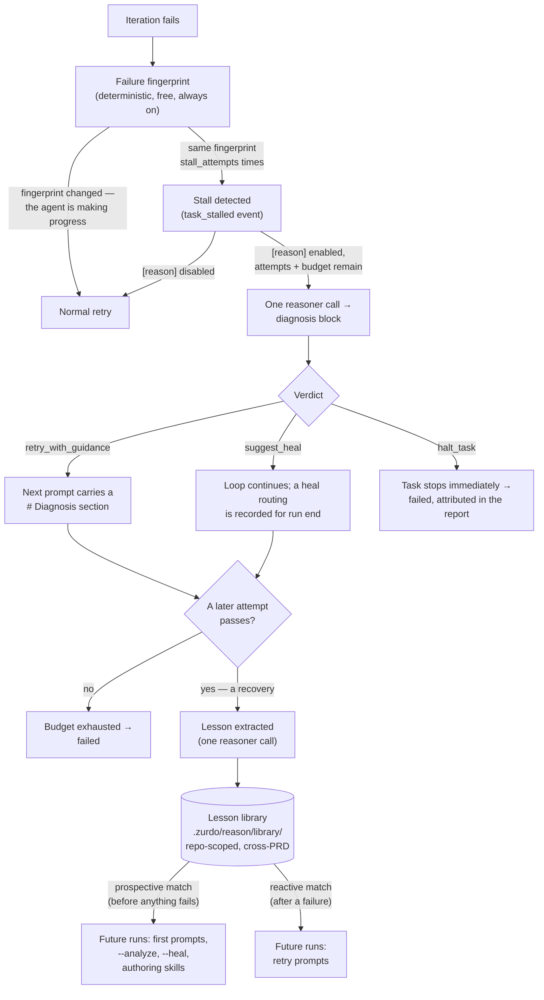

---
# Page settings
layout: default
comments: false

# Hero section
title: Diagnosis & lessons
description: "Stall detection, reasoner verdicts, and the cross-run lesson library."

# Micro navigation
micro_nav: true

# Page navigation
page_nav:
    prev:
        content: Structural verification
        url: '/docs/lumen.html'
    next:
        content: Commands
        url: '/docs/commands.html'

# Mermaid diagrams on this page
mermaid: true
---

A retry loop that keeps replaying the same failure is burning tokens, not converging. The **reason subsystem** (v1.3–v1.6) closes that gap in three moves: it *detects* when a task is stalled, it *diagnoses* the stall with one LLM call and decides whether retrying is even worth it, and it *remembers* — distilling recoveries into **lessons** that future runs in the same repository get told about before they trip over the same quirk.

The whole subsystem is **opt-in and off by default**. With `[reason] enabled = false` (the default), runs behave exactly as they did before the feature existed — except stall *detection*, which is deterministic, free, and always on.

## The lifecycle at a glance



Everything the reasoner produces is **advisory or subtractive** — it can guide the agent, stop spending, or route a criterion to `--heal`, but no verdict can ever mark a criterion passed, relax a hint, or edit the PRD. Verification stays the exclusive grader.

## Stall detection (always on)

Every failing iteration gets a **failure fingerprint** — a deterministic digest of *what* failed. When `stall_attempts` consecutive attempts (default `2`, minimum `2`) share the same fingerprint, the task is **stalled**: the agent is repeating itself, not converging. Detection is free, needs no LLM, and runs regardless of `[reason] enabled`.

A stall surfaces the moment it trips: a `task_stalled` line in the progress stream and `progress.log`, and a `## Fingerprint Stalls` section in `zurdo report`. (This is distinct from the older report field for tasks that exhausted their budget — a fingerprint stall fires *before* exhaustion, while there is still time to act.)

## Diagnosis blocks

With `[reason] enabled = true`, a detected stall with attempts remaining triggers **one** single-shot LLM call to the **reasoner** role (`[roles.reasoner]`, falling back to `[roles.analyzer]`). The call reads the stalled attempts' evidence and produces a **diagnosis block**: a structurally-verified artifact carrying a hypothesis about *why* the loop is stuck, guidance for the next attempt, a verdict, and a `confidence` (`low` / `medium` / `high`).

Costs are bounded on two axes: `max_diagnoses_per_task` (default `2`) and `max_reasoner_calls_per_run` (default `20`, shared with lesson extraction). A diagnosis never fires on a task's final attempt — its guidance would have no prompt to land in.

**Fail-open, everywhere.** A reasoner spawn failure, timeout, unparseable reply, or exhausted budget never fails the task — the iteration proceeds exactly as if the subsystem were disabled. The reason subsystem can stop zurdo from wasting money; it can never be the reason a run breaks.

## Verdicts

Every accepted diagnosis block carries exactly one verdict from a closed set:

| Verdict               | What zurdo does                                                                                                                                                          |
| --------------------- | -------------------------------------------------------------------------------------------------------------------------------------------------------------------------- |
| `retry_with_guidance` | The loop continues on its unchanged budget; the next prompt opens a `# Diagnosis` section carrying the reasoner's guidance (capped by `guidance_max_bytes`). Explicitly advisory — the agent may apply or ignore it. |
| `halt_task`           | Zurdo **stops attempting the task immediately**, even with attempts left — the verdict can spend the budget down, never up. The task records the same `failed` status as budget exhaustion, dependents go `blocked-by-dependency`, and the run continues on other tasks. Never silent: the close-out line reads `halted by reasoner diagnosis (attempt N): <hypothesis>` and the report gains a `## Halt Attributions` section. |
| `suggest_heal`        | The reasoner believes the *hint* is misaimed, not the code. Inside the loop this behaves like `retry_with_guidance`; at run end the routing surfaces as a `--heal <task> criterion <n>` summary line and a `## Heal Routings` report section. Zurdo **never runs `--heal` itself** — that stays your call. |

Deliberately absent from the enum: anything that marks a criterion passed, skips it, or weakens a hint. There is no verdict that makes work look done.

## Lessons

### Extraction — only recoveries teach

When a task that **stalled** later **passes** — a *recovery* — one reasoner call compares the stalled attempt's evidence with the recovering attempt's diff and distills **one rule a future run could apply first** (e.g. "tests in `tests/` need the daemon started via `make dev-up` before `cargo test` passes"). An ordinary first-attempt pass extracts nothing: no struggle, no lesson. Extraction is gated on `extract_lessons` (default `true`), charged to `max_reasoner_calls_per_run`, and fail-open — an extraction error never touches the task's passed status.

### The library — repository-scoped memory

Lessons live at `.zurdo/reason/library/`, one JSON file per lesson, written atomically. The library is **repository-scoped**: lessons transfer across every PRD in the repo, never across repos, and stay private by default (`.zurdo/` is gitignored). Duplicates are collapsed by content; on overflow past `max_lessons` (default `200`), the lowest-`uses` lessons are evicted first, oldest first among ties.

Per-run diagnosis blocks live separately under `.zurdo/<slug>/reason/`. `zurdo run --reset` archives the slug's blocks but **leaves the library untouched** — only `zurdo reason clear` deletes it.

### Matching — deterministic, no embeddings

Each lesson stores a **match surface** built by zurdo (never authored by the model) from up to four feature types: the failing criteria's **hint types** (`shell`, `grep`, …), typed **failure reasons**, the **shell command head** (`cargo`, `npm`, …), and **directory prefixes** from evidence paths and `**Frozen**` globs. A candidate scores one point per overlapping feature and needs **at least 2** to surface — one coincidence is never enough.

Matching runs in two modes:

- **Prospective** — against a task's *declared* surface, before anything fails. Powers first-iteration injection, `--analyze`, `--heal`, and `zurdo reason match`.
- **Reactive** — against an actual failure's components. Powers retry-prompt injection.

### Where lessons appear

| Surface                                  | Section rendered                     | Counts as a "use"? |
| ---------------------------------------- | ------------------------------------- | ------------------- |
| Executor prompts during a run            | `# Lessons From Previous Runs` (top `max_lessons_injected`, default `2`) | **Yes** — increments `uses`, stamps `last_matched_at` |
| `zurdo run --analyze`                    | Per-task `== Lessons ==` (every match, both full and `--static-only` passes) | No |
| `zurdo run --heal` propose prompt        | `=== LESSONS FROM PREVIOUS RUNS ===`  | No |
| `zurdo reason match <prd>` (preview CLI) | Per-task match listing                | No |
| `zurdo-prd-author` (pressure-test phase) and `zurdo-hint-debugger` (failure analysis) | `Lessons from previous runs` | No |

Only real executor-prompt injection stamps usage stats — previews and authoring reads can never shield a never-consumed lesson from eviction. Every injected lesson is attributed to its originating task and PRD, and the prompt section opens with a fixed advisory framing: lessons inform the agent; they never override the task.

## The `zurdo reason` CLI

| Command                       | What it does                                                                                                        |
| ----------------------------- | -------------------------------------------------------------------------------------------------------------------- |
| `zurdo reason match <prd>`    | Preview, per task, every library lesson whose prospective match clears the threshold — with each match's originating PRD, task, and recovered attempt. Read-only; works even with `[reason]` disabled. Invalid PRDs are rejected exactly as `zurdo validate` would. |
| `zurdo reason status`         | The library's lesson count (grouped by match key), plus each `.zurdo/<slug>/`'s persisted diagnosis-block count. Read-only; torn files are skipped, not fatal. |
| `zurdo reason clear`          | Delete the lesson library (only — per-run diagnosis blocks are untouched). Confirms on a TTY; non-interactive use requires `--yes`. |

Per-run diagnosis blocks aren't browsed through `zurdo reason` — they surface in `zurdo report` and the progress log.

## Configuration

The reasoner role and the `[reason]` table are accepted in `.zurdo/config.toml` but **not seeded by `zurdo init`** — add them by hand to opt in:

```toml
[roles.reasoner]                  # optional; falls back to [roles.analyzer]
provider = "anthropic"
model    = "claude-sonnet-4-6"

[reason]
enabled = true                    # master switch; default false
```

| Key                          | Default | Meaning                                                                                    |
| ---------------------------- | ------- | -------------------------------------------------------------------------------------------- |
| `enabled`                    | `false` | Master switch for diagnosis calls, lesson extraction, and lesson injection.                 |
| `stall_attempts`             | `2`     | Consecutive same-fingerprint attempts that define a stall (minimum `2`). Detection itself is always on. |
| `max_diagnoses_per_task`     | `2`     | Diagnosis-call budget per task.                                                             |
| `max_reasoner_calls_per_run` | `20`    | Run-wide cap on all reasoner calls (diagnosis + extraction).                                |
| `guidance_max_bytes`         | `4096`  | Size cap on the guidance carried into the next prompt.                                      |
| `extract_lessons`            | `true`  | Distill a lesson on every stall→pass recovery.                                              |
| `max_lessons_injected`       | `2`     | Top-k lessons injected per executor prompt; `0` disables injection.                         |
| `max_lessons`                | `200`   | Library cap; overflow evicts lowest-`uses` first, oldest first among ties.                  |

`enabled = true` with neither `[roles.reasoner]` nor `[roles.analyzer]` configured is a config-load error, raised before any PRD is read.

## Reading the results

`zurdo report` gains six sections, each omitted entirely when empty: `## Diagnoses` (accepted calls with model and token usage), `## Fingerprint Stalls`, `## Halt Attributions`, `## Heal Routings`, `## Lessons Extracted`, and `## Lessons Injected`. In `progress.log`, stalls land as `task_stalled` events and every diagnosis call as a `diagnosis_outcome` event (accepted or discarded, with verdict, confidence, and token counts when accepted).

<div class="callout callout--info" markdown="1">
**Note** Reasoner calls are billed LLM calls, visible in the report's token accounting as a separate reasoner tally. The defaults (2 diagnoses per task, 20 calls per run) keep the worst case small relative to the executor spend they exist to prevent.
</div>

Next: [Commands](commands.md)
