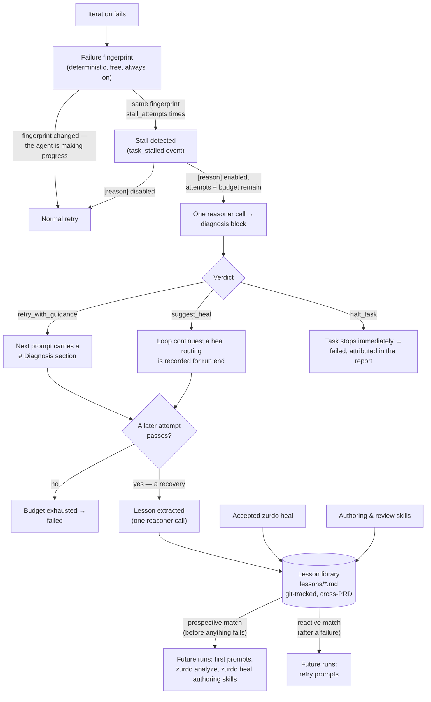

---
# Page settings
layout: default

# Hero section
title: Diagnosis & lessons
description: "Stall detection, reasoner verdicts, and the cross-run lesson library."

# Page navigation
page_nav:
    prev:
        content: Agent access (MCP)
        url: '/docs/mcp.html'
    next:
        content: Commands
        url: '/docs/commands.html'

# Mermaid diagrams on this page
mermaid: true
---

A retry loop that keeps replaying the same failure is burning tokens, not converging. The **reason subsystem** (v1.3–v1.6, extended in v1.11.0, v1.14.0, and v1.21.0) closes that gap in three moves: it *detects* when a task is stalled, it *diagnoses* the stall with one LLM call and decides whether retrying is even worth it, and it *remembers* — keeping **lessons** as reviewable files in your repository that future runs get told about before they trip over the same quirk. When a task dies anyway, a terminal [post-mortem](#post-mortems) explains why to *you*.

The **LLM half is opt-in and off by default**: with `[reason] enabled = false` (the default) zurdo never calls the reasoner. Two parts don't need the switch, because neither costs a token: stall *detection* is deterministic and always on, and since v1.14.0 lessons already committed under `lessons/` are read and injected into prompts whenever they match — in a repository with no `lessons/` directory that is a no-op.

## The lifecycle at a glance


```mermaid
flowchart TD
    FAIL["Iteration fails"] --> FP["Failure fingerprint<br/>(deterministic, free, always on)"]
    FP -->|"fingerprint changed —<br/>the agent is making progress"| RETRY["Normal retry"]
    FP -->|"same fingerprint<br/>stall_attempts times"| STALL["Stall detected<br/>(task_stalled event)"]
    STALL -->|"[reason] disabled"| RETRY
    STALL -->|"[reason] enabled,<br/>attempts + budget remain"| DIAG["One reasoner call →<br/>diagnosis block"]
    DIAG --> V{"Verdict"}
    V -->|retry_with_guidance| INJ["Next prompt carries a<br/># Diagnosis section"]
    V -->|suggest_heal| ROUTE["Loop continues; a heal routing<br/>is recorded for run end"]
    V -->|halt_task| HALT["Task stops immediately →<br/>failed, attributed in the report"]
    INJ --> OUT{"A later attempt<br/>passes?"}
    ROUTE --> OUT
    OUT -->|"no"| EXHAUST["Budget exhausted →<br/>failed"]
    OUT -->|"yes — a recovery"| EXTRACT["Lesson extracted<br/>(one reasoner call)"]
    EXTRACT --> LIB[("Lesson library<br/>lessons/*.md<br/>git-tracked, cross-PRD")]
    HEAL["Accepted zurdo heal"] --> LIB
    SKILLS["Authoring & review skills"] --> LIB
    LIB -->|"prospective match<br/>(before anything fails)"| FUT1["Future runs: first prompts,<br/>zurdo analyze, zurdo heal,<br/>authoring skills"]
    LIB -->|"reactive match<br/>(after a failure)"| FUT2["Future runs:<br/>retry prompts"]
```

Everything the reasoner produces is **advisory or subtractive** — it can guide the agent, stop spending, or route a criterion to `zurdo heal`, but no verdict can ever mark a criterion passed, relax a hint, or edit the PRD. Verification stays the exclusive grader.

## Stall detection (always on)

Every failing iteration gets a **failure fingerprint** — a deterministic digest of *what* failed. When `stall_attempts` consecutive attempts (default `2`, minimum `2`) share the same fingerprint, the task is **stalled**: the agent is repeating itself, not converging. Detection is free, needs no LLM, and runs regardless of `[reason] enabled`.

A stall surfaces the moment it trips: a `task_stalled` line in the progress stream and `progress.log`, and a `## Fingerprint Stalls` section in `zurdo report`. (This is distinct from the older report field for tasks that exhausted their budget — a fingerprint stall fires *before* exhaustion, while there is still time to act.)

Since **v1.8.0** the fingerprint also incorporates **frozen-path violations** and the **criterion index**, so an iteration that fails by touching a frozen path is distinguishable from one that fails a criterion, and two failures at different criteria no longer collide. That changed every fingerprint value: stall history recorded by an earlier zurdo isn't recognized as equal by a newer one. Existing runs proceed normally; they simply start their stall counting over (pass `--reset` if you'd rather start clean).

## Diagnosis blocks

With `[reason] enabled = true`, a detected stall with attempts remaining triggers **one** single-shot LLM call to the **reasoner** role (`[roles.reasoner]`, falling back to `[roles.analyzer]`). The call reads the stalled attempts' evidence and produces a **diagnosis block**: a structurally-verified artifact carrying a hypothesis about *why* the loop is stuck, guidance for the next attempt, a verdict, and a `confidence` (`low` / `medium` / `high`).

Costs are bounded on two axes: `max_diagnoses_per_task` (default `2`) and `max_reasoner_calls_per_run` (default `20`, shared with lesson extraction). A diagnosis never fires on a task's final attempt — its guidance would have no prompt to land in.

**Fail-open, everywhere.** A reasoner spawn failure, timeout, unparseable reply, or exhausted budget never fails the task — the iteration proceeds exactly as if the subsystem were disabled. The reason subsystem can stop zurdo from wasting money; it can never be the reason a run breaks.

## Verdicts

Every accepted diagnosis block carries exactly one verdict from a closed set:

| Verdict               | What zurdo does                                                                                                                                                          |
| --------------------- | -------------------------------------------------------------------------------------------------------------------------------------------------------------------------- |
| `retry_with_guidance` | The loop continues on its unchanged budget; the next prompt opens a `# Diagnosis` section carrying the reasoner's guidance (capped by `guidance_max_bytes`). Explicitly advisory — the agent may apply or ignore it. |
| `halt_task`           | Zurdo **stops attempting the task immediately**, even with attempts left — the verdict can spend the budget down, never up. The task records the same `failed` status as budget exhaustion, dependents go `blocked-by-dependency`, and the run continues on other tasks. Never silent: the close-out line reads `halted by reasoner diagnosis (attempt N): <hypothesis>` and the report gains a `## Halt Attributions` section. |
| `suggest_heal`        | The reasoner believes the *hint* is misaimed, not the code. Inside the loop this behaves like `retry_with_guidance`; at run end the routing surfaces as a `--heal <task> criterion <n>` summary line and a `## Heal Routings` report section. Zurdo **never runs `heal` itself** — that stays your call. |

Deliberately absent from the enum: anything that marks a criterion passed, skips it, or weakens a hint. There is no verdict that makes work look done.

## Post-mortems

A diagnosis speaks to the *agent*. A **post-mortem** (v1.11.0) speaks to **you** — the first reason block whose audience is human.

It fires under one narrow condition: a stall fingerprint repeating **after** an accepted `retry_with_guidance` block for that same fingerprint. That is the strongest available evidence that the accepted hypothesis was wrong, and the moment the most evidence exists. The task has spent its budget; there is nothing left to guide.

- **Its verdict space is restricted to `{halt_task, suggest_heal}`.** A post-mortem carrying `retry_with_guidance` fails verification and is discarded with a reason — advisory guidance with no subsequent prompt is waste. A `suggest_heal` post-mortem turns a dead run into a concrete `zurdo heal` next action.
- **Nothing in the runner branches on it.** It is persisted (`kind: post_mortem` under `.zurdo/<slug>/reason/`), priced into the reasoner tally, and rendered from the block store into `zurdo report`'s `## Diagnoses` table. The run's outcome is unchanged by it.
- **Its evidence bundle sees what the first diagnosis could not:** a never-dropped prior-hypothesis section (the earlier block's hypothesis, guidance, verdict, confidence, citation status, and the observed non-effect) plus **two** narrative projections — the pre-guidance and post-guidance attempts — so the reasoner can check directly whether the agent even followed the guidance.

Cost: one extra reasoner call per persistently-failed task, drawn from the existing per-task allowance of `2` that shipped defaults previously left unreachable. No new config key.

## What the reasoner actually reads

The evidence bundle handed to a diagnosis or post-mortem call is assembled by zurdo, never by the model. Two v1.11.0 changes made it far more informative:

**A structured projection, not a raw stream tail.** The narrative section used to carry a tail-only slice of the provider's raw event stream. It now renders three parts — the executor's final assistant text, a **numbered tool-call log**, and the run-level error when the stream carried one — built by classifying each parsed event against the per-provider [event vocabulary](providers.md#the-vocabulary-canary) and dropping bookkeeping frames. The old window was pathological on exactly the runs where diagnosis matters most: on one 348 KB transcript the reasoner saw 1.18% of it, and the single largest item in that window was the terminal result envelope — at 40% of the entire budget, almost entirely cost telemetry. An unparseable stream (unknown provider, non-JSON output, a crashed CLI) still falls back to a raw tail.

**Its own budget, truncated from both ends.** The narrative window (12 KB) is decoupled from the executor prompt's 4 KB truncation, which stays small deliberately — that prompt is rebuilt every iteration and token economy there is the point. Over-budget projections keep the **head and the tail** with a `[… n bytes elided …]` seam between them: over a tool-call log the head is where an agent picks its paths. A post-mortem's two projections split this budget at 6 KB each rather than doubling it.

**Uncited high confidence is clamped.** Evidence references can point at a criterion, a path, or (new) `{"step": N}` — the Nth line of the numbered tool-call log. A block claiming `confidence: high` while citing no such step is **downgraded to medium** at verification time, with `confidence_clamped: true` recorded on the persisted block rather than silently rewritten. Clamped rather than rejected: an uncited block can still carry correct guidance, and rejecting it would burn a retry that might have worked.

<div class="callout callout--info" markdown="1">
**Reason-block schema `2`** The bump accommodates the `post_mortem` kind and the `step` evidence-ref shape. Schema mismatches are verification failures, not migrations — blocks persisted under `.zurdo/<slug>/reason/` by an older zurdo are not upgraded in place.
</div>

## Out-of-tree path references

An agent that reaches outside the repository — editing `~/.claude/skills/`, writing to `$HOME` — produces work that is invisible to the diff, unauditable, and often the real reason a criterion won't go green. Since v1.11.0 every iteration's captured provider stream is scanned **at capture time** for absolute-path-shaped tokens (structured `file_path` / `path` / `changes[].path` fields and `command` tokens, with a leading `~` or `$HOME` resolved) that fall outside the repo root.

Findings are deduped by resolved path, kept in first-seen order, and capped at 20 with an explicit overflow marker. They surface on four places:

| Surface                    | What appears                                                                              |
| -------------------------- | ------------------------------------------------------------------------------------------- |
| `prd.json`                 | `out_of_tree_refs` on the attempt — omitted entirely when empty, so existing state round-trips unchanged |
| `progress.log`             | An `out_of_tree_refs` event on attempts that found something; a clean attempt appends nothing |
| `zurdo report`             | An `## Out-of-Tree References` section, one row per attempt that named such a path         |
| `zurdo review`             | A task-scoped `out-of-tree references:` block, drawn once per task ahead of the selected criterion's detail |

Plus the reasoner's evidence bundle, where it is a **never-dropped section** — visible to a diagnosis or post-mortem even when the bundle is over its byte cap and every optional section has been dropped.

The pass is **advisory and never gating**: it does not distinguish a read from a write, it never fails an iteration or a run, and the findings are deliberately excluded from the failure fingerprint so they cannot perturb stall detection or diagnosis triggering.

<div class="callout callout--warning" markdown="1">
**The authoring rule that prevents it** An executor resolves bare dotfile paths against `$HOME`, not the repository root. When a task edits dotfiles, spell the path out in full (`<repo-root>/.claude/skills/`) and pair it with an in-tree criterion that gate-checks the edit actually landed in the repo. The bundled `zurdo-prd-author` skill teaches this rule directly.
</div>

## Lessons

A **lesson** is a short, reviewable rule about your repository — "tests in `tests/` need the daemon started via `make dev-up` first" — that zurdo tells future runs about *before* they fail on it.

### Where lessons come from

Four sources, each recorded in the lesson's `source.kind`:

| `source.kind`    | Written by                                                                                           | Costs a token? |
| ---------------- | ------------------------------------------------------------------------------------------------------ | -------------- |
| `StallRecovery`  | The runner, when a **stalled** task later **passes**. One reasoner call compares the stalled attempt's evidence with the fixing attempt's diff and distills one rule. An ordinary first-attempt pass teaches nothing. Needs `[reason] enabled` and `extract_lessons` (default `true`); charged to `max_reasoner_calls_per_run`. | Yes |
| `HealAcceptance` | [`zurdo heal`](commands.md#zurdo-heal--re-aim-misaimed-grep-hints), when you answer `y` to `Apply this heal?` (v1.14.0). The heal log already holds everything, so the lesson is built directly from it — old payload, corrected payload, failure class — with **no provider call** and no reasoner role needed. Gated on `extract_lessons` alone. Nothing is written on the non-TTY path or for a rejected heal. | No |
| `AuthoringTrail` | The bundled `zurdo-prd-author` skill, for a decision in the PRD's `.trail.md` that records a correction someone would otherwise rediscover. | Your agent session |
| `IntentReview`   | The bundled `zurdo-prd-review` skill, after a post-run review that scaffolded a follow-up PRD (v1.17.0). | Your agent session |

Every write is fail-open: an extraction or library error is logged and never changes the task's or the heal's outcome.

### The library is source, not state

Since **v1.14.0**, lessons live in a git-tracked **`lessons/`** directory at the repo root, one `lessons/lesson-<hash8>.md` file per lesson — not under `.zurdo/`. **Don't gitignore it.** A lesson is YAML frontmatter plus a markdown body, so it reads like any other change in a PR diff:

```markdown
---
schema: 1
match:
  hint_types:
    - shell
  command_head: cargo
  path_prefixes:
    - tests/
source:
  kind: StallRecovery
  prd_slug: auth-a1b2
  task_id: task-auth
  recovered_attempt: 3
created_at: 2026-09-01T12:00:00Z
---

Integration tests under `tests/` need the dev daemon running. Start it with
`make dev-up` before `cargo test --test integration`, or the suite times out.
```

- **Filename.** `<hash8>` is the first 8 hex characters of a hash over `match` and the body only, so the name is stable and identical lessons are deduplicated.
- **Usage counts live elsewhere.** `uses` and `last_matched_at` are kept in **`.zurdo/reason/usage.json`**, keyed by that hash. A match updates only this file, so running zurdo never modifies a tracked lesson file. A lesson with no usage entry — including one you wrote by hand — counts as zero uses.
- **Retiring a lesson is `git rm`.** On overflow past `max_lessons` (default `200`), zurdo evicts the lowest-`uses` lessons first, oldest `created_at` first among ties.
- **Hand-authoring is fine.** The frontmatter keys are a closed set, though, so a typo'd key makes the file unparseable. An unparseable file is skipped (never fatal), and since v1.14.0 it is named in `zurdo reason status` (`reason: library unreadable <path>: <error>`) and warned about at every `zurdo run` pre-flight.
- **Repository-scoped.** Lessons apply to every PRD in the repo, never across repos. `zurdo run --reset` leaves them alone.

<div class="callout callout--warning" markdown="1">
**Upgrading from ≤ 1.13?** Lessons used to be JSON files under `.zurdo/reason/library/`. v1.14.0 does **not** migrate them: the old directory is neither read nor moved, so an upgraded repository starts with an empty library. Move any lessons worth keeping into `lessons/` yourself.
</div>

Per-run diagnosis blocks live separately under `.zurdo/<slug>/reason/`; `--reset` archives them along with the rest of the slug's state.

### Matching — deterministic, no embeddings

Each lesson's **match surface** has up to four components: the criteria's **hint types** (`shell`, `grep`, …), typed **failure reasons**, the **shell command head** (`cargo`, `npm`, …), and **directory prefixes** from evidence paths and `**Frozen**` globs. A candidate scores one point per overlapping component and needs **at least 2** to surface — one coincidence is never enough. The practical consequence for hand-written lessons: declare at least two components, or the lesson can never match.

Matching runs in two modes:

- **Prospective** — against a task's *declared* surface, before anything fails. Powers first-iteration injection, `zurdo analyze`, `zurdo heal`, and `zurdo reason match`.
- **Reactive** — against an actual failure's components. Powers retry-prompt injection.

### Where lessons appear

| Surface                                  | Section rendered                     | Counts as a "use"? |
| ---------------------------------------- | ------------------------------------- | ------------------- |
| Executor prompts during a run            | `# Lessons From Previous Runs` (top `max_lessons_injected`, default `2`) | **Yes** — increments `uses`, stamps `last_matched_at` in `usage.json` |
| `zurdo analyze`                          | Per-task `== Lessons ==` (every match, both full and `--static-only` passes) | No |
| `zurdo heal` propose prompt              | `=== LESSONS FROM PREVIOUS RUNS ===`  | No |
| `zurdo reason match <prd>` (preview CLI) | Per-task match listing                | No |
| `zurdo-prd-author` (pressure-test phase) and `zurdo-hint-debugger` (failure analysis) | `Lessons from previous runs` | No |

None of these checks `[reason] enabled`. Only real executor-prompt injection updates usage counts, so previews and authoring reads can't protect a lesson no run ever used from eviction. Every injected lesson is attributed to its source, and the prompt section opens with a fixed advisory framing: lessons inform the agent; they never override the task. Provenance renders per source — an attempt number for `StallRecovery`, a criterion index for `HealAcceptance`, `<task-id>, follow-up <path>` for `IntentReview`.

### Obligations: lessons that bind future PRDs

Most lessons are advice. Since **v1.21.0** a lesson can also carry an **obligation** — a `requires` block stating what any PRD it applies to must contain:

```yaml
requires:
  scope: prd                                     # prd (default) or task
  criterion_matching: 'go test (-count=1 )?\./\.\.\.'
```

- **`criterion_matching`** is one regex, in the same dialect as `[grep:]` patterns. It is tested against each criterion's prose **and** against each of its hints' source text (`shell: go test -count=1 ./...`), so a requirement that lives entirely inside a command is expressible.
- **`scope: prd`** — if any task in the PRD matches the lesson's `match` surface, some criterion *anywhere in the PRD* must satisfy the regex; one finding per PRD. **`scope: task`** — each matching task must satisfy it within its own criteria; one finding per task.
- A missed obligation is an [`unaddressed-lesson`](hints.md#the-warn-lint-families) warning from **`zurdo analyze`** (including `--static-only`); `zurdo validate` never emits it and `--strict` never promotes it. The finding names the lesson file it came from.
- A lesson with `requires` is **not injected into executor prompts** — it corrects PRD *authors*, and an executor can't act on it. If you need both, write two lessons.
- Adding `requires` to an existing lesson doesn't change its filename or its usage history.

This is the per-PRD counterpart of the [completion gate](configuration.md#the-completion-gate): the gate checks a repository-wide rule at run end; an obligation makes sure PRDs that touch a given area keep asking for the right check.

## The `zurdo reason` CLI

| Command                       | What it does                                                                                                        |
| ----------------------------- | -------------------------------------------------------------------------------------------------------------------- |
| `zurdo reason match <prd>`    | Preview, per task, every library lesson whose prospective match clears the threshold — with each match's originating PRD, task, and provenance. Read-only; works even with `[reason]` disabled. Invalid PRDs are rejected exactly as `zurdo validate` would. |
| `zurdo reason status`         | The library's lesson count (grouped by match key), one `reason: library unreadable <path>: <error>` line per lesson file that failed to parse, plus each `.zurdo/<slug>/`'s persisted diagnosis-block count. Read-only; the exit code doesn't change for a broken file. |
| `zurdo reason clear`          | Delete the usage sidecar, `.zurdo/reason/usage.json`, resetting every lesson's use count. It does **not** touch `lessons/` — those are tracked files; retire one with `git rm lessons/<file>.md`. Per-run diagnosis blocks are untouched too. Confirms on a TTY; non-interactive use requires `--yes`. |

Per-run diagnosis blocks aren't browsed through `zurdo reason` — they surface in `zurdo report` and the progress log.

## Configuration

The reasoner role and the `[reason]` table are accepted in `.zurdo/config.toml` but **not seeded by `zurdo init`** — add them by hand to opt in:

```toml
[roles.reasoner]                  # optional; falls back to [roles.analyzer]
provider = "anthropic"
model    = "claude-sonnet-4-6"

[reason]
enabled = true                    # master switch; default false
```

| Key                          | Default | Meaning                                                                                    |
| ---------------------------- | ------- | -------------------------------------------------------------------------------------------- |
| `enabled`                    | `false` | Switch for reasoner calls: stall diagnoses, post-mortems, and stall-recovery lesson extraction. Lesson reads and injection, and heal-acceptance lessons, don't check it (v1.14.0). |
| `stall_attempts`             | `2`     | Consecutive same-fingerprint attempts that define a stall (minimum `2`). Detection itself is always on. |
| `max_diagnoses_per_task`     | `2`     | Reasoner-call budget per task — a terminal [post-mortem](#post-mortems) draws from the same allowance. |
| `max_reasoner_calls_per_run` | `20`    | Run-wide cap on all reasoner calls (diagnosis + extraction).                                |
| `guidance_max_bytes`         | `4096`  | Size cap on the guidance carried into the next prompt.                                      |
| `extract_lessons`            | `true`  | Write a lesson on every stall→pass recovery (with `enabled`) and every accepted heal.       |
| `max_lessons_injected`       | `2`     | Top-k lessons injected per executor prompt; `0` disables injection.                         |
| `max_lessons`                | `200`   | Library cap; overflow evicts lowest-`uses` first, oldest first among ties.                  |

`enabled = true` with neither `[roles.reasoner]` nor `[roles.analyzer]` configured is a config-load error, raised before any PRD is read.

## Reading the results

`zurdo report` gains seven sections, each omitted entirely when empty: `## Diagnoses` (every persisted reason block — diagnoses and post-mortems alike — with model, token usage, and accepted-or-discarded outcome), `## Fingerprint Stalls`, `## Halt Attributions`, `## Heal Routings`, `## Out-of-Tree References`, `## Lessons Extracted`, and `## Lessons Injected`.

In `progress.log`, stalls land as `task_stalled` events and every *diagnosis* call as a `diagnosis_outcome` event (accepted or discarded, with verdict, confidence, and token counts when accepted). Post-mortems deliberately emit no `diagnosis_outcome` — that event keeps meaning what it has always meant, a diagnosis whose guidance an attempt is about to carry — and are read from the block store instead.

<div class="callout callout--info" markdown="1">
**Note** Reasoner calls are billed LLM calls, visible in the report's token accounting as a separate reasoner tally. The defaults (2 diagnoses per task, 20 calls per run) keep the worst case small relative to the executor spend they exist to prevent.
</div>

Next: [Commands](commands.md)
