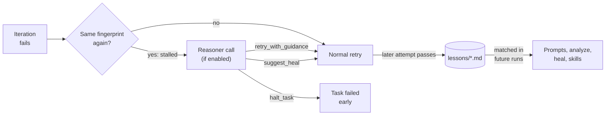

---
# Page settings
layout: default

# Hero section
title: Diagnosis & lessons
description: "Stall detection, reasoner verdicts, and the cross-run lesson library."

# Page navigation
page_nav:
    prev:
        content: Agent access (MCP)
        url: '/docs/mcp.html'
    next:
        content: Commands
        url: '/docs/commands.html'

# Mermaid diagrams on this page
mermaid: true
---

A retry loop that replays the same failure is burning tokens, not converging. The **reason subsystem** does three things about it:

<div class="lp-cards" markdown="1">
<div markdown="1">
**Detect**
Spots a stalled task by fingerprinting each failure. Free and always on.
</div>
<div markdown="1">
**Diagnose**
Makes one LLM call per stall to guide, re-route, or halt the task. Opt-in with `[reason] enabled`.
</div>
<div markdown="1">
**Remember**
Keeps **lessons** as reviewable files in `lessons/`. Future runs are told about them before they hit the same quirk.
</div>
</div>

With `[reason] enabled = false` (the default), zurdo never calls the reasoner. Stall detection and reading lessons that are already committed both work regardless, because neither one costs a token.

## The lifecycle at a glance


```mermaid
flowchart LR
    FAIL["Iteration<br/>fails"] --> FP{"Same fingerprint<br/>again?"}
    FP -->|no| RETRY["Normal retry"]
    FP -->|"yes: stalled"| DIAG["Reasoner call<br/>(if enabled)"]
    DIAG -->|retry_with_guidance| RETRY
    DIAG -->|suggest_heal| RETRY
    DIAG -->|halt_task| HALT["Task failed<br/>early"]
    RETRY -->|"later attempt passes"| LESSON[("lessons/*.md")]
    LESSON -->|"matched in<br/>future runs"| PROMPT["Prompts, analyze,<br/>heal, skills"]
```

Everything the reasoner produces is **advisory or subtractive**. It can guide the agent, stop spending, or point you to `zurdo heal`. It can never mark a criterion passed, relax a hint, or edit the PRD. Verification stays the only grader.

## Stall detection (always on)

Every failing iteration gets a **failure fingerprint**: a deterministic digest of *what* failed, including which criterion it was and any frozen-path violation. When `stall_attempts` consecutive attempts (default `2`) share a fingerprint, the task is **stalled**. This fires *before* the budget runs out, while there's still time to act.

<figure class="lp-terminal" aria-label="zurdo run output showing a task stalling on a repeated fingerprint">
<div class="lp-terminal__bar"><span class="lp-terminal__dots" aria-hidden="true"><i></i><i></i><i></i></span><span class="lp-terminal__title">zurdo run prds/greeter.md</span></div>
<pre class="lp-terminal__body"><code><span class="t-dim">─── task-test: Add a smoke test ─── effort=low, deps=[task-greet]</span>
  <span class="t-acc">→</span> iteration 2 of 3
  <span class="t-ok">✓</span> agent completed: exit=0, 56ms
    <span class="t-bad">✗</span> file-exists: tests/smoke.rs
    <span class="t-bad">✗</span> shell: cargo test --test integration
  <span class="t-warn">⚠ task-test: stalled — attempt 2 repeats fingerprint sha256:b5fc4cd1… (2 consecutive attempts)</span>
  <span class="t-acc">→</span> iteration 3 of 3
  <span class="t-dim">…</span>
  <span class="t-bad">✗ task-test: failed in 3 iterations</span> <span class="t-dim">(348ms)</span></code></pre>
<figcaption class="lp-terminal__caption"><span class="lp-dot" aria-hidden="true"></span>Stalls also appear as task_stalled in progress.log and under ## Fingerprint Stalls in zurdo report.</figcaption>
</figure>

<details markdown="1">
<summary>Upgrading from ≤ 1.7: fingerprint values changed</summary>

Since v1.8.0, fingerprints include frozen-path violations and the criterion index. A frozen-path failure is now distinguishable from a criterion failure, and failures at different criteria no longer collide. Every fingerprint value changed as a result, so stall history from an older zurdo isn't recognized. Existing runs proceed normally and start their stall count over. Pass `--reset` if you'd rather start clean.

</details>

## Diagnosis blocks

With `[reason] enabled = true`, a stall with attempts remaining triggers **one** LLM call to the **reasoner** role (`[roles.reasoner]`, falling back to `[roles.analyzer]`). It returns a **diagnosis block** containing a hypothesis, guidance for the next attempt, a verdict, and a `confidence` (`low` / `medium` / `high`).

- **Bounded cost:** at most `max_diagnoses_per_task` calls per task (default `2`) and `max_reasoner_calls_per_run` per run (default `20`, shared with lesson extraction). A diagnosis never fires on a task's final attempt, because there'd be no prompt left to carry it.
- **Fail-open:** a spawn failure, timeout, unparseable reply, or exhausted budget never fails the task. The iteration proceeds as if the subsystem were off.

## Verdicts

| Verdict | What zurdo does |
| --- | --- |
| `retry_with_guidance` | Continues on the same budget. The next prompt opens with a `# Diagnosis` section (capped at `guidance_max_bytes`), which the agent can apply or ignore. |
| `halt_task` | **Stops the task now**, even with attempts left. It's marked `failed` and its dependents become `blocked-by-dependency`. The close-out line reads `halted by reasoner diagnosis (attempt N): <hypothesis>`, and the report gains `## Halt Attributions`. |
| `suggest_heal` | The *hint* looks misaimed, not the code. The run behaves like `retry_with_guidance`, then at run end prints a `--heal <task> criterion <n>` line and adds a `## Heal Routings` section. Zurdo **never runs heal itself**. |

No verdict marks a criterion passed, skips it, or weakens a hint.

## Post-mortems

A diagnosis speaks to the *agent*. A **post-mortem** speaks to **you**.

It fires only when a stall fingerprint repeats **after** an accepted `retry_with_guidance` for that same fingerprint. That repeat is strong evidence the hypothesis was wrong, and by then the budget is spent. A post-mortem can only say `halt_task` or `suggest_heal`; a `suggest_heal` turns a dead run into a concrete `zurdo heal` next step. It appears in `zurdo report`'s `## Diagnoses` table and never changes the run's outcome.

<details markdown="1">
<summary>Post-mortem details</summary>

- A post-mortem carrying `retry_with_guidance` fails verification and is discarded with a reason, because guidance with no later prompt is waste.
- It's persisted as `kind: post_mortem` under `.zurdo/<slug>/reason/` and counted in the reasoner tally. Nothing in the runner branches on it.
- Its evidence includes the earlier block's hypothesis, guidance, verdict, confidence, citation status, and the fact that it had no effect. It also gets **two** narrative projections, from before and after the guidance, so the reasoner can check whether the agent followed it.
- Cost: one extra call per persistently failed task, drawn from the existing per-task allowance of `2`. There's no new config key.

</details>

## What the reasoner actually reads

Zurdo assembles the evidence bundle; the model never does.

- **A structured projection, not a raw log tail.** The bundle holds the executor's final text, a **numbered tool-call log**, and any run-level error. Zurdo builds it by classifying events against each provider's [event vocabulary](providers.md#the-vocabulary-canary) and dropping bookkeeping frames. An unparseable stream falls back to a raw tail.
- **A 12 KB window that keeps both ends.** Content over budget keeps the head and tail, with a `[… n bytes elided …]` seam in between. A post-mortem's two projections get 6 KB each.
- **Uncited high confidence is clamped.** Evidence can cite a criterion, a path, or `{"step": N}` (a line of the tool-call log). A `confidence: high` block that cites no step is downgraded to medium and recorded with `confidence_clamped: true`, rather than rejected.

<details markdown="1">
<summary>Why the projection replaced the raw tail</summary>

The old narrative section was a tail-only slice of the provider's raw event stream. It was worst on exactly the runs where diagnosis matters most: on one 348 KB transcript, the reasoner saw 1.18% of it. The largest item in that window was the terminal result envelope, which took 40% of the budget and was almost all cost telemetry.

The 12 KB narrative window is separate from the executor prompt's 4 KB truncation. That prompt stays small on purpose, because it's rebuilt every iteration. Keeping the head matters because over a tool-call log, the head is where an agent picks its paths. Clamping beats rejecting because an uncited block can still carry correct guidance, and rejecting it would burn a retry that might have worked.

</details>

<div class="callout callout--info" markdown="1">
**Reason-block schema `2`** This schema version adds the `post_mortem` kind and the `step` evidence-ref shape. Schema mismatches are verification failures, not migrations: blocks under `.zurdo/<slug>/reason/` written by an older zurdo are not upgraded in place.
</div>

## Out-of-tree path references

An agent that edits outside the repo (`~/.claude/skills/`, `$HOME`) produces work the diff can't see, and that's often the real reason a criterion won't pass. Zurdo scans every iteration's provider stream for absolute paths outside the repo root, resolving `~` and `$HOME`. It checks structured `file_path` / `path` / `changes[].path` fields and `command` tokens. Findings are deduplicated and capped at 20.

| Surface | What appears |
| --- | --- |
| `prd.json` | `out_of_tree_refs` on the attempt (omitted when empty) |
| `progress.log` | An `out_of_tree_refs` event (clean attempts add nothing) |
| `zurdo report` | `## Out-of-Tree References`, one row per affected attempt |
| `zurdo review` | An `out-of-tree references:` block per task |
| Reasoner evidence | A section that's never dropped, even when the bundle is over its cap |

This scan is **advisory**. It doesn't distinguish reads from writes, never fails anything, and is kept out of the failure fingerprint.

<div class="callout callout--warning" markdown="1">
**The authoring rule that prevents it** Executors resolve bare dotfile paths against `$HOME`, not the repo. When a task edits dotfiles, write the full path (`<repo-root>/.claude/skills/`) and add an in-tree criterion that checks the edit landed in the repo. The bundled `zurdo-prd-author` skill teaches this rule.
</div>

## Lessons

A **lesson** is a short, reviewable rule about your repository, such as "tests in `tests/` need `make dev-up` first". Zurdo tells future runs about it *before* they fail on it.

### Where lessons come from

| `source.kind` | Written by | Costs a token? |
| --- | --- | --- |
| `StallRecovery` | The runner, when a **stalled** task later **passes**. One reasoner call compares the stuck attempt with the fix and distills a rule. Needs `[reason] enabled` and `extract_lessons`. | Yes |
| `HealAcceptance` | [`zurdo heal`](commands.md#zurdo-heal--re-aim-misaimed-grep-hints), when you answer `y` to `Apply this heal?`. The lesson is built from the heal log with no provider call. Needs only `extract_lessons`, and isn't written on the non-TTY path. | No |
| `AuthoringTrail` | The `zurdo-prd-author` skill, for a correction recorded in the PRD's `.trail.md` | Your agent session |
| `IntentReview` | The `zurdo-prd-review` skill, after a review that produced a follow-up PRD | Your agent session |

An ordinary first-attempt pass teaches nothing. Every lesson write is fail-open: an error is logged and never changes the task's or the heal's outcome.

### The library is source, not state

Lessons live in a git-tracked **`lessons/`** directory at the repo root, one `lesson-<hash8>.md` per lesson. **Don't gitignore it.** Each lesson is YAML frontmatter plus a markdown body, so it reads like any other change in a PR:

```markdown
---
schema: 1
match:
  hint_types:
    - shell
  command_head: cargo
  path_prefixes:
    - tests/
source:
  kind: StallRecovery
  prd_slug: auth-a1b2
  task_id: task-auth
  recovered_attempt: 3
created_at: 2026-09-01T12:00:00Z
---

Integration tests under `tests/` need the dev daemon running. Start it with
`make dev-up` before `cargo test --test integration`, or the suite times out.
```

- **Stable names.** `<hash8>` hashes only `match` and the body, so identical lessons deduplicate.
- **Use counts live elsewhere.** `uses` and `last_matched_at` are stored in `.zurdo/reason/usage.json`, so a run never modifies a tracked lesson file. A hand-written lesson starts at zero uses.
- **Retire a lesson with `git rm`.** Above `max_lessons` (default `200`), zurdo evicts the lowest-`uses` lessons first, and the oldest among ties.
- **Hand-authoring is fine.** The frontmatter keys are a closed set, though. A file with a typo'd key is skipped rather than fatal. It's named in `zurdo reason status` and warned about at every run's pre-flight.
- **Repo-scoped.** Lessons apply to every PRD in the repo, and `zurdo run --reset` leaves them alone. Per-run diagnosis blocks live separately under `.zurdo/<slug>/reason/` and *are* archived by `--reset`.

<div class="callout callout--warning" markdown="1">
**Upgrading from ≤ 1.13?** Lessons used to be JSON files under `.zurdo/reason/library/`. They are **not** migrated: the old directory is neither read nor moved. Move any lessons worth keeping into `lessons/` yourself.
</div>

### Matching — deterministic, no embeddings

A lesson matches on up to four components. Each overlapping component scores one point, and **2 points are needed** to surface. One coincidence is never enough, so a hand-written lesson must declare at least two components.

<figure class="lp-figure" aria-label="A lesson's match surface compared with a task's declared surface: hint type, command head, and directory prefix overlap, giving a score of 3">
<div class="lp-figure__scroll"><svg viewBox="0 0 680 230" role="img">
  <text class="lp-svg-text" x="270" y="24" text-anchor="middle" font-weight="600">Lesson</text>
  <text class="lp-svg-text" x="530" y="24" text-anchor="middle" font-weight="600">Task task-test</text>
  <text class="lp-svg-muted" x="20" y="64">hint types</text>
  <text class="lp-svg-muted" x="20" y="108">failure reasons</text>
  <text class="lp-svg-muted" x="20" y="152">command head</text>
  <text class="lp-svg-muted" x="20" y="196">directory prefixes</text>
  <rect x="190" y="44" width="160" height="30" rx="6" class="lp-svg-accent" stroke-width="1.5"/>
  <text class="lp-svg-mono" x="270" y="64" text-anchor="middle">shell</text>
  <rect x="190" y="88" width="160" height="30" rx="6" class="lp-svg-box" stroke-width="1.5"/>
  <text class="lp-svg-muted" x="270" y="108" text-anchor="middle">—</text>
  <rect x="190" y="132" width="160" height="30" rx="6" class="lp-svg-accent" stroke-width="1.5"/>
  <text class="lp-svg-mono" x="270" y="152" text-anchor="middle">cargo</text>
  <rect x="190" y="176" width="160" height="30" rx="6" class="lp-svg-accent" stroke-width="1.5"/>
  <text class="lp-svg-mono" x="270" y="196" text-anchor="middle">tests/</text>
  <rect x="450" y="44" width="160" height="30" rx="6" class="lp-svg-accent" stroke-width="1.5"/>
  <text class="lp-svg-mono" x="530" y="64" text-anchor="middle">shell, file-exists</text>
  <rect x="450" y="88" width="160" height="30" rx="6" class="lp-svg-box" stroke-width="1.5"/>
  <text class="lp-svg-muted" x="530" y="108" text-anchor="middle">none yet</text>
  <rect x="450" y="132" width="160" height="30" rx="6" class="lp-svg-accent" stroke-width="1.5"/>
  <text class="lp-svg-mono" x="530" y="152" text-anchor="middle">cargo</text>
  <rect x="450" y="176" width="160" height="30" rx="6" class="lp-svg-accent" stroke-width="1.5"/>
  <text class="lp-svg-mono" x="530" y="196" text-anchor="middle">tests/</text>
  <circle cx="400" cy="59" r="9" class="lp-svg-ok"/>
  <circle cx="400" cy="147" r="9" class="lp-svg-ok"/>
  <circle cx="400" cy="191" r="9" class="lp-svg-ok"/>
  <text class="lp-svg-muted" x="400" y="108" text-anchor="middle">·</text>
</svg></div>
<figcaption>3 overlapping components, score 3 ≥ 2: the lesson surfaces for this task.</figcaption>
</figure>

- **Prospective** matching uses a task's *declared* surface, before anything fails. It powers first-prompt injection, `zurdo analyze`, `zurdo heal`, and `zurdo reason match`.
- **Reactive** matching uses an actual failure's components. It powers retry-prompt injection.

### Where lessons appear

<figure class="lp-terminal" aria-label="zurdo reason match previewing which lessons apply to each task">
<div class="lp-terminal__bar"><span class="lp-terminal__dots" aria-hidden="true"><i></i><i></i><i></i></span><span class="lp-terminal__title">zurdo reason match prds/greeter.md</span></div>
<pre class="lp-terminal__body"><code>reason: match prds/greeter.md
reason: task task-greet <span class="t-dim">0 lessons</span>
reason: task task-docs <span class="t-dim">0 lessons</span>
reason: task task-test <span class="t-ok">1 lessons</span>
reason: task task-test lesson <span class="t-acc">source=greeter-a4ed/task-test@3</span> Integration tests under `tests/` need the dev daemon running. …</code></pre>
<figcaption class="lp-terminal__caption"><span class="lp-dot" aria-hidden="true"></span>A read-only preview that works even with [reason] disabled.</figcaption>
</figure>

In a real run, the matching lesson lands in the executor's prompt:

```markdown
# Lessons From Previous Runs

Lessons distilled from earlier runs in this repository may apply here; verify each against the code before acting on it.

- Integration tests under `tests/` need the dev daemon running. Start it with
`make dev-up` before `cargo test --test integration`, or the suite times out.
  (learned in task-test of greeter-a4ed)
```

| Surface | Section | Counts as a use? |
| --- | --- | --- |
| Executor prompts | `# Lessons From Previous Runs` (top `max_lessons_injected`, default `2`) | **Yes** |
| `zurdo analyze` | Per-task `== Lessons ==` (also with `--static-only`) | No |
| `zurdo heal` propose prompt | `=== LESSONS FROM PREVIOUS RUNS ===` | No |
| `zurdo reason match <prd>` | Per-task listing | No |
| `zurdo-prd-author`, `zurdo-hint-debugger` | `Lessons from previous runs` | No |

None of these check `[reason] enabled`. Only real prompt injection counts as a use, so previews can't protect a lesson from eviction. Lessons are framed as advice: they never override the task. Each one is attributed to its source: an attempt number for `StallRecovery`, a criterion index for `HealAcceptance`, and `<task-id>, follow-up <path>` for `IntentReview`.

### Obligations: lessons that bind future PRDs

A lesson can also carry an **obligation**, a `requires` block stating what any PRD it applies to must contain:

```yaml
requires:
  scope: prd                                     # prd (default) or task
  criterion_matching: 'go test (-count=1 )?\./\.\.\.'
```

- **`criterion_matching`** is a regex in the [`[grep:]`](hints.md) dialect. It's tested against each criterion's prose **and** its hints' source text (`shell: go test -count=1 ./...`).
- **`scope: prd`**: if any task matches the lesson, some criterion *anywhere in the PRD* must satisfy the regex. **`scope: task`**: each matching task must satisfy it in its own criteria.
- A miss is an [`unaddressed-lesson`](hints.md#the-warn-lint-families) warning from `zurdo analyze` (including `--static-only`), naming the lesson file. `zurdo validate` never emits it, and `--strict` never promotes it.
- A lesson with `requires` is **not injected into prompts**, because it's aimed at PRD authors. If you need both behaviors, write two lessons. Adding `requires` doesn't change a lesson's filename or usage history.

This is the per-PRD counterpart of the [completion gate](configuration.md#the-completion-gate). The gate checks a repo-wide rule at run end; an obligation makes sure PRDs touching an area keep asking for the right check.

## The `zurdo reason` CLI

| Command | What it does |
| --- | --- |
| `zurdo reason match <prd>` | Previews every lesson that would match each task, with provenance. It's read-only and works with `[reason]` off. Invalid PRDs are rejected as `zurdo validate` would reject them. |
| `zurdo reason status` | Shows the lesson count by match key, one `library unreadable <path>: <error>` line per broken file, and each slug's diagnosis-block count. It's read-only, and the exit code is unaffected by broken files. |
| `zurdo reason clear` | Deletes `.zurdo/reason/usage.json`, resetting use counts. It never touches `lessons/` or diagnosis blocks. It asks for confirmation on a TTY; non-interactive use requires `--yes`. |

<figure class="lp-terminal" aria-label="zurdo reason status output">
<div class="lp-terminal__bar"><span class="lp-terminal__dots" aria-hidden="true"><i></i><i></i><i></i></span><span class="lp-terminal__title">zurdo reason status</span></div>
<pre class="lp-terminal__body"><code>reason: library 1 lessons
reason: library 0 lessons carry an obligation
reason: library match-key cargo 1 lessons
reason: greeter-a4ed 0 blocks</code></pre>
</figure>

Per-run diagnosis blocks aren't browsed here; they surface in `zurdo report` and the progress log.

## Configuration

`zurdo init` doesn't seed these. Add them by hand to opt in:

```toml
[roles.reasoner]                  # optional; falls back to [roles.analyzer]
provider = "anthropic"
model    = "claude-sonnet-4-6"

[reason]
enabled = true                    # master switch; default false
```

| Key | Default | Meaning |
| --- | --- | --- |
| `enabled` | `false` | Turns on reasoner calls: diagnoses, post-mortems, and stall-recovery lessons. Reading and injecting lessons, and heal-acceptance lessons, ignore it. |
| `stall_attempts` | `2` | Consecutive same-fingerprint attempts that count as a stall (minimum `2`) |
| `max_diagnoses_per_task` | `2` | Reasoner calls per task, post-mortems included |
| `max_reasoner_calls_per_run` | `20` | Run-wide cap on all reasoner calls (diagnosis + extraction) |
| `guidance_max_bytes` | `4096` | Size cap on guidance carried into the next prompt |
| `extract_lessons` | `true` | Write a lesson on every stall→pass recovery (with `enabled`) and every accepted heal |
| `max_lessons_injected` | `2` | Top-k lessons per prompt; `0` disables injection |
| `max_lessons` | `200` | Library cap; evicts lowest-`uses` first, oldest among ties |

`enabled = true` with neither `[roles.reasoner]` nor `[roles.analyzer]` configured is a config-load error, raised before any PRD is read.

## Reading the results

`zurdo report` adds up to seven sections, and each is omitted when empty:

- `## Diagnoses`: every reason block, diagnoses and post-mortems alike, with model, tokens, and whether it was accepted
- `## Fingerprint Stalls`, `## Halt Attributions`, `## Heal Routings`
- `## Out-of-Tree References`, `## Lessons Extracted`, `## Lessons Injected`

In `progress.log`, stalls are `task_stalled` events, and each diagnosis call is a `diagnosis_outcome` event with its verdict, confidence, and tokens. Post-mortems emit no `diagnosis_outcome`, so that event still means a diagnosis an attempt is about to carry. Post-mortems are read from the block store instead.

<div class="callout callout--info" markdown="1">
**Note** Reasoner calls are billed LLM calls, shown as a separate reasoner tally in the report. With the defaults (2 per task, 20 per run), the worst case stays small next to the executor spend they're meant to prevent.
</div>
