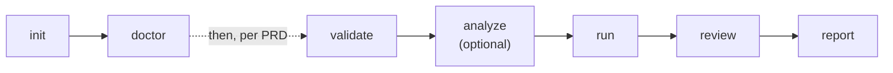
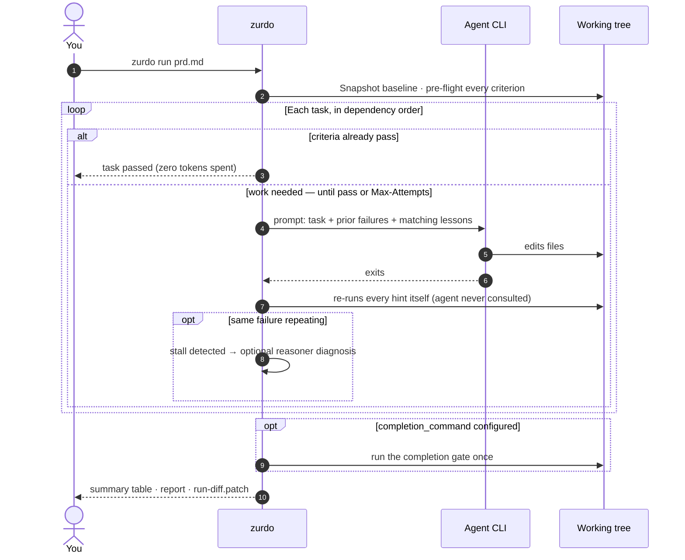
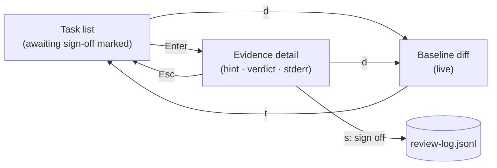
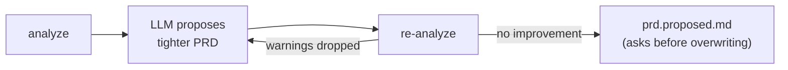

---
# Page settings
layout: default

# Hero section
title: Usage
description: "Everyday workflows, run output, CI integration, troubleshooting."

# Page navigation
page_nav:
    prev:
        content: Installation
        url: '/docs/installation.html'
    next:
        content: The PRD loop
        url: '/docs/workflow.html'

# Mermaid diagrams on this page
mermaid: true
---

## The everyday workflow



```sh
# One-time, at the root of the repo zurdo will drive:
zurdo init                    # writes .zurdo/config.toml, installs bundled skills
zurdo doctor                  # confirm the environment is actually run-ready

# Per PRD:
zurdo validate prds/feature.md      # grammar + dep-graph checks; free and instant
zurdo analyze prds/feature.md       # optional: static lints + LLM review of the PRD itself
zurdo run prds/feature.md           # drive the loop
zurdo review prds/feature.md        # walk the evidence, sign off [manual] criteria
zurdo report prds/feature.md        # curated run report (JSON; --format md for markdown)
```

- **`validate`** is deterministic: no LLM and no execution, so run it as often as you like.
- **`analyze`** lints hints that check nothing, such as vacuous shells, grep tautologies, and doc echoes. It also has an LLM critique vague criteria, all before you spend tokens on a run.
- A bare `zurdo <prd>` is short for `zurdo run <prd>`.
- `zurdo help <topic>` shows short guide pages (`workflow`, `hints`, `exit-codes`, …) in the terminal, offline.

<figure class="lp-terminal" aria-label="zurdo validate catching a hyphen in a task heading">
<div class="lp-terminal__bar"><span class="lp-terminal__dots" aria-hidden="true"><i></i><i></i><i></i></span><span class="lp-terminal__title">zurdo validate prds/bad.md</span></div>
<pre class="lp-terminal__body"><code><span class="t-bad">prds/bad.md:3: task heading uses hyphen-minus (U+002D) where an em-dash (U+2014) is required</span>
<span class="t-dim">$ echo $?</span>
2</code></pre>
<figcaption class="lp-terminal__caption"><span class="lp-dot" aria-hidden="true"></span>Grammar errors cost nothing to catch. A valid PRD just prints OK.</figcaption>
</figure>

## Checking the environment with `zurdo doctor`

When a run won't start, `zurdo doctor` tells you why. It doesn't need a PRD, never takes the run lock, and writes nothing.

```sh
zurdo doctor                  # config · providers · models · vocabulary · git · state · lumen
zurdo doctor --skip-probes    # environment only, no provider process spawned — offline/CI safe
zurdo doctor --format json    # one parseable document
```

Each finding is either **blocking**, which sets exit `4`, or **advisory**, which is reported but never fails. That makes doctor safe to use as a CI gate. It replaces the deprecated `zurdo check-models`, and adds the [vocabulary canary](providers.md#the-vocabulary-canary) at no extra cost. Sample output is on [Installation](installation.md#verify-the-installation), and each section is described on [Commands](commands.md#zurdo-doctor--diagnose-the-environment).

## What a run looks like



`zurdo run` narrates on stdout: a startup banner, a header per task, a line per criterion, and a final summary. Here's a real run where the agent never delivered:

<figure class="lp-terminal" aria-label="zurdo run output: a task fails after two attempts and its dependent is blocked">
<div class="lp-terminal__bar"><span class="lp-terminal__dots" aria-hidden="true"><i></i><i></i><i></i></span><span class="lp-terminal__title">zurdo run prds/changelog.md</span></div>
<pre class="lp-terminal__body"><code><span class="t-dim">═══════════════════════════════════════════════════════════════</span>
  Zurdo v1.25.0
  PRD:      prds/changelog.md
  Slug:     changelog-9e68
  Executor: anthropic (effort_map: high=claude-opus-4-7, low=claude-haiku-4-5, …)
  Tasks:    2 (2 pending, 0 passed, 0 blocked-by-dependency)
<span class="t-dim">═══════════════════════════════════════════════════════════════</span>
<span class="t-dim">─── task-changelog: Add a changelog ─── effort=low, deps=[]</span>
  <span class="t-acc">→</span> iteration 1 of 2 <span class="t-dim">(max-attempts=2, agent-timeout=30m 00s)</span>
  <span class="t-ok">✓</span> agent completed: exit=0, 56ms, 32 B stdout, 0 B stderr
    <span class="t-bad">✗</span> file-exists: CHANGELOG.md
      <span class="t-dim">stderr tail: path does not exist</span>
    <span class="t-ok">✓</span> file-exists: README.md
      <span class="t-dim">already passed at pre-flight — proves nothing about this run</span>
  <span class="t-acc">→</span> iteration 2 of 2
  <span class="t-dim">…</span>
  <span class="t-warn">⚠ task-changelog: stalled — attempt 2 repeats fingerprint sha256:04e97d83… (2 consecutive attempts)</span>
  <span class="t-bad">✗ task-changelog: failed in 2 iterations</span> <span class="t-dim">(154ms)</span>
  <span class="t-dim">⊘ task-release: blocked-by-dependency in 0 iterations (—)</span>
<span class="t-dim">═══ Run Summary ═══</span>
  task-id              status                   attempts   wall-clock   criteria
  task-changelog       <span class="t-bad">failed</span>                   2/2        154ms        1/2
  task-release         blocked-by-dependency    0/3        —            —
  totals               0 passed, 0 pending-review, 1 failed, 1 blocked     301ms
  iterations           2 used (of unlimited)
  passed-at-preflight  <span class="t-warn">1 criteria — proved nothing about this run</span>
Next: fix root causes and re-run — zurdo run prds/changelog.md
<span class="t-bad">run failed: 1 task(s) failed, 1 blocked-by-dependency</span></code></pre>
<figcaption class="lp-terminal__caption"><span class="lp-dot" aria-hidden="true"></span>The agent reported "Done!" both times. The file never appeared, so the task failed and the run exited 5.</figcaption>
</figure>

| Glyph | Meaning |
| --- | --- |
| `→` | action |
| `✓` / `✗` | pass / fail |
| `⊘` | skipped or manual |
| `⚠` | warning |

With a real agent, the agent line also reports token counts and an estimated cost, and the summary adds a `tokens & cost` row. A task that ends `passed-pending-review` is waiting for your `[manual]` sign-off in the [review TUI](#reviewing-a-run-with-zurdo-review). Criteria that were green before the agent ran are flagged at the end of their line and counted under `passed-at-preflight` (see [Evidence integrity](how-it-works.md#evidence-integrity)).

Progress goes to stdout, and the same events are written as JSONL to `.zurdo/<slug>/progress.log` for tooling. `--no-progress` silences the stream, `--quiet-agent` drops the live agent output while keeping the spinner, and `--no-color` strips ANSI.

### When a task passes without doing anything

A task can reach `passed` with **zero attempts** when all its criteria were green before the run. That's fine for a re-run, an idempotent task, or work a dependency already did. It can also mean the criteria don't verify what the task describes, so the summary names those tasks. When *every* task passed this way, the warning gets stronger:

<figure class="lp-terminal" aria-label="Run summary warning that every task passed at pre-flight">
<div class="lp-terminal__bar"><span class="lp-terminal__dots" aria-hidden="true"><i></i><i></i><i></i></span><span class="lp-terminal__title">zurdo run prds/greeter.md --reset</span></div>
<pre class="lp-terminal__body"><code>  task-greet           passed (pre-flight)    0/3   —   —
  task-docs            passed (pre-flight)    0/3   —   —
  iterations           0 used (of unlimited)
  passed-at-preflight  <span class="t-warn">3 criteria — proved nothing about this run</span>
<span class="t-warn">warning: every task (2) passed at pre-flight without any agent work — task-greet, task-docs.
Nothing ran. Either this PRD is already complete, or its criteria do not verify the work it describes.</span></code></pre>
</figure>

When only some tasks passed this way, the warning reads `N tasks passed at pre-flight without any agent work — …` and asks you to confirm this is a re-run. The list is cut off after ten names. The warning is diagnostic only: it never changes the exit code, and it stays silent on a resume, where this is expected. It's paired with the [empty-test-run check](hints.md#a-shell-hint-that-runs-no-tests-fails) on `[shell:]` hints.

### The completion gate

Set [`[verification] completion_command`](configuration.md#the-completion-gate) and zurdo runs that one command against the finished tree, once every task has ended `passed` or `passed-pending-review`:

```toml
[verification]
completion_command = "cargo test --workspace && cargo clippy --all-targets -- -D warnings"
```

<figure class="lp-terminal" aria-label="Run summary showing a failed completion gate and exit 9">
<div class="lp-terminal__bar"><span class="lp-terminal__dots" aria-hidden="true"><i></i><i></i><i></i></span><span class="lp-terminal__title">zurdo run prds/greeter.md</span></div>
<pre class="lp-terminal__body"><code>  totals               2 passed, 0 pending-review, 0 failed, 0 blocked     442ms
  <span class="t-bad">completion gate      FAILED (exit 101) after 347ms</span>
    command: cargo test --workspace
    stderr:
      error: could not find `Cargo.toml` in `…/demo` or any parent directory
<span class="t-bad">run failed: every task passed but the completion gate exited 101: cargo test --workspace</span></code></pre>
<figcaption class="lp-terminal__caption"><span class="lp-dot" aria-hidden="true"></span>Every task passed, but the repository didn't: exit 9. No task is marked failed.</figcaption>
</figure>

If the gate fails or runs past `[timeouts] completion_seconds` (default `900`), the run exits **`9`**. The verdict also appears in the `gate` column of `zurdo state list` and in `zurdo report`. Use the gate for the rule every PRD would otherwise repeat: "the whole suite still passes". It runs again on `--resume`, so after you fix the breakage, resuming re-checks the tree.

### Reading the agent as it works

On a TTY, the live agent output is shown as one summary line per meaningful step instead of raw JSON:

<figure class="lp-terminal" aria-label="Live agent output summarized as one line per step">
<div class="lp-terminal__bar"><span class="lp-terminal__dots" aria-hidden="true"><i></i><i></i><i></i></span><span class="lp-terminal__title">zurdo run prds/rate-limit.md</span></div>
<pre class="lp-terminal__body"><code>  <span class="t-dim">•</span> agent: I'll add the limiter middleware first, then wire it into app.rs
  <span class="t-dim">•</span> tool Bash: cargo test rate_limit:: <span class="t-dim">(exit 0)</span>
  <span class="t-dim">•</span> edit: src/middleware/rate_limit.rs <span class="t-ok">(+64 −0)</span>
  <span class="t-dim">•</span> result: turn complete — 2 files changed</code></pre>
</figure>

This works with all three providers' structured formats (`claude` stream-json, `codex --json`, `copilot` JSON). The full raw stream is always saved to `.zurdo/<slug>/iterations/*.out` and `.err`. Prefer the raw bytes? `--raw-agent` restores them (it can't be combined with `--quiet-agent`).

## Interrupting and resuming

Press Ctrl-C once and zurdo finishes the current iteration, prints the summary, and exits cleanly. The next run offers to resume:

```sh
zurdo run prds/feature.md --resume    # resume without the prompt
zurdo run prds/feature.md --reset     # archive state, start fresh
```

If you **edited the PRD** since the last run, zurdo refuses with exit `4` and asks for `--reset`. Mid-run edits are never silently absorbed. Details are in [How it works](how-it-works.md#resume-locks-and-recovery).

## Re-verifying after the fact

`zurdo verify <prd>` re-runs every finished task's criteria against the **current** tree. Use it after you hand-edit code or rebase:

<figure class="lp-terminal" aria-label="zurdo verify output">
<div class="lp-terminal__bar"><span class="lp-terminal__dots" aria-hidden="true"><i></i><i></i><i></i></span><span class="lp-terminal__title">zurdo verify prds/greeter.md</span></div>
<pre class="lp-terminal__body"><code><span class="t-ok">verify: no regressions detected (2 terminal tasks re-checked)</span></code></pre>
</figure>

`verify` re-checks recorded criteria only. It doesn't run the completion gate.

## Reviewing a run with `zurdo review`

`zurdo review <prd>` opens a terminal UI over the run's recorded evidence, so you can give your `[manual]` verdicts with the facts in front of you.



- **Task list**: statuses, with `passed-pending-review` tasks marked `<< awaiting manual sign-off`.
- **Evidence detail**: for each criterion, the hint's source text and the latest verdict: exit code, typed failure reason, and stderr excerpt. It also warns if the evidence changed since the baseline.
- **Baseline diff**: the working tree against `.zurdo/<slug>/baseline`, recomputed live.

Keys: `j`/`k` or the arrow keys move, `Enter` opens, `Esc` goes up, `d` shows the diff, `t` returns to the task list, `q` quits. The only write action is **`s`**: it signs off the selected `[manual]` criterion, with an optional note and an explicit confirmation. Sign-offs go to a tamper-evident `.zurdo/<slug>/review-log.jsonl` and can't be undone. Signing a task's last `[manual]` criterion flips the task to `passed`.

`review` needs a real terminal. Without a TTY, or with `--no-prompt`, it exits `2` and points you to `zurdo report`. It also needs existing run state; without it, it exits `3`. More on [Commands](commands.md#zurdo-review--walk-the-evidence-sign-off-manual-criteria).

## Refining a PRD with `zurdo analyze --fix`

`zurdo analyze <prd>` runs the pre-flight analysis and stops before executing anything. `--static-only` skips the LLM and runs only the deterministic lints. `--fix` adds a refinement loop:



```sh
zurdo analyze prds/feature.md --fix
```

## Healing misaimed grep hints with `zurdo heal`

A `[grep:]` hint can fail because the code is wrong, or because the *hint* is wrong: a moved file, a renamed symbol, a pattern aimed at the wrong line. `zurdo heal` re-aims failed `[grep:]` and `[no-grep:]` payloads, using the run's failure history and the live tree as evidence:


```sh
zurdo heal prds/feature.md
```

On a TTY, you approve each verified heal (`y/N`) and the PRD is edited in place. Without a TTY, or with `--no-prompt`, verified heals go to `<prd>.proposed.md`. `heal` needs a prior run's `.zurdo/<slug>/prd.json` and `[roles.analyzer]` in config. It never runs tasks and never writes `prd.json`. Not sure whether the hint or the code is at fault? The bundled `zurdo-hint-debugger` skill checks the iteration logs first.

<div class="callout callout--info" markdown="1">
**Upgrading from ≤ 1.6?** The old flag spellings (`zurdo run --analyze`, `zurdo --analyze`, `zurdo run --heal`) still work but print a deprecation notice. See [Commands](commands.md#zurdo-heal--re-aim-misaimed-grep-hints).
</div>

## CI integration

Exit codes are designed for branching from a shell wrapper. The full table is in [Commands](commands.md#exit-codes).

```sh
#!/usr/bin/env bash
set -euo pipefail

# Gate 0: is the environment even run-ready? Advisory findings never fail the build.
zurdo doctor --skip-probes

# Gate 1: PRD quality. --strict turns advisory lints into exit 2.
zurdo validate prds/feature.md --strict --format json > validate.json

ec=0
zurdo run prds/feature.md \
    --no-prompt \
    --no-color \
    --max-iterations 50 \
    --log-format json --log-file zurdo.log \
  || ec=$?

case "$ec" in
  0)   echo "all tasks passed" ;;
  2)   echo "PRD grammar broken";                    exit 1 ;;
  3|4) echo "infra / pre-flight";                    exit 1 ;;
  5)   echo "task failure";                          exit 1 ;;  # real regression
  6)   echo "budget exhausted";                      exit 1 ;;  # bump --max-iterations
  7|8) echo "analyze-fix non-convergent";            exit 1 ;;
  9)   echo "tasks passed, completion gate failed";  exit 1 ;;
  *)   echo "unexpected ec=$ec";                     exit 1 ;;
esac
```

<div class="lp-cards" markdown="1">
<div markdown="1">
**Never block on stdin**
`--no-prompt` makes the resume prompt default to *Resume*. Add `--resume` or `--reset` to state your intent explicitly.
</div>
<div markdown="1">
**Fail on weak criteria**
`validate --strict` turns weak-criteria lints into errors. `analyze --static-only` is the other free gate, and it runs even without a config.
</div>
<div markdown="1">
**Split flakes from regressions**
Exit `6` means the budget ran out. Exit `5` means a task really failed. Cap spend with `--max-iterations` and per-task `Max-Attempts`.
</div>
<div markdown="1">
**Keep the evidence**
Save `.zurdo/<slug>/reports/*.json` and `.zurdo/<slug>/iterations/*` as build artifacts for post-mortems.
</div>
</div>

<details markdown="1">
<summary>More CI notes</summary>

- `--no-color` keeps logs grep-friendly in CI's plain-text artifact viewer.
- `--log-format json` plus `--log-file` gives you a structured diagnostic log alongside the JSONL `progress.log`.
- **`--format json` on `validate`, `verify`, and `state list`** emits the shared versioned envelope (`{schema_version, command, data}`): one contract to parse instead of three prose shapes, with diagnostics still on stderr. It changes rendering only; exit codes match text mode. See [Machine-readable output](commands.md#machine-readable-output).
- **`zurdo validate --strict`** promotes six lint families to errors: `grep-target`, `vacuous-shell`, `grep-tautology`, `frozen-overlap`, `doc-echo`, `uncovered-requirement`. `skill-resolution`, `discarded-evidence`, and `cached-verification` stay advisory ([why](commands.md#zurdo-validate---strict)).
- **`zurdo analyze --static-only`** adds the lesson-obligation check (`unaddressed-lesson`) and runs even in a checkout with no `.zurdo/config.toml`.
- **`[verification] completion_command`** turns "the whole suite passes" into exit `9` instead of a criterion every PRD has to repeat.
- **`zurdo doctor`** exits `4` only on findings that genuinely stop a run. `--skip-probes` keeps it offline and spawns no provider process.

</details>

## Troubleshooting

| Symptom | Cause | Fix |
| --- | --- | --- |
| `lock held by pid <n>` (exit `3`) | Another `zurdo run`, or an open `zurdo review`, holds the lock for this PRD | Wait. If no zurdo is running, the lock is stale and the next run takes it over. |
| `state mismatch — pass --reset` (exit `4`) | The PRD changed (any byte) since the last run | If the edits were intentional, use `--reset`. Old state goes to `.zurdo/<slug>/.archive/<ts>/`. `zurdo heal` edits are reconciled automatically. |
| `unknown model anthropic:<x>` (exit `4`) | A model in `[effort_map.<provider>]` is unknown or unsupported under your auth | Probe with `zurdo doctor`, fix the entry, or pass `--skip-model-check`. |
| Run won't start, unclear message | Config, provider, `PATH`, model, or state problem | `zurdo doctor` names the failing check and, where it can, the fix. |
| `task heading uses hyphen-minus where em-dash required` (exit `2`) | The task heading uses `-` or `–` instead of `—` | Use a real em-dash: `Option+Shift+-` on macOS, `Compose - - -` on Linux. |
| `acceptance criterion has no hint` (exit `2`) | A `- [ ]` line has no hint | Add a hint, or `[manual]` for human-only review. |
| Agent runs forever, no progress | The agent is hung or slow | Lower `Agent-timeout` in the task, or `[timeouts] agent_seconds` in config. |
| `frozen path modified: <path>` on every iteration | The task really needs to edit a frozen path | Unfreeze it or restructure the task. `zurdo analyze` warns about these overlaps up front. |
| Grep criterion keeps failing though the content looks right | The pattern or path is misaimed (moved file, renamed symbol) | Run `zurdo heal <prd>`. |
| `structural hint requires lumen.enabled = true` | The PRD uses `[symbol:]`, `[references:]`, or `[callers:]` with Lumen off | Set `[lumen] enabled = true`. See [Structural verification](lumen.md#turning-it-on). |
| `a test runner ran zero tests` | A `[shell:]` test command matched no tests, or every selected test is `#[ignore]`d | Fix the filter, write the test, or run ignored tests with `-- --include-ignored`. See the [empty-test-run check](hints.md#a-shell-hint-that-runs-no-tests-fails). |
| Pre-flight fails with a non-ready Lumen index | A file the structural index needed couldn't be parsed | `zurdo lumen rebuild`, then re-run. For faster repairs, keep the index warm with [Vela](lumen.md#the-vela-watcher). |
| Exit `9` although every task passed | The [completion gate](#the-completion-gate) failed or timed out | Read its output in the summary or `zurdo report`, fix the tree, then `zurdo run --resume`. Raise `[timeouts] completion_seconds` if it just ran long. |
| `discarded-evidence` / `cached-verification` warning | A `[shell:]` test hint discards stdout, or runs `go test` without `-count=1` | Drop the `>/dev/null`, or add `-count=1`. |
| `reason: library unreadable lessons/<file>.md: …` | A lesson file's frontmatter doesn't parse (often a misspelled key) | Fix the key named in the error. Until then, the lesson is ignored. The exit code is unaffected. |
| `task_stalled` in the progress stream | The agent keeps repeating the same failure | Enable `[reason]` so a stall gets a diagnosis. See [Diagnosis & lessons](reason.md). |
| Criterion passes but proves nothing | The hint is too loose (`[shell: true]`, `[file-exists: README.md]`) | Tighten it. `zurdo analyze` flags many of these. |
| `[Y/n]` prompts in CI logs | Stdin happened to be a TTY | Always pass `--no-prompt` in CI, plus `--resume` or `--reset`. |
| `zurdo: command not found` after `brew install` | The Homebrew bin directory isn't on `PATH` (Linux) | Add `eval "$(/home/linuxbrew/.linuxbrew/bin/brew shellenv)"` to your shell rc. See [Installation](installation.md#verify-the-installation). |

<details markdown="1">
<summary>After upgrading zurdo</summary>

| Symptom | Cause | Fix |
| --- | --- | --- |
| `warning: '[experimental] structural_hints' is deprecated and ignored` | A pre-1.9 config still has the retired gate | Delete the key. `[lumen] enabled` controls structural hints on its own. |
| A structural hint that used to pass now fails "wrong kind" | v1.25.0 moved some names to more specific kinds (`field`, `enum`, `enum-variant`, `interface`) | Re-pin on the kind `zurdo lumen query --name` reports, or on the enclosing type. See [the upgrade note](lumen.md#what-resolves-per-language). |
| Lessons from before v1.14 no longer show up | The library moved from `.zurdo/reason/library/` to a git-tracked `lessons/` directory, without migration | Move the lessons you want to keep into `lessons/`. See [Diagnosis & lessons](reason.md#the-library-is-source-not-state). |

</details>

Still stuck? Run with `-v` (`--log-level=debug`) and check `.zurdo/<slug>/progress.log`: every state transition is recorded there.
