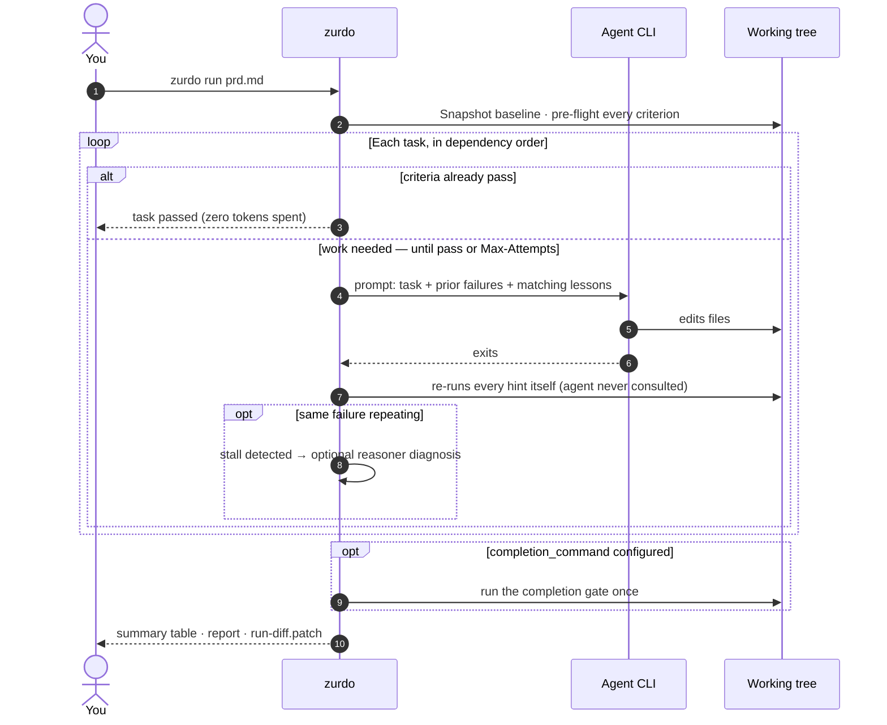

---
# Page settings
layout: default
comments: false

# Hero section
title: Usage
description: "Everyday workflows, run output, CI integration, troubleshooting."

# Micro navigation
micro_nav: true

# Page navigation
page_nav:
    prev:
        content: Installation
        url: '/docs/installation.html'
    next:
        content: The operating rhythm
        url: '/docs/workflow.html'

# Mermaid diagrams on this page
mermaid: true
---

## The everyday workflow

```sh
# One-time, at the root of the repo zurdo will drive:
zurdo init                    # writes .zurdo/config.toml, installs bundled skills
zurdo doctor                  # confirm the environment is actually run-ready

# Per PRD:
zurdo validate prds/feature.md      # grammar + dep-graph checks; free and instant
zurdo analyze prds/feature.md       # optional: static lints + LLM review of the PRD itself
zurdo run prds/feature.md           # drive the loop
zurdo review prds/feature.md        # walk the evidence, sign off [manual] criteria
zurdo report prds/feature.md        # curated run report (JSON; --format md for markdown)
```

`zurdo validate` is deterministic — no LLM, no execution — so run it as often as you like. `zurdo analyze` goes further: it lints hints for no-ops (vacuous shells, grep tautologies, doc echoes) and has an LLM critique vague criteria, all **before** you spend tokens on a real run. A bare `zurdo <prd>` is sugar for `zurdo run <prd>`, and `zurdo help <topic>` puts condensed guide pages (`workflow`, `hints`, `exit-codes`, …) in the terminal, offline.

## Checking the environment with `zurdo doctor`

When a run won't start — a CLI missing from `PATH`, a model id your plan doesn't cover, a config that no longer parses — `zurdo doctor` answers *why* without a PRD, without taking the run lock, and without writing anything:

```sh
zurdo doctor                  # config · providers · models · vocabulary · git · state · lumen
zurdo doctor --skip-probes    # environment only, no provider process spawned — offline/CI safe
zurdo doctor --format json    # one parseable document
```

Findings split into **blocking** (gate the exit code: `4`) and **advisory** (reported, never gating), so doctor is safe as a CI gate without failing builds over informational noise. It subsumes the deprecated `zurdo check-models`: the `models` section probes the same rows and adds the [vocabulary canary](providers.md#the-vocabulary-canary) at no extra process spawn. Section-by-section details are on [Commands](commands.md#zurdo-doctor--diagnose-the-environment).

## What a run looks like

One run, end to end — who does what, and where the human is (and isn't) needed:



`zurdo run` emits a live narration on stdout: a startup banner, per-task headers, per-criterion pass/fail, then a final summary table.

```
═══════════════════════════════════════════════════════════
  Zurdo v1.21.0
  PRD:      prds/auth.md
  Slug:     auth-a1b2
  Executor: anthropic (effort_map: low=claude-haiku-4-5,
                                   medium=claude-sonnet-4-6,
                                   high=claude-opus-4-7)
  Tasks:    7 (4 pending, 2 passed, 1 blocked-by-dependency)
═══════════════════════════════════════════════════════════

─── task-auth: Set up authentication ─── effort=medium, deps=[]
  → iteration 1 of 5 (max-attempts=5, agent-timeout=30m)
  ⠋ task-auth iter 1 — claude-sonnet-4-6 — 12s — 4.1 KB stdout
  ✓ agent completed: exit=0, 47s, 18.4 KB stdout
                     tokens in=3,421 out=8,209 — $0.12 est.
  → running 5 criteria
    ✓ shell: cargo build (1.2s)
    ✓ shell: cargo test (8.4s)
    ✗ shell: cargo clippy -- -D warnings (3.1s)
      stderr tail: error: this loop never actually loops
  iteration 1: 4/5 criteria passed; will retry
  ...
  ✓ task-auth: passed in 2 iterations (8m 14s)

═══ Run Summary ═══
  task-id          status                  attempts   wall-clock   criteria
  ──────────────────────────────────────────────────────────────────────────
  task-auth        passed                  2/5        8m 14s       5/5
  task-login       passed-pending-review   1/5        3m 02s       4/4
  task-rate-limit  failed                  5/5        12m 41s      3/4
  ──────────────────────────────────────────────────────────────────────────
  totals           1 passed, 1 pending-review, 1 failed                24m 57s
  iterations       8 used (of unlimited)
  tokens & cost    in=142,308 out=384,902 — $0.34 est.
```

Glyph legend: `→` action, `✓` pass, `✗` fail, `⊘` skipped/manual, `⚠` warning.

A task that ends `passed-pending-review` is waiting on your `[manual]` sign-off — settle it in the [review TUI](#reviewing-a-run-with-zurdo-review).

A criterion that was already green before the agent ever ran carries the tail `already passed at pre-flight — proves nothing about this run`, and the summary table adds a `passed-at-preflight` tally — see [Evidence integrity](how-it-works.md#evidence-integrity).

### When a task passes without doing anything

A task can reach terminal `passed` with **zero attempts and no iterations**: every acceptance criterion was already green before the run started. Sometimes that's correct — a re-run, an idempotent task, work a dependency already did. Sometimes it means the criteria don't actually verify the work the task describes. Since v1.13.0 the run summary names those tasks rather than leaving the tally to be noticed:

```
  passed-at-preflight  9 criteria — proved nothing about this run
warning: 3 tasks passed at pre-flight without any agent work — task-json, task-strict,
         task-envelope. Their criteria were already satisfied before the run started;
         confirm this is a re-run and not a vacuous criterion set.
```

If **every** task passed that way the wording escalates to "Nothing ran. Either this PRD is already complete, or its criteria do not verify the work it describes." The list elides after ten task names. The warning is purely diagnostic — it never changes the exit code — and it stays silent on a resume, where passing at pre-flight is the expected shape. Its companion guard is the [empty-test-run check](hints.md#a-shell-hint-that-runs-no-tests-fails) on `[shell:]` hints.

### The completion gate

If `.zurdo/config.toml` sets [`[verification] completion_command`](configuration.md#the-completion-gate), a run whose tasks all ended `passed` or `passed-pending-review` finishes with one more step: zurdo runs that command once against the finished tree.

```toml
[verification]
completion_command = "cargo test --workspace && cargo clippy --all-targets -- -D warnings"
```

A passing gate changes nothing. A failing one — or one that runs past `[timeouts] completion_seconds` (default `900`) — makes the run exit **`9`**, and the summary prints the command and its captured output. No task is marked failed: each passed its own criteria, and the gate is reporting on the repository. The verdict is also in `zurdo state list`'s `gate` column and in `zurdo report`.

Use it for the rule every PRD would otherwise have to restate — "the whole suite still passes". Since the gate also runs on `--resume`, fixing the breakage and resuming re-checks the tree.

The progress stream is on stdout; a parallel JSONL event log lands at `.zurdo/<slug>/progress.log` for tooling. Tunables: `--no-progress` silences the stream, `--quiet-agent` drops the live tee of agent output (spinner stays), `--no-color` strips ANSI.

### Reading the agent as it works

On a TTY, the live tee of the agent's output renders **step summaries** instead of raw JSON — one line per meaningful step:

```
  • agent: I'll add the limiter middleware first, then wire it into app.rs
  • tool Bash: cargo test rate_limit:: (exit 0)
  • edit: src/middleware/rate_limit.rs (+64 −0)
  • result: turn complete — 2 files changed
```

Zurdo recognizes the structured stream formats of all three providers (`claude` stream-json, `codex --json`, `copilot` JSON output). The full raw stream is always captured to `.zurdo/<slug>/iterations/*.out`/`.err` regardless — the summaries only change what scrolls past your eyes. Prefer the firehose? `--raw-agent` restores the byte-level tee (mutually exclusive with `--quiet-agent`).

## Interrupting and resuming

Ctrl-C once and zurdo finishes the current iteration, renders the summary with partial state, and exits cleanly. The next `zurdo run` against the same PRD offers to resume:

```sh
zurdo run prds/feature.md --resume    # resume without the prompt
zurdo run prds/feature.md --reset     # archive state, start fresh
```

If you **edited the PRD** since the last run, zurdo refuses with exit `4` (PRD-hash drift) and asks for `--reset` — mid-run edits are never silently absorbed. Details in [How it works](how-it-works.md#resume-locks-and-recovery).

## Re-verifying after the fact

`zurdo verify <prd>` re-runs every terminal task's criteria against the **current** working tree — useful after you've hand-edited code, rebased, or want to confirm a run's claims still hold:

```sh
zurdo verify prds/feature.md
```

`verify` re-checks recorded criteria only — it doesn't run the completion gate.

## Reviewing a run with `zurdo review`

A run that ends `passed-pending-review` is waiting on you: one or more `[manual]` criteria need a human verdict. `zurdo review <prd>` opens a terminal UI over the run's recorded evidence so that verdict happens next to the facts, not from memory:

```sh
zurdo review prds/feature.md
```

Three surfaces, all read-only: the **task list** (statuses, with `passed-pending-review` tasks marked `<< awaiting manual sign-off`), **evidence detail** per criterion (the hint's source text, the latest iteration's verdict with exit code, typed failure reason, and a stderr excerpt — plus a warning when the evidence changed since the run-start baseline), and the **baseline diff** (the working tree against `.zurdo/<slug>/baseline`, recomputed live). Navigate with `j`/`k`/arrows, `Enter` to descend, `d` for the diff, `t` for the task list, `Esc` to go up, `q` to quit.

The one write action: `s` signs off the selected `[manual]` criterion — an optional one-line reviewer note, then an explicit confirmation. Sign-offs land in a tamper-evident log at `.zurdo/<slug>/review-log.jsonl`, and signing a task's last unsigned `[manual]` criterion flips it to `passed`. Sign-offs are irrevocable. Full details on [Commands](commands.md#zurdo-review--walk-the-evidence-sign-off-manual-criteria).

`review` needs a real terminal (non-TTY or `--no-prompt` exits `2` with a pointer at `zurdo report`) and an existing run state (exit `3` without one).

## Refining a PRD with `zurdo analyze --fix`

`zurdo analyze <prd>` runs the full pre-flight analysis and never proceeds to execution (`--static-only` skips the LLM and keeps just the deterministic lints). Adding `--fix` turns it into an iterative refinement loop: the LLM proposes a tightened PRD, zurdo re-analyzes, and the loop repeats until warnings stop decreasing. The result is written to `<prd>.proposed.md`, and zurdo asks before overwriting your original.

```sh
zurdo analyze prds/feature.md --fix
```

## Healing misaimed grep hints with `zurdo heal`

A `[grep:]` hint can fail because the code is wrong — or because the *hint* is wrong (a moved file, a renamed symbol, a pattern aimed at the wrong line). After a run with such failures, `zurdo heal` re-aims failed `[grep:]`/`[no-grep:]` payloads using the run's failure history plus the live working tree as evidence:

```sh
zurdo heal prds/feature.md
```

It runs select → propose → verify → apply: the analyzer proposes a corrected payload for each failed grep hint, zurdo verifies the proposal against the tree, and only verified heals are offered. On a TTY each heal is a `y/N` edit to the PRD in place; on non-TTY (or with `--no-prompt`) verified heals go to `<prd>.proposed.md` instead. `heal` requires an existing `.zurdo/<slug>/prd.json` from a prior run and `[roles.analyzer]` in config; it never executes tasks and never writes `prd.json`. If you're unsure whether the hint or the code is at fault, the bundled `zurdo-hint-debugger` skill correlates the hint with the iteration logs first.

<div class="callout callout--info" markdown="1">
**Upgrading from ≤ 1.6?** `analyze` and `heal` used to be flags on `run`. The old spellings (`zurdo run --analyze`, `zurdo --analyze`, `zurdo run --heal`) still work identically but print a stderr deprecation notice — see [Commands](commands.md#zurdo-heal--re-aim-misaimed-grep-hints).
</div>

## CI integration

The exit-code surface is designed for clean branching from a shell wrapper (the full table is in [Commands](commands.md#exit-codes)):

```sh
#!/usr/bin/env bash
set -euo pipefail

# Gate 0: is the environment even run-ready? Advisory findings never fail the build.
zurdo doctor --skip-probes

# Gate 1: PRD quality. --strict turns advisory lints into exit 2.
zurdo validate prds/feature.md --strict --format json > validate.json

ec=0
zurdo run prds/feature.md \
    --no-prompt \
    --no-color \
    --max-iterations 50 \
    --log-format json --log-file zurdo.log \
  || ec=$?

case "$ec" in
  0)    echo "all tasks passed" ;;
  2)    echo "PRD grammar broken";   exit 1 ;;
  3|4)  echo "infra / pre-flight";   exit 1 ;;
  5)    echo "task failure";         exit 1 ;;  # real regression
  6)    echo "budget exhausted";     exit 1 ;;  # bump --max-iterations
  7|8)  echo "analyze-fix non-convergent"; exit 1 ;;
  9)    echo "tasks passed, completion gate failed"; exit 1 ;;
  *)    echo "unexpected ec=$ec";    exit 1 ;;
esac
```

Notes:

- `--no-prompt` makes the resume prompt non-interactive (defaults to *Resume*) so the run never blocks on stdin.
- `--no-color` keeps logs grep-friendly in CI's plain-text artifact viewer.
- `--log-format json` plus `--log-file` gives you a structured diagnostic log alongside the JSONL `progress.log`.
- **`--format json` on `validate`, `verify`, and `state list`** emits the shared versioned envelope (`{schema_version, command, data}`) — one contract to parse instead of three prose shapes, with diagnostics still on stderr. It changes rendering only; exit codes match text mode. See [Machine-readable output](commands.md#machine-readable-output).
- **`zurdo validate --strict`** promotes six lint families — `grep-target`, `vacuous-shell`, `grep-tautology`, `frozen-overlap`, `doc-echo`, `uncovered-requirement` — to errors so weak criteria fail the build rather than scrolling past. `skill-resolution`, `discarded-evidence`, and `cached-verification` stay advisory ([why](commands.md#zurdo-validate---strict)).
- **`zurdo analyze --static-only`** is the other free gate: it adds the lesson-obligation check (`unaddressed-lesson`) and, since v1.18.0, runs even in a checkout with no `.zurdo/config.toml`.
- **`[verification] completion_command`** turns "the whole suite passes" into exit `9` instead of a criterion every PRD has to repeat.
- **`zurdo doctor`** is a safe pre-gate: exit `4` only on findings that genuinely stop a run. Use `--skip-probes` to keep it offline and free of provider spawns.
- Capture `.zurdo/<slug>/reports/*.json` and `.zurdo/<slug>/iterations/*` as build artifacts for post-mortems.
- Cap spend with `--max-iterations` (global) and per-task `Max-Attempts` (PRD metadata). Exit `6` distinguishes "budget hit" from `5` ("a task actually failed"), so dashboards can split flakes from regressions.

## Troubleshooting

| Symptom                                                            | Cause                                                                            | Fix                                                                                              |
| ------------------------------------------------------------------ | --------------------------------------------------------------------------------- | ------------------------------------------------------------------------------------------------ |
| `lock held by pid <n>` (exit `3`)                                  | Another `zurdo run` (or an open `zurdo review` session) holds the run lock for the same PRD. | Wait for it. If no zurdo is running, the lock is stale and the next run will take it over.        |
| `state mismatch — pass --reset` (exit `4`)                         | The PRD file changed (any byte) since the last successful run.                   | If the edits were intentional, run with `--reset` (old state archives under `.zurdo/<slug>/.archive/<ts>/`). Edits applied by `zurdo heal` are reconciled automatically. |
| `unknown model anthropic:<x>` (exit `4`)                           | The model under `[effort_map.<provider>]` is unknown or unsupported under your auth. | Probe with `zurdo doctor`, fix the entry, or pass `--skip-model-check`.                          |
| Run won't start and the message isn't obvious                      | Config, provider block, `PATH`, model, or state problem.                         | `zurdo doctor` — it names the failing check and, where it can, the remedy.                       |
| `task heading uses hyphen-minus where em-dash required` (exit `2`) | The H2 task heading uses `-` or `–` instead of U+2014 `—`.                       | Insert a real em-dash. macOS: `Option+Shift+-`. Linux Compose key: `Compose - - -`.              |
| `acceptance criterion has no hint` (exit `2`)                      | A `- [ ]` line lacks any hint.                                                   | Add at least one hint, or `[manual]` if it's a human-review-only criterion.                      |
| Agent runs forever, no progress                                    | Agent is hung or slow.                                                           | Lower `Agent-timeout` in the task metadata or `[timeouts] agent_seconds` in config.              |
| `frozen path modified: <path>` fails every iteration               | The task genuinely requires editing a path frozen by `**Frozen**` or `[verification] protected_paths`. | Unfreeze the path or restructure the task — `zurdo analyze` warns about hint/frozen-glob overlaps up front. |
| Grep criterion keeps failing though the content looks right        | The hint's pattern or file path is misaimed (moved file, renamed symbol).        | Run `zurdo heal <prd>` to re-aim failed grep payloads against the live tree.                     |
| Validation error: *structural hint requires `lumen.enabled = true`* | The PRD uses `[symbol:]`/`[references:]`/`[callers:]` while Lumen is off.       | Set `[lumen] enabled = true` — since v1.9.0 that is the only gate. See [Structural verification](lumen.md#turning-it-on). |
| `warning: '[experimental] structural_hints' is deprecated and ignored` | A pre-1.9 config still carries the retired gate.                              | Delete the key; `[lumen] enabled` governs structural hints on its own.                           |
| Criterion fails with *a test runner ran zero tests*                | A `[shell:]` test command matched no tests — an empty filter, a test never written. | Fix the filter or write the test. This is the [empty-test-run check](hints.md#a-shell-hint-that-runs-no-tests-fails) refusing a vacuous exit `0`. |
| Pre-flight fails with a non-ready Lumen index                      | A working-tree file the structural index needed could not be parsed.             | `zurdo lumen rebuild`, then re-run. Slow cold repairs after big changes? Keep the index warm with the [Vela watcher](lumen.md#the-vela-watcher). |
| Run exits `9` although every task passed                          | The [completion gate](#the-completion-gate) failed or timed out.                  | Read the command output in the run summary (or `zurdo report`), fix the tree, then `zurdo run --resume` — the gate re-runs on resume. Raise `[timeouts] completion_seconds` if it merely ran long. |
| Criterion fails with *a test runner ran zero tests* although tests exist | Every selected test is `#[ignore]`d (v1.18.0), or the filter matches nothing. | Run the ignored tests explicitly (`-- --include-ignored`) or fix the filter. |
| `discarded-evidence` / `cached-verification` warning               | A `[shell:]` test hint discards stdout, or runs `go test` without `-count=1`.   | Drop the `>/dev/null`; add `-count=1`. Either shape can let a criterion pass without really testing the current tree. |
| `reason: library unreadable lessons/<file>.md: …`                  | A lesson file's frontmatter doesn't parse (often a misspelled key).              | Fix the key named in the error; until then the lesson is ignored. The exit code is unaffected. |
| Lessons from before v1.14 no longer show up                        | The library moved from `.zurdo/reason/library/` to a git-tracked `lessons/` directory, without migration. | Move the lessons you want to keep into `lessons/` — see [Diagnosis & lessons](reason.md#the-library-is-source-not-state). |
| `task_stalled` in the progress stream; attempts repeat the same failure | The agent is looping on one failure instead of converging.                  | Enable the `[reason]` subsystem so a stall gets a reasoner diagnosis (guide, heal routing, or early halt) — see [Diagnosis & lessons](reason.md). |
| Criterion passes but proves nothing                                | Hint is too loose (`[shell: true]`, `[file-exists: README.md]`).                 | Tighten the hint. `zurdo analyze` flags many such no-ops as warnings.                            |
| `[Y/n]` prompts appear in CI logs                                  | Default mode is interactive when stdin happens to be a TTY.                      | Always pass `--no-prompt` in CI (plus `--resume` or `--reset` to declare intent explicitly).     |
| `zurdo: command not found` after `brew install`                    | Homebrew bin directory not on PATH (Linux specifically).                         | `eval "$(/home/linuxbrew/.linuxbrew/bin/brew shellenv)"` in your shell rc.                       |

If your symptom isn't here, run with `-v` (`--log-level=debug`) and check `.zurdo/<slug>/progress.log` — every state transition is structured there.

Next: [The operating rhythm](workflow.md)
