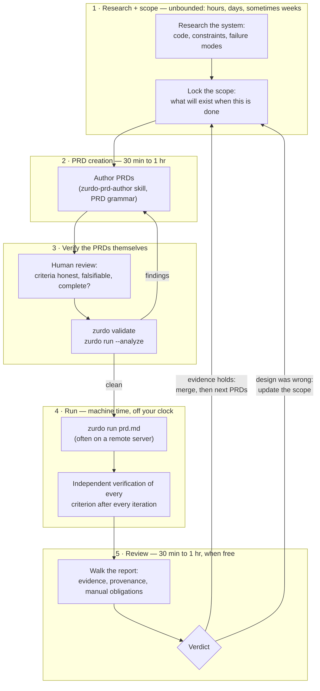

---
# Page settings
layout: default
comments: false

# Hero section
title: The operating rhythm
description: "The loop zurdo was built around — and how it maps, ceremony by ceremony, onto agile."

# Micro navigation
micro_nav: true

# Page navigation
page_nav:
    prev:
        content: Usage
        url: '/docs/usage.html'
    next:
        content: Effective use
        url: '/docs/effective-use.html'

# Mermaid diagrams on this page
mermaid: true
---

[Writing PRDs](writing-prds.md) teaches the artifact — this guide teaches the loop you run it in. It describes the workflow zurdo was built around: scope deliberately, author fast, verify the spec before spending tokens, run on machine time, review on your schedule, and let results feed the next scope.

The audience is the same as zurdo's: engineers who design systems. The loop assumes you can decompose work into tasks and state what "done" means as observable evidence. If you can do that, the loop turns development itself into autocomplete on steroids — the engineering is kept; only the typing is delegated.

## The loop



Two properties make the loop work:

- **Human attention appears only where judgment is irreplaceable** — locking the scope, and accepting or rejecting outcomes. Everything between those two points runs on machine time.
- **Verification is symmetric.** The spec is verified before execution (phase 3), the work is verified after (phase 4). The cheap gate runs before the expensive phase; expensive human judgment runs only after both machine gates pass.

## Phase by phase

### 1 · Research + scope — the unbounded phase

Every other phase is timeboxed. This one is deliberately not: scoping can take an hour, days, or weeks, and that is correct — **because the scope is a commitment device**. Once a PRD runs, the scope dictates the work and forces you to build and *finish*, not build and deviate.

This is the agile discipline, enforced mechanically instead of socially (the full ceremony-by-ceremony mapping is in [The agile correlation](#the-agile-correlation) below). A sprint commitment only works if the team doesn't renegotiate it mid-sprint; zurdo's runtime gives that rule teeth:

- **The PRD is immutable during a run** — the runtime never modifies it, and mid-run "actually, let's also…" has no entry point.
- **Criteria are independently re-run** — the definition of done cannot drift to match whatever got built.
- **Frozen paths** fence evidence the run must not touch.

Deviation isn't suppressed — it's *scheduled*. Anything discovered mid-run becomes input to the next scoping session, not a mid-flight swerve. The cost of that discipline is paid here, up front: a scope worth committing to takes as long as it takes.

Deliverable: a locked statement of what will exist when the work is done — concrete enough that phase 2 is transcription, not invention.

### 2 · PRD creation — 30 min to 1 hr

With the scope locked, authoring is fast. Use the `zurdo-prd-author` skill: it interrogates intent into tasks, dependency edges, and the [PRD grammar](writing-prds.md), and pressure-tests every criterion's hint before any tokens burn. Criteria are born as evidence — "when this is done, what observable facts will be true?" — not retrofitted onto tasks.

If authoring drags past an hour, that's usually the previous phase leaking: the scope wasn't actually locked.

### 3 · Verify the PRDs — human and machine

Two gates, in order:

1. **Human pass.** Are the criteria honest? Would each one fail on today's tree? Is anything a tautology the agent can satisfy without doing the work? Is every `[manual]` genuinely un-automatable?
2. **Machine pass.** `zurdo validate` for grammar, dependency graph, and the deterministic lints; `zurdo run --analyze` for the deeper pre-flight when the PRD warrants it.

Findings loop back to phase 2. Nothing runs until both gates are clean. This is the cheapest verification in the whole system — a bad criterion caught here costs a minute; caught after a run, it costs the run.

### 4 · Run — machine time

`zurdo run prd.md`, typically on a remote server, then go about your day. The runtime drives the agent task by task, and after every iteration it — never the agent — executes every hint and decides pass/fail. Attempt budgets (`Max-Attempts`) bound the spend; crash-safe state under `.zurdo/<slug>/` means an interrupted run resumes instead of restarting.

This phase consumes zero engineer attention by design. Its duration does not appear in your cycle time.

### 5 · Review — 30 min to 1 hr, when free

Read the report (`zurdo report`), walk the evidence, and settle every `[manual]` obligation. Review is not "did it work at all?" — the criteria already answered that. Review is *"is this how I'd have built it?"* Green means the evidence you demanded exists and wasn't tampered with; it does not mean merge. The human reviews the diff — verification just did the triage.

### 6 · Decide — merge or re-scope

Two exits, both feeding phase 1:

- **Evidence holds.** Merge the implementation (branching, committing, and PRs are yours — zurdo has no git automation), then continue with the next PRDs.
- **The design was wrong.** A task that exhausts `Max-Attempts` is often not an agent failure — it's the PRD telling you the scope's model of the system was wrong. Treat persistently failing criteria as design feedback and take them into the next scoping session.

## The agile correlation

If the loop feels familiar, it should: it is the agile cycle with the sprint compressed from two weeks to a few hours, the team replaced by an agent, and — the part that matters — **every rule that agile enforces socially enforced mechanically instead**.

| Agile ceremony / artifact | Zurdo equivalent | What changes |
|---|---|---|
| Product backlog | The scope queue — findings and deferred work feeding the next scoping session | Same role, same grooming discipline |
| Sprint planning | Research + scope (phase 1) | Still the unbounded, judgment-heavy phase — zurdo doesn't compress *this*, and shouldn't |
| User story + acceptance criteria | PRD task + hint-typed criteria (`[shell:]`, `[grep:]`, …) | Criteria stop being prose — they're executable predicates ([Hints reference](hints.md)) |
| Definition of Done | The hints themselves | DoD stops being aspirational: the runtime executes it after every iteration; nobody can "call it done" |
| Sprint commitment | The locked PRD | Immutable during the run by design — mid-sprint renegotiation has no entry point |
| The sprint | The run (phase 4) | Two weeks becomes hours; burndown becomes `Max-Attempts` budgets and cost accounting |
| Daily standup | `progress.log` + iteration records | Same information, zero meetings — read it when you review, or never |
| Sprint review / demo | Review (phase 5): report, evidence, `[manual]` sign-off | "It works, trust me" is replaced by evidence the runtime gathered independently |
| Retrospective | The decide step (phase 6) | Persistently failing criteria are the retro input: they tell you the scope's model of the system was wrong |
| Velocity | `throughput ≈ attention ÷ (author + review)` | Measured in merged scopes per unit of attention, not story points |

The correlation runs deeper than vocabulary. Agile's core insight was *commit, execute without renegotiation, inspect at a fixed cadence, adapt in the next cycle* — and its chronic failure mode is that every one of those rules is enforced by social pressure, so they erode: the Definition of Done drifts into aspiration, scope creeps mid-sprint, the demo becomes theater. Zurdo keeps the insight and swaps the enforcement: the PRD cannot drift, the criteria cannot be talked into passing, and the demo is a report the executor had no hand in grading. It's the agile program with a runtime instead of a scrum master.

One honest asymmetry: agile ceremonies also carry team communication, and zurdo replaces none of that. This loop covers the single-engineer (or engineer-plus-agent) cycle; aligning humans with each other is still your job.

## Pipelining: nothing forces the loop to be serial

Cycle N+1's authoring never waits on cycle N's review. While one PRD runs, scope or author the next; review when free.

```mermaid
gantt
    title A representative day — machine time overlaps human time
    dateFormat HH:mm
    axisFormat %H:%M
    section Human
    Author plus verify PRD A      :a1, 09:00, 1h
    Author plus verify PRD B      :a2, 10:00, 1h
    Other work, meetings          :a3, 11:00, 4h
    Review A and B, merge         :a4, 15:00, 1h
    section Machine
    Run PRD A                     :r1, 10:00, 3h
    Run PRD B                     :r2, 11:00, 4h
```



This is where the productivity actually comes from — not agent speed. Daily throughput is roughly:

```text
throughput ≈ available attention ÷ (authoring timebox + review timebox)
```

Implementation duration drops out of the equation entirely. An interactive chat workflow cannot decouple these: there, engineer attention is consumed per iteration, so throughput stays chained to implementation time. Here it is consumed per design and per verdict.

The other gain is cognitive batching. Design happens in one uninterrupted block, review in another — no context-switching between architect-brain and reviewer-brain every few minutes all day.

## Practical notes

- **Unattended runs are the point.** Verification is what makes it safe to take your attention off the loop; attempt budgets are what bound the cost. Without both, "go about your day" is just deferred debugging.
- **Remote servers fit naturally.** State is atomic and resumable; the run doesn't care that you've disconnected.
- **Make the machine PRD-gate a habit**, not a choice — run `validate` before every run, on every PRD, including ones you're sure about. The mornings you skip it are the mornings you were rushing, which are exactly the mornings it pays.
- **Respect the timeboxes asymmetrically.** Authoring and review are meant to be short *because scoping was thorough*. If either regularly overruns, fix the scope phase — don't grow the timeboxes.

Next: [Effective use](effective-use.md)
