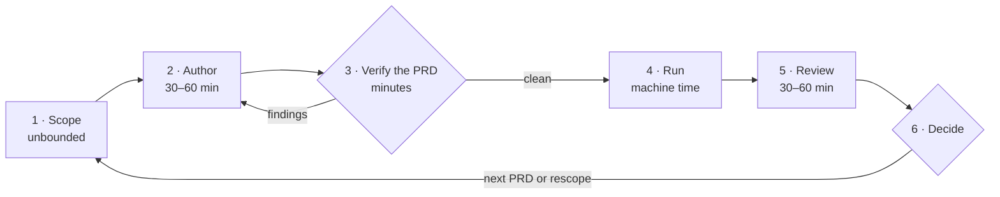

---
# Page settings
layout: default

# Hero section
title: The PRD loop
description: "The loop zurdo was built around — and how it maps, ceremony by ceremony, onto agile."

# Page navigation
page_nav:
    prev:
        content: Usage
        url: '/docs/usage.html'
    next:
        content: Effective use
        url: '/docs/effective-use.html'

# Mermaid diagrams on this page
mermaid: true
---

[Writing PRDs](writing-prds.md) covers the artifact. This page covers the loop you run it in: you keep the engineering judgment and hand the agent only the typing.

## The loop

```mermaid
flowchart LR
    S["1 · Scope<br/>unbounded"] --> A["2 · Author<br/>30–60 min"]
    A --> G{"3 · Verify the PRD<br/>minutes"}
    G -->|findings| A
    G -->|clean| R["4 · Run<br/>machine time"]
    R --> V["5 · Review<br/>30–60 min"]
    V --> D{"6 · Decide"}
    D -->|"next PRD or rescope"| S
```

Two properties make it work:

- **You're needed only where judgment is irreplaceable:** locking the scope and accepting the result. Everything between runs on machine time.
- **Verification happens on both sides.** The spec is checked before the run and the work after it, so the cheap gate always runs first.

## Phase by phase

**1 · Scope (unbounded)**
Research the code, constraints, and failure modes, then lock what will exist when you're done. Take as long as it takes: the scope is a commitment.

**2 · Author (30–60 min)**
Turn the scope into tasks and criteria with the [`zurdo-prd-author`](writing-prds.md#authoring-with-the-bundled-skills) skill, evidence first. If this drags, the scope wasn't locked.

**3 · Verify the PRD (minutes)**
Check that each criterion is honest, falsifiable, and failing today, then run [`zurdo validate` and `zurdo analyze`](writing-prds.md#validate-early-analyze-before-you-spend). A bad criterion costs a minute here and a whole run later.

**4 · Run (machine time)**
Start `zurdo run`, often on a remote server, and walk away. Zurdo checks every hint after every iteration, and `Max-Attempts` caps the spend.

**5 · Review (30–60 min)**
Read `zurdo report` and sign off `[manual]` criteria in [`zurdo review`](usage.md#reviewing-a-run-with-zurdo-review). The criteria proved it works. Review asks whether it's how you'd have built it.

**6 · Decide**
If the evidence holds, merge it yourself (zurdo has no git automation). If a task kept failing, the scope's model of the system was probably wrong: rescope.

Why scoping is the one phase without a timebox

Once a PRD runs, the scope dictates the work and forces you to *finish* rather than deviate. Zurdo enforces this mechanically:

- **The PRD is immutable during a run.** A mid-run "actually, let's also…" has no way in.
- **Zurdo re-runs every criterion itself**, so the definition of done can't drift to match whatever got built.
- **[Frozen paths](how-it-works.md#evidence-integrity)** fence off evidence the run must not touch.

Deviation isn't suppressed, it's *scheduled* into the next scoping session. A good scope makes phase 2 transcription, not invention.

## The agile correlation

This is the agile cycle with three changes: the sprint shrinks to hours, an agent replaces the team, and **every rule agile enforces socially, zurdo enforces mechanically**.

| Agile | Zurdo | What changes |
|---|---|---|
| Product backlog | Findings and deferred work for the next scope | Same role |
| Sprint planning | Scope (phase 1) | Still the slow, judgment-heavy phase |
| Story + acceptance criteria | PRD task + [hint-typed criteria](hints.md) | Criteria become executable checks |
| Definition of Done | The hints | Checked after every iteration, so nobody can just "call it done" |
| Sprint commitment | The locked PRD | Can't be renegotiated mid-run |
| The sprint | The run | Weeks become hours; `Max-Attempts` replaces the burndown |
| Daily standup | `progress.log` + iteration records | Same information, no meeting |
| Sprint review / demo | Review: report, evidence, `[manual]` sign-off | Gathered evidence replaces "trust me" |
| Retrospective | Decide (phase 6) | Failing criteria are the retro input |
| Velocity | [Throughput](#pipelining) | Counted in merged scopes, not story points |

Agile's rules erode because people enforce them. Here the PRD can't drift, the criteria can't be talked into passing, and the agent doesn't grade its own demo.

Agile ceremonies also keep a team talking to each other, and zurdo replaces none of that. This loop covers one engineer working with one agent.

## Pipelining

The loop doesn't have to be serial. While one PRD runs, author the next, then review both when you're free.

```mermaid
gantt
    title A representative day: machine time overlaps human time
    dateFormat HH:mm
    axisFormat %H:%M
    section Human
    Author + verify PRD A         :a1, 09:00, 1h
    Author + verify PRD B         :a2, 10:00, 1h
    Other work, meetings          :a3, 11:00, 4h
    Review A and B, merge         :a4, 15:00, 1h
    section Machine
    Run PRD A                     :r1, 10:00, 3h
    Run PRD B                     :r2, 11:00, 4h
```

throughput ≈ available attention ÷ (authoring timebox + review timebox)

Implementation time drops out of the equation, and that's the gain, not agent speed. A chat workflow costs your attention every iteration. Here you spend it once on the design and once on the verdict, and you can batch each: design in one block, review in another.

## Tracking the loop with Carol

The loop above is one PRD at a time. When the work spans several PRDs, or teammates follow it on GitHub, [Carol](../carol/index.md) keeps the tracker in step at each edge of the loop, so nobody copies run results into issues by hand:

| Phase | Carol |
|---|---|
| 1 · Scope | `carol scope` mirrors the initiative's `scope.md` and research tickets as issues. See [Initiatives](../carol/initiatives.md). |
| 2 · Author | `carol publish` turns the PRD into an epic and one issue per task. `carol board` puts them on a board. |
| 4 · Run | `carol status` shows the phase as *in flight*, or *crashed* if the run died |
| 5 · Review | `carol sync` posts each task's outcome, labels failures with their failing hints, and closes what passed |
| 6 · Decide | `carol status` flags phases whose status disagrees with their tickets. `carol score --report` puts run outcomes beside the PRD's lint warnings. |

Carol only mirrors the loop. It never runs zurdo and never decides anything, and every write waits for `--apply`. See [GitHub sync](../carol/github-sync.md).

## Practical notes

- **Validate every PRD**, even ones you're sure about. You're most tempted to skip it when rushing, which is exactly when it catches something.
- **Disconnect freely.** State is atomic and resumable, so remote runs survive a dropped session.
- **If authoring or review keeps running over, fix the scope.** Don't stretch the timeboxes.

Next: [Effective use](effective-use.md)
