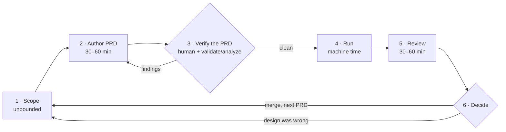

---
# Page settings
layout: default

# Hero section
title: The PRD loop
description: "The loop zurdo was built around — and how it maps, ceremony by ceremony, onto agile."

# Page navigation
page_nav:
    prev:
        content: Usage
        url: '/docs/usage.html'
    next:
        content: Effective use
        url: '/docs/effective-use.html'

# Mermaid diagrams on this page
mermaid: true
---

[Writing PRDs](writing-prds.md) teaches the artifact. This page teaches the loop you run it in. You scope deliberately, write the PRD fast, check the spec before spending tokens, run on machine time, and review when you're free.

It assumes you can split work into tasks and state "done" as observable evidence. You keep the engineering and delegate only the typing.

## The loop

```mermaid
flowchart LR
    S["1 · Scope<br/>unbounded"] --> A["2 · Author PRD<br/>30–60 min"]
    A --> G{"3 · Verify the PRD<br/>human + validate/analyze"}
    G -->|findings| A
    G -->|clean| R["4 · Run<br/>machine time"]
    R --> V["5 · Review<br/>30–60 min"]
    V --> D{"6 · Decide"}
    D -->|"merge, next PRD"| S
    D -->|"design was wrong"| S
```

Two properties make it work:

- **You're needed only where judgment is irreplaceable:** when you lock the scope, and when you accept or reject the result. Everything in between runs on machine time.
- **Verification happens on both sides.** The spec is checked before the run and the work after it, so the cheap gate always runs before the expensive one.

## Phase by phase

**1 · Scope (unbounded)**
Research the code, constraints, and failure modes, then lock what will exist when you're done. Take as long as it takes, because the scope is a commitment.

**2 · Author (30–60 min)**
Use the [`zurdo-prd-author`](writing-prds.md#authoring-with-the-bundled-skills) skill to turn the scope into tasks and criteria, writing the evidence first. If this drags, the scope wasn't really locked.

**3 · Verify the PRD**
First a human check: is each criterion honest, falsifiable, and failing today? Then [`zurdo validate` and `zurdo analyze`](writing-prds.md#validate-early-analyze-before-you-spend). Catching a bad criterion here costs a minute. Catching it after a run costs the run.

**4 · Run (machine time)**
Start `zurdo run`, often on a remote server, and walk away. Zurdo checks every hint after every iteration, and `Max-Attempts` caps the spend.

**5 · Review (30–60 min)**
Read `zurdo report` and sign off `[manual]` criteria in [`zurdo review`](usage.md#reviewing-a-run-with-zurdo-review), which keeps a tamper-evident log of sign-offs. The criteria already answered "does it work?" Review asks "is this how I'd have built it?" Green means the evidence exists. It doesn't mean merge.

**6 · Decide**
If the evidence holds, merge it yourself (zurdo has no git automation) and move on to the next PRD. If a task keeps failing, the scope's model of the system was probably wrong, so take that into the next scoping session.

Why scoping is the one phase without a timebox

The scope is a commitment device. Once a PRD runs, the scope dictates the work and forces you to *finish*, not deviate. Zurdo enforces this mechanically, not socially:

- **The PRD is immutable during a run.** A mid-run "actually, let's also…" has no way in.
- **Zurdo re-runs every criterion itself**, so the definition of done can't drift to match whatever got built.
- **[Frozen paths](how-it-works.md#evidence-integrity)** fence off evidence the run must not touch.

Deviation isn't suppressed, it's *scheduled*: anything you discover mid-run goes into the next scoping session. A good scope is concrete enough that phase 2 is transcription, not invention.

## The agile correlation

This is the agile cycle with three changes. The sprint shrinks to hours, an agent replaces the team, and **every rule agile enforces socially, zurdo enforces mechanically**.

| Agile | Zurdo | What changes |
|---|---|---|
| Product backlog | Findings and deferred work queued for the next scope | Same role |
| Sprint planning | Scope (phase 1) | Still the slow, judgment-heavy phase, and it should be |
| Story + acceptance criteria | PRD task + [hint-typed criteria](hints.md) | Criteria become executable checks |
| Definition of Done | The hints | Executed after every iteration, so nobody can just "call it done" |
| Sprint commitment | The locked PRD | Can't be renegotiated mid-run |
| The sprint | The run | Weeks become hours, and `Max-Attempts` replaces the burndown |
| Daily standup | `progress.log` + iteration records | Same information, no meeting |
| Sprint review / demo | Review: report, evidence, `[manual]` sign-off | Evidence the runtime gathered replaces "trust me" |
| Retrospective | Decide (phase 6) | Failing criteria are the retro input |
| Velocity | Throughput (see [Pipelining](#pipelining)) | Counted in merged scopes, not story points |

Agile's rules erode because people enforce them: the definition of done drifts and the demo becomes theater. Here the PRD can't drift, the criteria can't be talked into passing, and the agent doesn't grade its own demo.

One honest limit: agile ceremonies also keep a team talking to each other, and zurdo replaces none of that. This loop covers one engineer working with one agent.

## Pipelining

The loop doesn't have to be serial. While one PRD runs, scope or author the next one, and review when you're free.

```mermaid
gantt
    title A representative day — machine time overlaps human time
    dateFormat HH:mm
    axisFormat %H:%M
    section Human
    Author + verify PRD A         :a1, 09:00, 1h
    Author + verify PRD B         :a2, 10:00, 1h
    Other work, meetings          :a3, 11:00, 4h
    Review A and B, merge         :a4, 15:00, 1h
    section Machine
    Run PRD A                     :r1, 10:00, 3h
    Run PRD B                     :r2, 11:00, 4h
```

throughput ≈ available attention ÷ (authoring timebox + review timebox)

Implementation time drops out of the equation. That's where the gain comes from, not from agent speed. In a chat workflow, every iteration costs your attention. Here you spend it once on the design and once on the verdict. You also get to batch similar work: design in one block, review in another.

## Practical notes

- **Unattended runs are the point.** Verification makes it safe to look away, and attempt budgets cap the cost.
- **Remote servers fit naturally.** State is atomic and resumable, so you can disconnect.
- **Run `zurdo validate` before every run**, even on PRDs you're sure about. You're most tempted to skip it when you're rushing, which is exactly when it catches something.
- **If authoring or review regularly runs over, fix the scope phase.** Don't stretch the timeboxes.

Next: [Effective use](effective-use.md)
