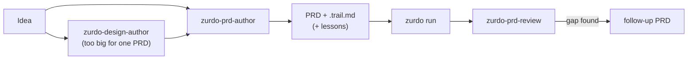

---
# Page settings
layout: default

# Hero section
title: Writing PRDs
description: "The PRD grammar and its load-bearing rules."

# Page navigation
page_nav:
    prev:
        content: Effective use
        url: '/docs/effective-use.html'
    next:
        content: Hints reference
        url: '/docs/hints.html'

# Mermaid diagrams on this page
mermaid: true
---

A zurdo PRD is markdown with a strict grammar. If a PRD parses, zurdo can execute its acceptance criteria.

<div class="callout callout--danger" markdown="1">
**Important** If you remember three things: use a real **em-dash (`—`, U+2014)** in task headings, leave **no blank line** under the heading, and give **every criterion at least one hint**.
</div>

## The 60-second tour

<figure class="lp-figure" aria-label="Anatomy of a PRD: title, task heading, metadata block, optional requirements, description sent to the agent, and acceptance criteria run by zurdo">
<div class="lp-figure__scroll"><svg viewBox="0 0 680 320" role="img">
  <rect x="10" y="10" width="340" height="30" rx="5" class="lp-svg-box" stroke-width="1"/>
  <text class="lp-svg-mono" x="22" y="30"># PRD: Add authentication</text>
  <rect x="10" y="52" width="340" height="30" rx="5" class="lp-svg-accent" stroke-width="1.5"/>
  <text class="lp-svg-mono" x="22" y="72">## Task: task-auth — Add tokens</text>
  <rect x="10" y="84" width="340" height="46" rx="5" class="lp-svg-box" stroke-width="1"/>
  <text class="lp-svg-mono" x="22" y="103">**Effort**: medium</text>
  <text class="lp-svg-mono" x="22" y="121">**Depends-on**: []</text>
  <rect x="10" y="142" width="340" height="30" rx="5" class="lp-svg-box" stroke-width="1" stroke-dasharray="4 3"/>
  <text class="lp-svg-mono" x="22" y="162">### Requirements</text>
  <rect x="10" y="184" width="340" height="30" rx="5" class="lp-svg-box" stroke-width="1"/>
  <text class="lp-svg-mono" x="22" y="204">### Description</text>
  <rect x="10" y="226" width="340" height="84" rx="5" class="lp-svg-box" stroke-width="1"/>
  <text class="lp-svg-mono" x="22" y="246">### Acceptance Criteria</text>
  <text class="lp-svg-mono" x="22" y="268">- [ ] tests pass</text>
  <text class="lp-svg-mono" x="22" y="288">      [shell: cargo test]</text>
  <path class="lp-svg-line" d="M356 67 H384" stroke-width="1.5"/>
  <text class="lp-svg-text" x="392" y="63" font-weight="600">Em-dash between id and title</text>
  <text class="lp-svg-muted" x="392" y="80">id matches ^task-[a-z0-9-]+$</text>
  <path class="lp-svg-line" d="M356 107 H384" stroke-width="1.5"/>
  <text class="lp-svg-text" x="392" y="103" font-weight="600">Metadata, directly under the heading</text>
  <text class="lp-svg-muted" x="392" y="120">no blank lines · seven keys only</text>
  <path class="lp-svg-line" d="M356 157 H384" stroke-width="1.5"/>
  <text class="lp-svg-text" x="392" y="161" font-weight="600">Optional: requirement ids</text>
  <path class="lp-svg-line" d="M356 199 H384" stroke-width="1.5"/>
  <text class="lp-svg-text" x="392" y="203" font-weight="600">Sent verbatim to the agent</text>
  <path class="lp-svg-line" d="M356 268 H384" stroke-width="1.5"/>
  <text class="lp-svg-text" x="392" y="264" font-weight="600">Run by zurdo, never the agent</text>
  <text class="lp-svg-muted" x="392" y="281">each criterion needs ≥ 1 hint</text>
</svg></div>
<figcaption>Sections must appear in this order. Requirements is the only optional one.</figcaption>
</figure>

The full grammar in one example:

```markdown
# PRD: <free-form title>

## Task: task-1 — <task title>
**Effort**: medium
**Depends-on**: []
**Max-Attempts**: 5          # optional, falls back to config default
**Skills**: rust-style       # optional, comma-separated
**Agent-timeout**: 30m       # optional, units required (s/m/h)
**Category**: Backend        # optional, used to group reports
**Frozen**: docs/adr/*.md    # optional, globs the agent must not modify

### Requirements
- req-tests-green: The workspace test suite passes.
- req-health-endpoint: The service exposes a working /health endpoint.

### Description
Free-form prose. Passed verbatim to the executor agent.

### Acceptance Criteria
- [ ] cargo tests pass [shell: cargo test --workspace] [proves:req-tests-green]
- [ ] binary exists [file-exists: target/release/zurdo]
- [ ] /health returns 200 [http: GET http://localhost:8080/health -> 200] [proves:req-health-endpoint]
- [ ] design review signed off [manual]
```

## The five rules

Each broken rule is a validation error with its own message:

<figure class="lp-terminal" aria-label="zurdo validate rejecting four malformed PRDs">
<div class="lp-terminal__bar"><span class="lp-terminal__dots" aria-hidden="true"><i></i><i></i><i></i></span><span class="lp-terminal__title">zurdo validate</span></div>
<pre class="lp-terminal__body"><code><span class="t-dim">$</span> zurdo validate bad/hyphen.md
<span class="t-bad">bad/hyphen.md:3: task heading uses hyphen-minus (U+002D) where an em-dash (U+2014) is required</span>
<span class="t-dim">$</span> zurdo validate bad/blank-line.md
<span class="t-bad">bad/blank-line.md:3: blank line between task heading and metadata block</span>
<span class="t-dim">$</span> zurdo validate bad/unknown-key.md
<span class="t-bad">bad/unknown-key.md:6: unknown metadata key `Priority`</span>
<span class="t-dim">$</span> zurdo validate bad/no-hint.md
<span class="t-bad">bad/no-hint.md:11: criterion has no hints in task `task-1`</span></code></pre>
<figcaption class="lp-terminal__caption"><span class="lp-dot" aria-hidden="true"></span>Each one exits 2, so you find out before a run starts.</figcaption>
</figure>

| # | Rule | Good | Bad |
| --- | --- | --- | --- |
| 1 | The heading is `## Task: <id> — <title>`, with an **em-dash** | `## Task: task-1 — Greet` | `task-1 - Greet`, `task-1 – Greet` |
| 2 | Metadata sits **directly** under the heading, with no blank line before or inside it | heading, then `**Effort**: low` on the next line | a blank line between them |
| 3 | Only the [seven metadata keys](#metadata-keys) are allowed, each written as `**Key**: value` | `**Effort**: low` | `**Priority**: high` |
| 4 | Every criterion needs **at least one hint**. Write `[manual]` if a human checks it. | `- [ ] tests pass [shell: cargo test]` | `- [ ] the greeter works` |
| 5 | `Effort` must be a key in your config's `[effort_map.<provider>]` | `low`, `medium`, `high` (default config) | a level your map doesn't define |

- **Task ids** match `^task-[a-z0-9-]+$`. `task-1`, `task-auth-rotate`, and `task-3a` are valid. `Task-1`, `auth_rotate`, and `task--` are not.
- **Em-dash input.** On macOS, type `Option+Shift+-`. On Linux, type `Compose - - -`. If your editor or linter swaps dashes automatically, turn that off for `.md` files.
- **Hints combine with AND.** `[shell: cargo build] [file-exists: target/debug/zurdo]` passes only if both pass. Every hint type is on the [Hints reference](hints.md). With `[lumen] enabled = true`, the [structural hints](lumen.md) are available too. Run `zurdo lumen query --name <name>` first to get the exact kind and name.
- **Effort isn't a fixed list.** It's checked at pre-flight against the active executor's map. If your `[effort_map.anthropic]` defines only `low` and `high`, then `medium` is rejected for Anthropic runs. See [Configuration](configuration.md).

### Metadata keys

| Key             | Required? | Notes                                                                 |
| --------------- | --------- | ---------------------------------------------------------------------- |
| `Effort`        | yes       | A key in the active executor's `[effort_map.<provider>]`. |
| `Depends-on`    | yes       | YAML-style array, e.g. `[task-1, task-2]`. Empty array is `[]`.        |
| `Max-Attempts`  | no        | Positive integer. Falls back to `defaults.max_attempts` in config.     |
| `Skills`        | no        | Comma-separated skill names. You install these yourself (see below). |
| `Agent-timeout` | no        | Duration with an explicit unit: `30s`, `15m`, `1h`. Bare integers fail. |
| `Category`      | no        | Free-form label. If absent, the task is grouped as `Uncategorized` in reports. |
| `Frozen`        | no        | Comma-separated globs of paths the agent must not modify.  |

<details markdown="1">
<summary>Frozen paths and skills in detail</summary>

**Frozen paths.**
- **Glob syntax.** Patterns are anchored at the repo root. `*` stays within one path segment, `**` crosses directories, and negation isn't supported.
- **Run-wide globs.** You can also set them in `[verification] protected_paths` config. Zurdo enforces both lists together.
- **Per-task check.** After each iteration, zurdo diffs the tree against *that task's* baseline. The baseline is captured at the task's first attempt and reused for its retries, so a task is never charged for an earlier task's edits.
- **Failure.** Touching a frozen path fails the iteration no matter what the criteria say, and the retry prompt tells the agent to revert it.
- **Untracked files.** They're covered: a path that didn't exist at capture time is protected once it's created. Freezing a glob over an untracked path doesn't fail every attempt on its own.
- **Outside a git repo**, enforcement drops to a warning, because it needs the baseline. See [How it works](how-it-works.md#evidence-integrity).

**Skills are user-managed.** Zurdo never installs the skills you name in `**Skills**`. It only warns at pre-flight if they're missing. Put them where your provider finds them:
- project scope: `.claude/skills/<name>/` for Anthropic, `.agents/skills/<name>/` for Codex and Copilot
- global scope: for example `~/.claude/skills/`
- custom directories, via `[skills] search_paths` in config

List bare names only. Zurdo adds the provider's prefix when it renders the prompt: `/` for Anthropic and Copilot, `$` for Codex.

</details>

## Requirement traceability (optional)

You can list what a task must achieve, then mark which criterion proves each item:

```markdown
### Requirements
- req-auth-1: Tokens must expire after 24 hours
- req-auth-2: Expired tokens must be rejected with HTTP 401

### Description
Add JWT-based authentication. …

### Acceptance Criteria
- [ ] token expiry is enforced [shell: cargo test auth::token_expiry] [proves:req-auth-1]
- [ ] expired token rejected [http: GET http://localhost:8080/protected -> 401] [proves:req-auth-2]
- [ ] full test suite passes [shell: cargo test --workspace]
```

| Check | Result |
| --- | --- |
| `### Requirements` appears after `### Description` | error |
| An id doesn't match `^req-[a-z0-9-]+$`, or is duplicated within the task | error |
| `[proves:<id>]` names a requirement this task doesn't declare | error |
| A declared requirement has no criterion proving it | `uncovered-requirement` warning from `validate` and `analyze`. It's an error under `--strict`. |

`[proves:]` is a modifier, not a hint. It runs no check, so put it after the hints on the line. A criterion without it still gates the task, just without a trace. Several criteria can prove the same requirement.

## Pre-authored tests

A `[shell: cargo test my_test]` criterion is only as honest as the test it runs. If the agent writes both the feature and the test, it controls both sides of the check. Instead, **write the test before the run** and commit it with the PRD. Then the agent can only make it pass. The `zurdo-prd-author` skill teaches this pattern.

Mark the test as ignored so CI stays green on the PRD commit:

```markdown
### Description

<…the work…>

The tests marked `#[ignore = "pre-authored: task-03"]` in `tests/preauthored_task_03.rs`
are evidence, not scratch. Do not delete them or weaken their assertions. The only edit
this task may make to that file is removing the `#[ignore …]` attribute.

### Acceptance Criteria

- [ ] login rejects a missing password [shell: cargo test -- --include-ignored login_rejects_missing_password]
- [ ] no pre-authored test for this task is still ignored [no-grep: #\x5bignore in tests/preauthored_task_03.rs]
```

<div class="lp-cards" markdown="1">
<div markdown="1">
**Use `--include-ignored`, never `--ignored`**
`--ignored` runs *only* ignored tests. After the agent removes the attribute, it matches nothing, and the [empty-test-run check](hints.md#a-shell-hint-that-runs-no-tests-fails) fails the criterion.
</div>
<div markdown="1">
**The `[no-grep:]` guard**
It forces the marker's removal. `#\x5b` is a literal `[`, because the hint tokenizer rejects an unclosed `[`. The prefix also catches a bare `#[ignore]`. Don't mention the attribute in a comment in that file, or the guard will match forever.
</div>
<div markdown="1">
**One file per task**
The guard is scoped to a single file. Put the instruction paragraph in the task's `### Description`, because the PRD preamble never reaches the agent.
</div>
<div markdown="1">
**Stub what doesn't exist**
Commit a `todo!()` stub for any function the test calls. `#[ignore]` stops a test from running, not from compiling.
</div>
</div>

**Before committing, run the hint yourself.** It must fail **on an assertion** or a `todo!()` panic. A compile error or a zero-test run doesn't count. If a test genuinely can't come first, explain why in the task's `.trail.md`.

<details markdown="1">
<summary>The same pattern in Go</summary>

- Put the test in a dedicated `_test.go` file tagged `//go:build preauthored`.
- Use a hint like `[shell: go test -tags=preauthored -run '^TestX$' -count=1 ./...]`.
- Add a guard: `[no-grep: //go:build preauthored in …]`.
- `-count=1` is mandatory. Go caches passing results, and the [`cached-verification`](hints.md#the-warn-lint-families) lint flags a missing flag.
- Don't use `t.Skip()`: a skipped test still counts as a passing package.

</details>

## Authoring with the bundled skills



- **`zurdo-prd-author`** runs an evidence-first interview. It drafts the criteria first, derives tasks from them, and pressure-tests every hint until it truly verifies. It also writes a `<prd-name>.trail.md` sidecar recording *why* each decision was made. Zurdo never parses the sidecar, but `zurdo-hint-debugger` reads it when a criterion fails.
- **Lessons.** When a [lesson library](reason.md) exists, the author skill reads it to fold in known repo quirks. When the interview settles a correction worth keeping, it writes a new `lessons/lesson-<hash8>.md` for you to commit with the PRD.
- **`zurdo-design-author`** comes first when the work is too big for one PRD. It writes a `docs/design/<topic>.md` record with rejected alternatives and phases that have observable exit criteria. Every claim marked as new needs a measured number.
- **`zurdo-prd-review`** comes after a run. It compares the diff with what each task *meant*, and turns any gap into a follow-up PRD instead of editing the original. See [Skills](how-it-works.md#skills).

`zurdo init` installs all of them. Invoke them from your agent CLI like any other skill. A lesson can also carry an [obligation](reason.md#obligations-lessons-that-bind-future-prds): a check that every PRD touching some area must include. `zurdo analyze` warns about any PRD that leaves it out.

## Validate early, analyze before you spend

```sh
zurdo validate prds/feature.md              # free, instant: grammar, dep graph, lints
zurdo analyze prds/feature.md               # + lesson obligations and an LLM critique
```

<figure class="lp-terminal" aria-label="zurdo validate warning about criteria that prove nothing">
<div class="lp-terminal__bar"><span class="lp-terminal__dots" aria-hidden="true"><i></i><i></i><i></i></span><span class="lp-terminal__title">zurdo validate prds/docs.md</span></div>
<pre class="lp-terminal__body"><code><span class="t-warn">prds/docs.md:15: warning:</span> task `task-1` shell hint `true` is a no-op and proves nothing about its criterion
<span class="t-warn">prds/docs.md:16: warning:</span> task `task-1` grep pattern `hello` already matches `main.rs` in the current working tree — the criterion may not prove the change
<span class="t-warn">prds/docs.md:17: warning:</span> task `task-1` criterion's only proof greps `README.md` for `Usage section`, a phrase the criterion itself names — the agent satisfies it by writing the phrase
<span class="t-warn">prds/docs.md:9: warning:</span> task `task-1` requirement `req-ci` is not proven by any criterion
<span class="t-ok">OK</span></code></pre>
<figcaption class="lp-terminal__caption"><span class="lp-dot" aria-hidden="true"></span>With --strict, these four warnings become errors and the command exits 2.</figcaption>
</figure>

`validate` runs nine of the ten [lint families](hints.md#the-warn-lint-families). `--strict` turns the six promotable ones into errors. `zurdo analyze` also checks lesson obligations and flags [hints that prove nothing](hints.md#beware-vacuous-hints-and-tautologies) and criteria too vague to verify, all before a run spends any tokens.
